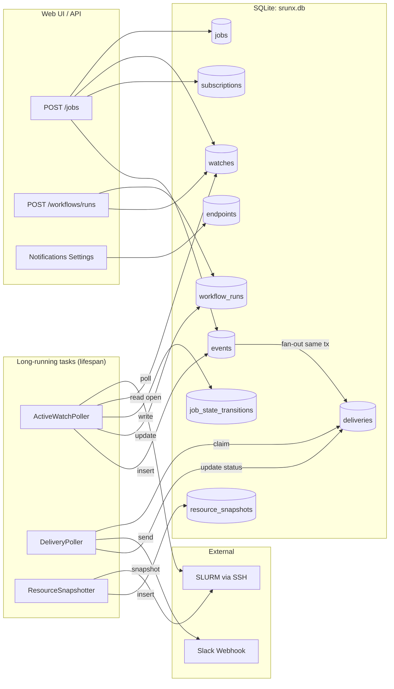
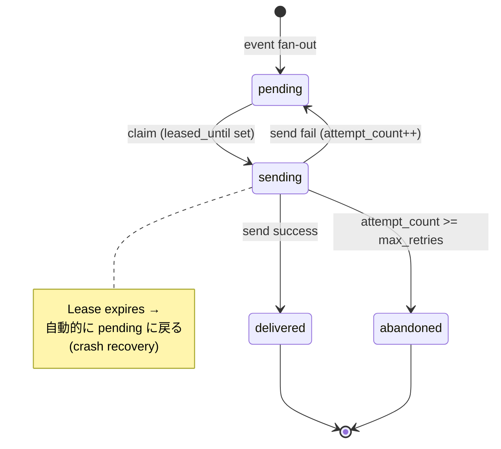
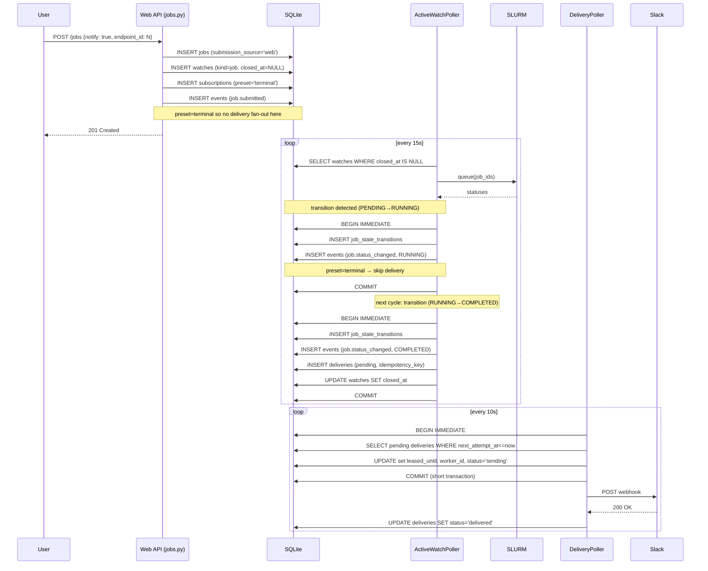
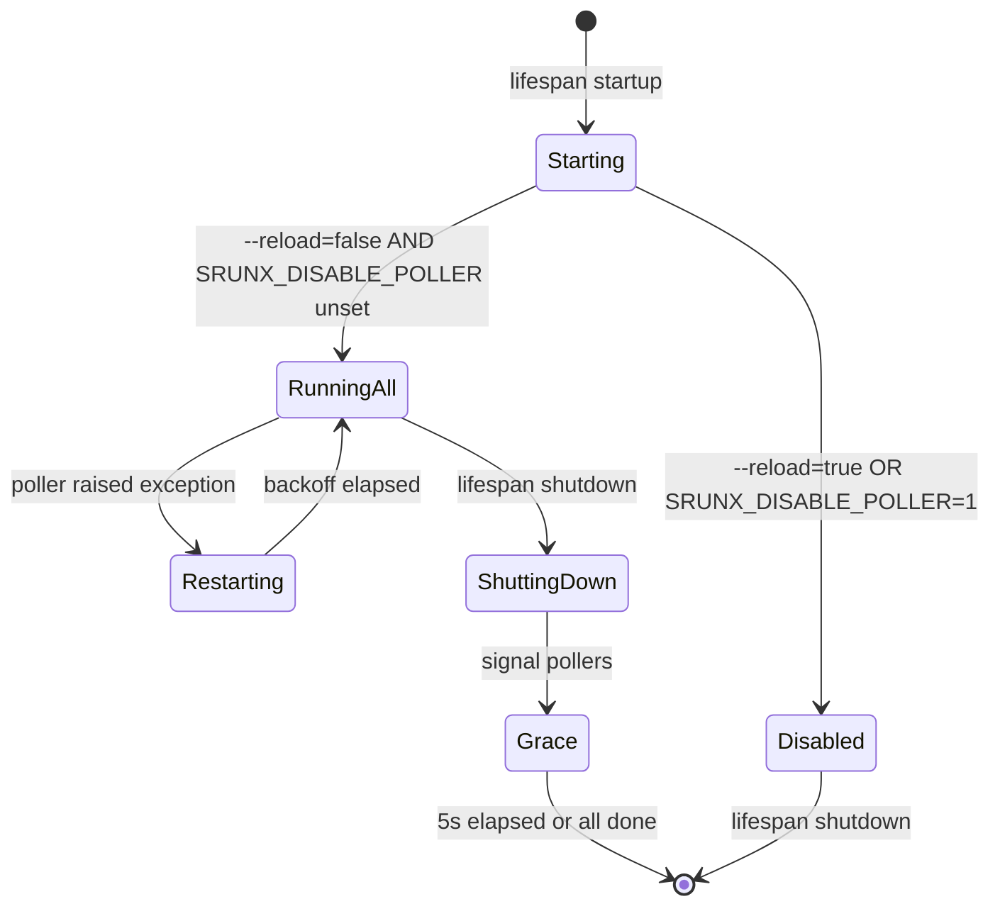

# Design Document

> **Historical naming note** (added during PR #203, the #193 oversized-module
> split): this spec was authored when the SSH-transport SLURM client was
> ``SlurmSSHAdapter`` in ``src/srunx/web/ssh_adapter.py``. It has since been
> renamed to ``SlurmSSHClient`` and moved to ``src/srunx/slurm/clients/ssh.py``.
> The original names are preserved below as historical context; new work
> should target the current paths.

## Overview

本 spec は srunx の通知配送と状態永続化を刷新する。既存の in-memory / file-based なバラバラな状態管理を、**単一の SQLite データベース (`srunx.db`)** に統合する。通知は Outbox パターンベースの耐久性ある配送(Watch / Subscription / Endpoint / Event / Delivery の5概念)で実現し、ワークフロー実行状態・ジョブ状態遷移・リソース時系列も同 DB に乗せる。

全体は **3 つの長時間稼働タスク** を FastAPI lifespan 上で起動する single-process 構成を取る:

- **ActiveWatchPoller**(Producer): open watch を走査し SLURM を poll、transition 検出、`events` と `deliveries` を生成
- **DeliveryPoller**(Consumer): `deliveries` から claim して外部(Slack)へ送信
- **ResourceSnapshotter**: 定期的に `resource_snapshots` を挿入

これらは `PollerSupervisor` でラップされ、例外発生時にも web lifespan を巻き込まずに exponential backoff で再起動する。`--reload` モードでは全 poller が起動しない(二重配送事故防止)。

既存の `SlackCallback` は `SlackWebhookDeliveryAdapter` として再利用し、`SlackCallback._sanitize_text` のロジックをそのまま流用する。

## Steering Document Alignment

### Technical Standards

本プロジェクトには `tech.md` が存在しない。`CLAUDE.md` に記された以下の規約に従う:

- **Python 3.12+** の型ヒント構文(`str | None`, `list[X]`)
- **Pydantic v2** によるデータバリデーション(`BaseModel`, `Field`, `model_validator`)
- **anyio** ベースの非同期処理(`asyncio` を直接使わない)
- **uv** で依存管理(`uv add`, `uv sync`)
- **ruff + mypy + pytest** で品質担保

### Project Structure

本プロジェクトには `structure.md` が存在しない。`CLAUDE.md` の "Current Modular Structure" に従い、新規コードを以下の配置とする:

```
src/srunx/
├── db/                       # 新規: DB レイヤ
│   ├── __init__.py
│   ├── connection.py         # SQLite 接続、PRAGMA 設定、context manager
│   ├── migrations.py         # スキーマ DDL + マイグレーション適用
│   └── repositories/         # テーブルごとの CRUD
│       ├── __init__.py
│       ├── base.py           # BaseRepository(共通処理)
│       ├── endpoints.py
│       ├── watches.py
│       ├── subscriptions.py
│       ├── events.py
│       ├── deliveries.py
│       ├── workflow_runs.py
│       ├── job_state_transitions.py
│       ├── resource_snapshots.py
│       └── jobs.py           # 既存 history.py の schema 拡張を吸収
├── notifications/            # 新規: 通知ドメイン層
│   ├── __init__.py
│   ├── service.py            # NotificationService(fan-out ロジック)
│   ├── sanitize.py           # sanitize_slack_text 共有ユーティリティ
│   ├── adapters/
│   │   ├── __init__.py
│   │   ├── base.py           # DeliveryAdapter 抽象
│   │   └── slack_webhook.py  # WebhookClient 直叩き + sanitize 使用
│   └── presets.py            # preset → event kind フィルタ
├── pollers/                  # 新規: 長時間稼働タスク
│   ├── __init__.py
│   ├── supervisor.py         # PollerSupervisor(例外回復 + shutdown 制御)
│   ├── active_watch_poller.py
│   ├── delivery_poller.py
│   ├── resource_snapshotter.py
│   └── reload_guard.py       # --reload 検出ユーティリティ(ユニットテスト可能)
└── web/
    ├── app.py                # lifespan で PollerSupervisor を起動(修正)
    ├── routers/
    │   ├── endpoints.py      # 新規: endpoint CRUD API
    │   ├── subscriptions.py  # 新規: subscription CRUD API
    │   ├── watches.py        # 新規: watch 一覧 API(読み取り中心)
    │   ├── deliveries.py     # 新規: delivery の observability API
    │   ├── jobs.py           # 修正: submit 時に watch/subscription 作成 + history.record_job
    │   └── workflows.py      # 修正: workflow_runs 永続化、_monitor_run を poller に委譲
    ├── state.py              # 削除: RunRegistry は DB-backed に置き換え
    └── frontend/src/
        ├── pages/settings/NotificationsTab.tsx  # 拡張: endpoint CRUD
        └── pages/NotificationsCenter.tsx        # 新規: delivery / subscription 可視化
```

## Code Reuse Analysis

### Existing Components to Leverage

- **`src/srunx/callbacks.py` (`SlackCallback`)**: `_sanitize_text` を **新規 `src/srunx/notifications/sanitize.py` にユーティリティとして切り出し**、`SlackCallback`(CLI 経路で残存)と `SlackWebhookDeliveryAdapter`(新規)双方が同じ関数を参照する。`SlackWebhookDeliveryAdapter` は `SlackCallback` インスタンスを composition で保持せず、`slack_sdk.WebhookClient` を直接 instantiate する(`Event` 入力と `SlackCallback` の `Job/Workflow` 入力で型が合わず、composition だと wrapper が ugly になるため)。CLI 側 `SlackCallback` の挙動は `_sanitize_text` 移動以外は不変。
- **`src/srunx/history.py`**: 既存の `init_db`, `record_job`, `update_job_completion`, `JobRecord` モデルのスキーマを新 DB(`srunx.db`)に移植。既存の SQLite 接続ロジックは新 `db/connection.py` に統合・拡張される。既存 `~/.srunx/history.db` は起動時削除。
- **`src/srunx/config.py` (`SrunxConfig`, `get_config`)**: 設定ファイルパス解決ユーティリティ(`get_config_dir()`)を `$XDG_CONFIG_HOME` fallback 対応に拡張し、DB パス解決にも再利用する。`notifications.slack_webhook_url` フィールドは deprecated としてマーク(読み取りは残すが起動時に `endpoints` へ一度だけ移行)。
- **`src/srunx/monitor/job_monitor.py` (`JobMonitor.watch_continuous`)**: Phase 1 では CLI 経路でのみ使用継続(R10.9)。**ただし状態遷移観測時に `JobStateTransitionRepository.insert(source='cli_monitor')` を呼び出すよう小変更する**(R6.1 の SSOT 要件を CLI 経路でも満たすため)。通知発火経路(CLI の `SlackCallback` 直叩き)はそのまま。Phase 2 で全面的に ActiveWatchPoller へ統合する。
- **`src/srunx/monitor/resource_monitor.py` (`ResourceMonitor`, `ResourceSnapshot`)**: `ResourceSnapshotter` が `ResourceMonitor.get_current_snapshot()` を呼んで `resource_snapshots` に書き込む。既存 `ResourceSnapshot` モデル(`monitor/types.py:63`)を SQLite row とのマッパーに通す。
- **`src/srunx/client.py` (`Slurm`)**: SLURM へのアクセスは既存 `Slurm` クライアント経由に統一。`ActiveWatchPoller` は `Slurm.queue()` と `Slurm.retrieve()` を batch で呼ぶ。
- **`src/srunx/web/ssh_adapter.py` (`SlurmSSHAdapter`)**: Web 経由の submit パスで使用。**バグ修正(R5.1)の実装場所**: `SlurmSSHAdapter.submit_job` 自体は SLURM-only な責務に留め、**record 挿入は `web/routers/jobs.py` の router 層で実施**する(`adapter.submit_job` 成功後に `JobRepository.record_submission()` を呼ぶ)。adapter は pure SLURM 抽象、router はアプリケーションロジックという責務分離を維持するため。

### Phase 1 で変更しない領域(明示)

以下は Phase 1 の design スコープ外とし、現行動作を維持する:

- **CLI 起動のワークフロー実行(`src/srunx/runner.py` の `WorkflowRunner`)**: Phase 1 では `workflow_runs` への書き込みを行わない。CLI-originated workflow の DB 永続化は Phase 2 で扱う。`workflow_runs.triggered_by` CHECK 制約は `'cli'` を含めるが、Phase 1 ではこの値で書き込まれる行は生まれない(将来のためにスキーマだけ予約)。
- **`ScheduledReporter` の historical counts 実装**: 現行の `sacct` shell-out パス(`monitor/scheduler.py:257`)は Phase 1 では変更しない。R6.3 は「`job_state_transitions` + `jobs` への SQL クエリで**回答可能にする**」(可能性の宣言)であり、`ScheduledReporter` 側の置き換えは Phase 2。`JobRepository` 側に `count_by_status_in_range(...)` を Phase 1 で提供しておき、Phase 2 で `ScheduledReporter` が利用に切り替える。
- **`ResourceMonitor` の API 自体**: 現行の live 取得 API は変更しない。Phase 1 では `ResourceSnapshotter` がそれを呼び、結果を `resource_snapshots` に書くのみ。

### Integration Points

- **FastAPI lifespan (`src/srunx/web/app.py`)**: 起動時に DB 初期化 → 必要なら migration 実行 → `PollerSupervisor.start_all()` で3つの poller を起動。shutdown 時に `PollerSupervisor.shutdown()` で grace period 5秒。
- **Web submit router (`src/srunx/web/routers/jobs.py:81`)**: 現状の直接 Slack 送信ロジックを削除し、以下に差し替え:
  1. `JobRepository.record_submission()` で `jobs` に登録(バグ修正)
  2. 通知トグルがオンなら `WatchRepository.create()` + `SubscriptionRepository.create()`
  3. `EventRepository.insert()` で `job.submitted` イベント挿入(preset `all` のみ fan-out)
- **Workflow router (`src/srunx/web/routers/workflows.py`)**: `_monitor_run` の in-memory ループを削除。代わりに:
  1. Workflow 起動時に `WorkflowRunRepository.create(status='pending')`
  2. **この workflow_run に対して内部 watch を自動作成**(`WatchRepository.create(kind='workflow_run', target_ref=f'workflow_run:{run_id}')`)。通知 subscription 有無に関わらず、ActiveWatchPoller が監視・状態遷移検出・再起動後 resume を確実に拾えるようにするため(H C2 の修正)。
  3. ユーザーが workflow_run 単位の通知を有効化した場合、上記 watch に対して `SubscriptionRepository.create()` を追加する。**subscription が存在しない auto-watch の場合、`NotificationService.fan_out` は空マッチ → `deliveries` は生成されない**(events は記録される)。これは正常挙動:watch は状態遷移検出と `workflow_runs.status` 更新のために存在し、通知配送は subscription が付いたときのみ発生
  4. ジョブごとに **SLURM submit → `JobRepository.record_submission()` → `WorkflowRunJobRepository.create(workflow_run_id, job_id)`** の順で書き込む(H H3、FK が成立する順序)
  5. 状態遷移の検出と `workflow_runs.status` 更新は `ActiveWatchPoller` に委譲
  6. `/runs` API は `WorkflowRunRepository.list_all()` から返す
- **Workflow API contract changes(M M9)**: 現行は status 値 `'syncing' | 'submitting' | ...` と run_id が **string UUID**。本 spec では status 値を `'pending' | 'running' | 'completed' | 'failed' | 'cancelled'` に、run_id を **integer autoincrement** に変更する。影響箇所として以下を同 PR で更新する必要がある:
  - `src/srunx/web/frontend/src/lib/types.ts` の `WorkflowRun` 型
  - `src/srunx/web/routers/workflows.py` の Pydantic response モデル
  - 既存の E2E / API テスト(`tests/` 配下)
- **設定 UI (`src/srunx/web/frontend/src/pages/settings/NotificationsTab.tsx`)**: 単一 webhook URL 入力を削除し、endpoint 一覧表示 + 追加/無効化/削除 UI に置き換え。新 API(`/api/endpoints`)経由。

## Architecture

### High-level Dataflow



### Delivery State Machine



### Submit → Terminal Notification Sequence



### Poller Lifecycle (Supervisor)



## Components and Interfaces

### DB Layer

#### `db/connection.py`

- **Purpose**: SQLite 接続管理。PRAGMA 設定(`foreign_keys=ON`, `journal_mode=WAL`, `busy_timeout=5000`)。接続プーリングは不要(SQLite は shared cache + WAL で十分)。
- **Interfaces**:
  - `get_db_path() -> Path`: `$XDG_CONFIG_HOME/srunx/srunx.db` または `~/.config/srunx/srunx.db` を返す(R5.5)。
  - `open_connection() -> sqlite3.Connection`: `Connection` を開き、PRAGMA 適用、`row_factory = sqlite3.Row` を設定。
  - `@contextmanager transaction(conn, mode='DEFERRED'|'IMMEDIATE')`: `BEGIN ... COMMIT/ROLLBACK` をラップ。
  - `init_db()`:
    1. 親ディレクトリ(`~/.config/srunx/`)が存在しなければ 0700 で作成
    2. DB ファイルが未作成なら作成し、**`chmod 0600` を明示的に適用**(NFR Security)
    3. 接続を開いて PRAGMA 適用
    4. `migrations.py` の `apply_migrations()` を呼ぶ
    5. `~/.srunx/history.db` が存在すれば削除(失敗時は `.broken` にリネーム)
- **Dependencies**: `sqlite3`, `pathlib`, `os`, `stat`
- **Reuses**: 既存 `history.py:_get_db_path` の位置計算ロジックを XDG 対応に拡張。

#### `db/migrations.py`

- **Purpose**: スキーマ DDL の適用。`schema_version` テーブルで管理。「適用済みか?」はテーブルに行が存在するかで判定する(version number 比較ではなく name-based の idempotent マイグレーション)。
- **Interfaces**:
  - `MIGRATIONS: list[Migration]`(`Migration(version=1, name='v1_initial', sql=...)`等)
  - `apply_migrations(conn)`: `schema_version` にない name の migration を `BEGIN IMMEDIATE` で1つずつ適用し、成功時に `schema_version` へ行を追加。**全マイグレーションは transaction 内で実行**(失敗時ロールバック、部分適用を防止)。
  - `bootstrap_from_config(conn, config)`:
    1. `schema_version` に `name='bootstrap_slack_webhook_url'` が既に存在するか確認
    2. 存在すれば no-op(once-only 保証)
    3. 存在しなければ `config.notifications.slack_webhook_url` を読む
    4. **値が None / 空**の場合:移行対象なし → `schema_version` に記録(次回以降もスキップ、無駄な読み取り回避)
    5. **値がある場合**:`BEGIN IMMEDIATE` 内で `endpoints` に挿入し、成功したときのみ同 transaction 内で `schema_version` に記録。INSERT が例外(例: 既に同名 endpoint が手動登録されている等)になった場合は両方 rollback し、**`schema_version` には記録しない**(M M10:失敗時に「移行済み」扱いしないため、起動時に再試行可能)。例外はログ warning で顕在化。
- **Dependencies**: DB schema 定義 SQL(本 document の Data Models 章)

#### Repository 群(`db/repositories/*.py`)

各テーブルに対応する薄い CRUD 層。Pydantic モデルで入出力をバリデートしつつ、SQL はパラメータ化クエリ(`?` プレースホルダ)で書く。全 repository は `BaseRepository` を継承し `Connection` を注入可能。

- **`BaseRepository`**: `__init__(conn)`。共通の row → model 変換ヘルパ。
- **`EndpointRepository`**: `create`, `get`, `list`, `disable`, `delete`, `update`(webhook URL 検証は service 層で実施)
- **`WatchRepository`**: `create`, `get`, `list_open` (`closed_at IS NULL` のみ), `close`(`closed_at=datetime('now')`)
- **`SubscriptionRepository`**: `create`, `get`, `list_by_watch`, `list_active_by_event` (`events.kind` ベースで fan-out 対象を返す)
- **`EventRepository`**: `insert`, `get`
- **`DeliveryRepository`**:
  - `insert`(`idempotency_key` UNIQUE 違反は `INSERT OR IGNORE` で黙殺)
  - `reclaim_expired_leases()`: 以下の SQL を実行。`DeliveryPoller.run_cycle()` の冒頭で呼ぶ(**crash/shutdown で置き去りになった行を pending に戻す**)。
    ```sql
    UPDATE deliveries
       SET status = 'pending', leased_until = NULL, worker_id = NULL
     WHERE status = 'sending'
       AND leased_until < strftime('%Y-%m-%dT%H:%M:%fZ','now');
    ```
  - `claim_one(worker_id, lease_duration_secs=300)`: **SQLite では `UPDATE ... LIMIT ... RETURNING` が標準ビルドで使えない**ため、以下の2段階で実装(全体を `BEGIN IMMEDIATE` で包む):
    ```sql
    -- Step 1: find one candidate (single-worker 前提なので limit=1)
    SELECT id FROM deliveries
     WHERE status = 'pending'
       AND next_attempt_at <= strftime('%Y-%m-%dT%H:%M:%fZ','now')
       AND endpoint_id IN (SELECT id FROM endpoints WHERE disabled_at IS NULL)
     ORDER BY next_attempt_at
     LIMIT 1;
    -- Step 2: claim by id
    UPDATE deliveries
       SET status = 'sending',
           leased_until = strftime('%Y-%m-%dT%H:%M:%fZ','now','+' || :lease_secs || ' seconds'),
           worker_id = :worker_id
     WHERE id = :id
       AND status = 'pending'
     RETURNING *;
    ```
    `limit=1` にする理由(H H7): single-worker 前提では batch 化の性能利点がほぼ無く、`shutdown` 時の「in-flight 1件完走 + 残り放棄」の意味論が自然に成立するため。
  - `mark_delivered(id)`, `mark_retry(id, error)`(`attempt_count++`, `next_attempt_at = strftime('%Y-%m-%dT%H:%M:%fZ','now','+' || :backoff_secs || ' seconds')`, `status='pending'`, `leased_until=NULL`), `mark_abandoned(id, error)`
  - `count_stuck_pending(older_than_sec=300)` → int(observability)

- **`EventRepository`**:
  - `insert(event)`: deterministic `source_ref + kind + to_status` をベースに**論理的な dedup を担保**。SQL レベルでは下記 UNIQUE を使う(producer 二重起動時の defense-in-depth, H H5):
    ```sql
    CREATE UNIQUE INDEX idx_events_dedup ON events(kind, source_ref, payload_hash);
    ```
    `payload_hash` は `payload` の deterministic sub-field(`to_status` 等)を含む short hash として `events` 挿入時に計算・保存(payload_hash カラムを追加)。
- **`WorkflowRunRepository`**: `create`, `get`, `list`, `list_incomplete`(再起動後 resume 用), `update_status`, `update_error`
- **`WorkflowRunJobRepository`**: `create`, `list_by_run`
- **`JobStateTransitionRepository`**: `insert`, `latest_for_job`(dedup 判定用), `history_for_job`
- **`ResourceSnapshotRepository`**: `insert`, `list_range`(時間範囲フィルタ), `delete_older_than(days)`(R7.5 pruning 関数)
- **`JobRepository`**: 既存 `history.py` を移植・拡張(`jobs.job_id` に UNIQUE 追加、`workflow_run_id` / `submission_source` 列追加)。interfaces: `record_submission`(R5.1 のバグ修正経路), `update_status(job_id, status, started_at, completed_at, duration_secs)`(ActiveWatchPoller から terminal transition 時に呼ぶ), `update_completion`, `get`, `list`, `count_by_status_in_range(from_at, to_at, statuses)`(Phase 2 の ScheduledReporter 置換用に Phase 1 で提供)

### Notifications Domain

#### `notifications/service.py`

- **Purpose**: イベントから subscription への fan-out を司る。
- **Interfaces**:
  - `NotificationService.fan_out(event: Event, conn) -> list[DeliveryId]`:
    1. `event.source_ref` と `event.kind` にマッチする open watch(`closed_at IS NULL`)を検索
    2. 各 watch の subscription を列挙し、`presets.should_deliver` で preset フィルタ
    3. **endpoint が `disabled_at IS NULL` のもののみ fan-out 対象**にする
    4. deterministic `idempotency_key` を生成し `DeliveryRepository.insert`(UNIQUE 違反は黙殺)
    5. 全てを caller が開いている同一 `BEGIN IMMEDIATE` 内で実行(events 挿入と atomicity を保つ)
  - `NotificationService.create_watch_for_job(job_id, endpoint_id, preset) -> WatchId`: 便宜 API。
  - `NotificationService.create_watch_for_workflow_run(run_id, endpoint_id, preset) -> WatchId`: 便宜 API。
- **Dependencies**: `WatchRepository`, `SubscriptionRepository`, `EventRepository`, `DeliveryRepository`, `EndpointRepository`, `presets`
- **Reuses**: —(新規)

#### `notifications/presets.py`

- **Purpose**: preset(`terminal` / `running_and_terminal` / `all` / `digest`)と event kind のマッピングを pure function で提供。
- **Interfaces**:
  - `should_deliver(preset: str, event_kind: str, to_status: str | None) -> bool`

#### `notifications/adapters/base.py`

- **Purpose**: Delivery adapter の抽象。
- **Interfaces**:
  ```python
  class DeliveryAdapter(Protocol):
      kind: str  # 'slack_webhook' 等
      def send(self, event: Event, endpoint_config: dict) -> None: ...
  ```
- **Dependencies**: `Event` model

#### `notifications/sanitize.py`(新規・ユーティリティ)

- **Purpose**: Slack メッセージ用のテキストサニタイズを両経路(既存 `SlackCallback` と新 adapter)で共有(L L12)。
- **Interfaces**: `sanitize_slack_text(text: str) -> str`
- **Dependencies**: なし(pure function)
- **Reuses**: 実体は既存 `SlackCallback._sanitize_text` のロジックそのまま。`SlackCallback` 側は `from srunx.notifications.sanitize import sanitize_slack_text` に書き換え、内部で同関数を呼ぶ(挙動不変)。

#### `notifications/adapters/slack_webhook.py`

- **Purpose**: Slack webhook 配送。
- **Interfaces**: `SlackWebhookDeliveryAdapter.send(event, endpoint_config)`。`endpoint_config["webhook_url"]` から `slack_sdk.WebhookClient` を直接 instantiate し、event kind/payload に応じた Slack blocks を構築して送信。
- **Reuses**: `notifications.sanitize.sanitize_slack_text` を使用。`SlackCallback` クラス自体は composition しない(`Event` 入力と `SlackCallback` の `Job/Workflow` 入力で型が合わず wrapper が不自然になるため、直叩き方針)。

### Pollers

#### `pollers/supervisor.py`

- **Purpose**: 複数 long-running task のライフサイクル管理。例外捕捉、exponential backoff 再起動、grace shutdown。
- **Interfaces**:
  ```python
  class PollerSupervisor:
      def __init__(self, pollers: list[Poller]): ...
      async def start_all(self) -> None: ...
      async def shutdown(self, grace_seconds: float = 5.0) -> None: ...
  
  class Poller(Protocol):
      name: str
      async def run_cycle(self) -> None: ...
      interval_seconds: float
  ```
- **動作詳細**:
  - `start_all()`: `anyio.create_task_group()` 内で各 poller を `_run_with_backoff(poller)` で wrap。例外発生時は 1→2→4→...→60 秒の exponential backoff で再起動、web lifespan は巻き込まない。
  - `shutdown()`: supervisor 内部の `anyio.Event` を set。各 poller は `run_cycle` の間に event を check、set されていれば即座に return。その後 `anyio.move_on_after(grace_seconds)` で残り time box を管理、超過すれば `CancelScope.cancel()` で強制停止。in-flight の Slack HTTP POST は時間が足りなければ abort(`leased_until` 残存のまま → 次回起動時に `DeliveryRepository.reclaim_expired_leases` で回収)。

**Crash 回復フロー**(全 poller 共通):
1. lifespan 起動
2. `DeliveryPoller` が最初の `run_cycle` 冒頭で `reclaim_expired_leases()` を呼ぶ(sending かつ `leased_until < now` な行を pending に戻す)
3. `ActiveWatchPoller` が最初の `run_cycle` で open watches を読む時点で、`job_state_transitions.latest_for_job` を参照して「最後に観測された state」を取得(R10.8、重複通知防止)
4. 以降通常動作
- **Dependencies**: `anyio`(`create_task_group`, `Event`, `CancelScope`, `move_on_after`), structured logging(loguru)
- **Reuses**: —

#### `pollers/reload_guard.py`

- **Purpose**: uvicorn `--reload` モード検出(R8.3)。ユニットテスト容易にするため pure function で分離。
- **Interfaces**:
  - `is_reload_mode(env: Mapping[str, str] = os.environ, argv: list[str] = sys.argv) -> bool`
    - `env` に `UVICORN_RELOAD` がある、または `argv` に `--reload` が含まれている場合 True。
  - `should_start_pollers(env, argv) -> bool`: reload mode または `SRUNX_DISABLE_POLLER=1` なら False。

#### `pollers/active_watch_poller.py`

- **Purpose**: SLURM を poll してジョブ/ワークフロー状態遷移を検出、events と deliveries を生成、**`jobs` / `workflow_runs` の状態列も更新する**(R10 + H H4)。
- **Interfaces**:
  - `ActiveWatchPoller(slurm_client, repos, notification_service)`
  - `async run_cycle()`:
    1. `WatchRepository.list_open()` で open watch を取得
    2. ジョブ種 watch は SLURM に batch query、workflow_run 種 watch は DB 上の `workflow_run_jobs` の集約状態を評価
    3. 状態変化を検出したジョブについて、`BEGIN IMMEDIATE` transaction 内で:
       - `JobStateTransitionRepository.insert(job_id, from_status, to_status, source='poller')`
       - **`JobRepository.update_status(job_id, status, started_at, completed_at, duration_secs)`**(H H4:履歴 API が終端状態を読めるように)
       - `EventRepository.insert(kind='job.status_changed', payload={from,to,...})`。payload_hash UNIQUE 違反は `INSERT OR IGNORE`(H H5:producer 二重起動時の dedup)
       - INSERT が成功したら `NotificationService.fan_out(event, conn)` で subscription matching → `deliveries` 挿入
       - 終端状態ならその job が属する watches を `close`
    4. workflow_run watch の場合は、所属ジョブ集約で `workflow_runs.status` を計算・更新、`workflow_run.status_changed` イベント挿入、fan-out
- **Dependencies**: `Slurm`(or `SlurmSSHAdapter`、web 実行時), `WatchRepository`, `JobStateTransitionRepository`, `EventRepository`, **`JobRepository`**, `WorkflowRunRepository`, `WorkflowRunJobRepository`, `NotificationService`
- **Reuses**: `Slurm.queue()` を batch query として使用。

#### `pollers/delivery_poller.py`

- **Purpose**: `deliveries` から claim して外部送信(R3, R8)。
- **Interfaces**:
  - `DeliveryPoller(repos, adapter_registry)`
  - `async run_cycle()`:
    1. `reclaim_expired_leases()` を呼んで crash/shutdown 置き去り行を回収
    2. `claim_one(worker_id)` で1行を lease(`BEGIN IMMEDIATE` → SELECT → UPDATE → commit、短いトランザクション)。`None` なら cycle 終了
    3. claim された delivery について対応 adapter を呼ぶ(`anyio.to_thread.run_sync(adapter.send, ...)`)
    4. 結果に応じて `mark_delivered` / `mark_retry` / `mark_abandoned`(これらは個別の短いトランザクション)
    5. interval を待たずに即座に次の `claim_one` を試行するオプションフロー(backlog 消化高速化)。ただし空クレームが続いたら interval で sleep
- **Dependencies**: `DeliveryRepository`, `EndpointRepository`, `EventRepository`, `DeliveryAdapter` registry, `anyio`
- **Reuses**: `SlackWebhookDeliveryAdapter`

#### `pollers/resource_snapshotter.py`

- **Purpose**: 定期的にリソーススナップショットを記録(R7.2)。
- **Interfaces**:
  - `ResourceSnapshotter(resource_monitor, repo, interval_seconds=300)`
  - `async run_cycle()`: `ResourceMonitor.get_current_snapshot()` を呼び、`ResourceSnapshotRepository.insert()`。
- **起動ガード**(M M8): `SRUNX_DISABLE_RESOURCE_SNAPSHOTTER='1'` の場合は PollerSupervisor 構築時に除外する。PollerSupervisor は poller リストを受け取るだけなので、個別 enable 判定は lifespan 起動側(`web/app.py`)で行う。
- **Dependencies**: `ResourceMonitor`(既存), `ResourceSnapshotRepository`
- **Reuses**: `src/srunx/monitor/resource_monitor.py`

### Web Router Changes

#### `web/routers/endpoints.py`(新規)

- **Endpoints**:
  - `GET /api/endpoints` → 一覧
  - `POST /api/endpoints` → 作成(kind, name, config)。`slack_webhook` の場合は webhook URL 正規表現を bbackend で再検証(R4.2, Security NFR)
  - `PATCH /api/endpoints/{id}` → disable/enable、name 変更
  - `DELETE /api/endpoints/{id}` → ハード削除(subscriptions は ON DELETE CASCADE)

#### `web/routers/subscriptions.py`(新規)

- `GET /api/subscriptions?watch_id=`
- `POST /api/subscriptions` → { watch_id, endpoint_id, preset }
- `DELETE /api/subscriptions/{id}`

#### `web/routers/watches.py`(新規・読み取り中心)

- `GET /api/watches?open=true|false` → 一覧
- watch 作成は submit フローに付随するので直接の `POST` 公開はしない(Phase 1)

#### `web/routers/deliveries.py`(新規・observability)

- `GET /api/deliveries?subscription_id=&status=` → 履歴・状態
- `GET /api/deliveries/stuck` → `count_stuck_pending` を返す(R Observability)

#### `web/routers/jobs.py`(修正)

- 現状の直接 Slack 送信ブロック(L125-143)を削除
- 新しい流れ:
  1. `JobRepository.record_submission(...)`(バグ修正)
  2. リクエストに `notify=true, endpoint_id=N, preset='terminal'` が含まれる場合:
     - `WatchRepository.create(kind='job', target_ref=f'job:{job_id}')`
     - `SubscriptionRepository.create(watch_id, endpoint_id, preset)`
     - `EventRepository.insert(kind='job.submitted', ...)`(preset=all のみ fan-out)

#### `web/routers/workflows.py`(修正)

- `_monitor_run` バックグラウンドタスクを削除
- 新規 flow:
  1. `POST /workflows/runs`:
     - `WorkflowRunRepository.create(status='pending')`
     - ワークフロー定義から各ジョブを enumerate し `WorkflowRunJobRepository.create` + `JobRepository.record_submission`
     - 初回ジョブ submit 成功後 `WorkflowRunRepository.update_status('running')` + `events.workflow_run.status_changed` 挿入
     - オプションで workflow_run 単位の watch 作成(UI からの指定で)
  2. `GET /runs` → `WorkflowRunRepository.list()`(再起動後も DB から返る)

#### `web/app.py`(修正)

- lifespan 起動フック:
  1. `db.init_db()`(初回は schema 適用 + 旧 history.db 削除 + 0600 permissions)
  2. `db.migrations.bootstrap_from_config(config)`(1 回限りの移行)
  3. `should_start = reload_guard.should_start_pollers(os.environ, sys.argv)`
  4. `should_start` が True なら、個別 env var を見て poller リストを組み立て:
     ```python
     pollers = []
     if os.environ.get('SRUNX_DISABLE_ACTIVE_WATCH_POLLER') != '1':
         pollers.append(ActiveWatchPoller(...))
     if os.environ.get('SRUNX_DISABLE_DELIVERY_POLLER') != '1':
         pollers.append(DeliveryPoller(...))
     if os.environ.get('SRUNX_DISABLE_RESOURCE_SNAPSHOTTER') != '1':
         pollers.append(ResourceSnapshotter(...))
     supervisor = PollerSupervisor(pollers)
     await supervisor.start_all()
     ```
- lifespan 終了フック: `await supervisor.shutdown(grace_seconds=5.0)`

### Frontend Changes

- **`NotificationsTab.tsx`**: 単一 webhook URL 入力を削除。endpoint 一覧(kind / name / status)をテーブル表示。追加フォーム(kind select は Phase 1 では `slack_webhook` のみ)。行ごとに enable/disable / delete。**デフォルト endpoint / デフォルト preset** の選択 UI もここに含める(`SrunxConfig` の `notifications.default_endpoint_name` と `notifications.default_preset` フィールドを追加して永続化、R9.3)。
- **Submit dialog**(`SubmitDialog.tsx` 想定): 通知トグル + endpoint select(複数ある場合) + preset select。デフォルト値は `SrunxConfig` の設定から読み込む。endpoint 未登録時は UI 側で案内表示(R9.4)。
- **新規 `NotificationsCenter.tsx`**: subscription 一覧、最新の delivery status、stuck pending 件数のダッシュボード(Phase 1 では最小限の API 経由の読み取り UI)。

## Data Models

### Schema DDL(SQLite)

以下を `db/migrations.py` の `SCHEMA_V1` 定数として保持する。

```sql
-- Minimum SQLite version: **3.35** (for RETURNING; GENERATED ALWAYS AS ... STORED requires 3.31).
--
-- PRAGMAs applied at every connection open:
--   PRAGMA foreign_keys = ON;
--   PRAGMA journal_mode = WAL;
--   PRAGMA busy_timeout = 5000;
--
-- Timestamp policy (C1):
--   All TEXT timestamp columns store **ISO 8601 UTC** with millisecond precision,
--   formatted as `YYYY-MM-DDTHH:MM:SS.sssZ` (e.g. '2026-04-18T03:14:15.926Z').
--   Python-side: always write via `datetime.now(timezone.utc).isoformat(timespec='milliseconds').replace('+00:00','Z')`.
--   SQL-side: use `strftime('%Y-%m-%dT%H:%M:%fZ','now')` to match format.
--   String comparison is lexicographically correct for UTC ISO 8601, so ORDER BY / <,> work.
--
-- Table creation order is significant: parent tables must be declared before
-- tables that reference them via FK.
--
-- NOTE on UPDATE ... LIMIT RETURNING:
--   The stock Python stdlib sqlite3 is not compiled with
--   SQLITE_ENABLE_UPDATE_DELETE_LIMIT. DO NOT use `UPDATE ... LIMIT` in this spec.
--   The claim pattern uses SELECT to pick one id, then UPDATE WHERE id=:id RETURNING.
--   See `DeliveryRepository.claim_one` in Components section.

-- ============================================================
-- schema_version: migration tracking
-- One row per applied migration. Idempotency is checked by `name`
-- (not by version comparison), so bootstraps can coexist with
-- schema bumps.
--   `version` is reserved for future major schema bumps (v2, v3...).
--              In Phase 1 all migrations use version=1.
--   `name`    is a unique identifier per migration step
--              (e.g. 'v1_initial', 'bootstrap_slack_webhook_url').
-- ============================================================
CREATE TABLE schema_version (
    version    INTEGER NOT NULL,
    name       TEXT NOT NULL,
    applied_at TEXT NOT NULL,
    PRIMARY KEY (version, name)
);

-- ============================================================
-- workflow_runs: replaces in-memory RunRegistry
-- ============================================================
CREATE TABLE workflow_runs (
    id                 INTEGER PRIMARY KEY AUTOINCREMENT,
    workflow_name      TEXT NOT NULL,
    workflow_yaml_path TEXT,
    status             TEXT NOT NULL
                         CHECK (status IN ('pending','running','completed','failed','cancelled')),
    started_at         TEXT NOT NULL,
    completed_at       TEXT,
    args               TEXT,                                 -- JSON: workflow args snapshot
    error              TEXT,
    triggered_by       TEXT NOT NULL CHECK (triggered_by IN ('cli','web','schedule'))
);
CREATE INDEX idx_workflow_runs_status     ON workflow_runs(status);
CREATE INDEX idx_workflow_runs_started_at ON workflow_runs(started_at);

-- ============================================================
-- jobs: migrated from ~/.srunx/history.db, extended
-- ============================================================
CREATE TABLE jobs (
    id                INTEGER PRIMARY KEY AUTOINCREMENT,
    job_id            INTEGER NOT NULL UNIQUE,              -- SLURM job ID
    name              TEXT NOT NULL,
    command           TEXT,                                  -- JSON array
    status            TEXT NOT NULL,
    nodes             INTEGER,
    gpus_per_node     INTEGER,
    memory_per_node   TEXT,
    time_limit        TEXT,
    partition         TEXT,
    nodelist          TEXT,
    conda             TEXT,
    venv              TEXT,
    container         TEXT,
    env_vars          TEXT,                                  -- JSON
    submitted_at      TEXT NOT NULL,
    started_at        TEXT,
    completed_at      TEXT,
    duration_secs     INTEGER,
    workflow_run_id   INTEGER REFERENCES workflow_runs(id) ON DELETE SET NULL,
    submission_source TEXT NOT NULL CHECK (submission_source IN ('cli','web','workflow')),
    log_file          TEXT,
    metadata          TEXT                                   -- JSON
);
CREATE INDEX idx_jobs_status          ON jobs(status);
CREATE INDEX idx_jobs_submitted_at    ON jobs(submitted_at);
CREATE INDEX idx_jobs_workflow_run_id ON jobs(workflow_run_id);

-- ============================================================
-- workflow_run_jobs: membership
-- FK to jobs(job_id) uses ON DELETE SET NULL to tolerate job row
-- insertion lagging the workflow membership row (rare, but possible
-- on submit failure retries).
-- ============================================================
CREATE TABLE workflow_run_jobs (
    id              INTEGER PRIMARY KEY AUTOINCREMENT,
    workflow_run_id INTEGER NOT NULL REFERENCES workflow_runs(id) ON DELETE CASCADE,
    job_id          INTEGER REFERENCES jobs(job_id) ON DELETE SET NULL,
    job_name        TEXT NOT NULL,
    depends_on      TEXT,                                    -- JSON array of job names
    UNIQUE (workflow_run_id, job_name)
);
CREATE INDEX idx_wrj_run ON workflow_run_jobs(workflow_run_id);

-- ============================================================
-- job_state_transitions: SSOT for state changes
-- FK to jobs(job_id) is SET NULL because transitions may be observed
-- for jobs whose history row was pruned or (rarely) never inserted.
-- ============================================================
CREATE TABLE job_state_transitions (
    id          INTEGER PRIMARY KEY AUTOINCREMENT,
    job_id      INTEGER REFERENCES jobs(job_id) ON DELETE SET NULL,
    from_status TEXT,                                        -- NULL = first observation
    to_status   TEXT NOT NULL,
    observed_at TEXT NOT NULL,
    source      TEXT NOT NULL CHECK (source IN ('poller','cli_monitor','webhook'))
);
CREATE INDEX idx_jst_job_id      ON job_state_transitions(job_id, observed_at);
CREATE INDEX idx_jst_observed_at ON job_state_transitions(observed_at);

-- ============================================================
-- resource_snapshots: time-series
-- ============================================================
CREATE TABLE resource_snapshots (
    id              INTEGER PRIMARY KEY AUTOINCREMENT,
    observed_at     TEXT NOT NULL,
    partition       TEXT,                                    -- NULL = cluster-wide
    gpus_total      INTEGER NOT NULL,
    gpus_available  INTEGER NOT NULL,
    gpus_in_use     INTEGER NOT NULL,
    nodes_total     INTEGER NOT NULL,
    nodes_idle      INTEGER NOT NULL,
    nodes_down      INTEGER NOT NULL,
    gpu_utilization REAL GENERATED ALWAYS AS (
        CASE WHEN gpus_total > 0
             THEN CAST(gpus_in_use AS REAL) / gpus_total
             ELSE NULL END
    ) STORED
);
CREATE INDEX idx_rs_observed_at ON resource_snapshots(observed_at);
CREATE INDEX idx_rs_partition   ON resource_snapshots(partition, observed_at);

-- ============================================================
-- endpoints: delivery destinations
-- ============================================================
CREATE TABLE endpoints (
    id          INTEGER PRIMARY KEY AUTOINCREMENT,
    kind        TEXT NOT NULL CHECK (kind IN ('slack_webhook','generic_webhook','email','slack_bot')),
    name        TEXT NOT NULL,
    config      TEXT NOT NULL,                               -- JSON: kind-specific
    created_at  TEXT NOT NULL,
    disabled_at TEXT,
    UNIQUE (kind, name)
);

-- ============================================================
-- watches: observation targets
-- ============================================================
CREATE TABLE watches (
    id         INTEGER PRIMARY KEY AUTOINCREMENT,
    kind       TEXT NOT NULL CHECK (kind IN ('job','workflow_run','resource_threshold','scheduled_report')),
    target_ref TEXT NOT NULL,                                -- e.g. "job:12345", "workflow_run:42"
    filter     TEXT,                                         -- JSON: optional event-type filter
    created_at TEXT NOT NULL,
    closed_at  TEXT                                          -- set when target reaches terminal
);
CREATE INDEX idx_watches_kind_target ON watches(kind, target_ref);
CREATE INDEX idx_watches_open        ON watches(closed_at) WHERE closed_at IS NULL;

-- ============================================================
-- subscriptions: watch × endpoint × preset
-- ============================================================
CREATE TABLE subscriptions (
    id          INTEGER PRIMARY KEY AUTOINCREMENT,
    watch_id    INTEGER NOT NULL REFERENCES watches(id) ON DELETE CASCADE,
    endpoint_id INTEGER NOT NULL REFERENCES endpoints(id) ON DELETE CASCADE,
    preset      TEXT NOT NULL CHECK (preset IN ('terminal','running_and_terminal','all','digest')),
    created_at  TEXT NOT NULL,
    UNIQUE (watch_id, endpoint_id)
);
CREATE INDEX idx_subs_watch_id    ON subscriptions(watch_id);
CREATE INDEX idx_subs_endpoint_id ON subscriptions(endpoint_id);

-- ============================================================
-- events: universal shape for fan-out input
-- payload_hash is a deterministic fingerprint of the event's logical
-- identity. It is computed as SHA-256 hex of the same logical key
-- string used for `deliveries.idempotency_key` (see Idempotency Key
-- Generation Policy section):
--   - 'job.submitted'             -> f"job:{job_id}:submitted"
--   - 'job.status_changed'        -> f"job:{job_id}:status:{to_status}"
--   - 'workflow_run.status_changed' -> f"workflow_run:{run_id}:status:{to_status}"
--   - 'resource.threshold_crossed'  -> f"resource:{partition}:{threshold_id}:{window_iso}"
--   - 'scheduled_report.due'        -> f"scheduled_report:{schedule_id}:{scheduled_run_at_iso}"
-- Populated at INSERT time by the Python layer. The UNIQUE index on
-- (kind, source_ref, payload_hash) provides producer-side deduplication
-- as defense-in-depth (H H5): if two ActiveWatchPoller instances race
-- (e.g. --reload misdetection), only one logical event row survives.
-- ============================================================
CREATE TABLE events (
    id           INTEGER PRIMARY KEY AUTOINCREMENT,
    kind         TEXT NOT NULL CHECK (kind IN (
        'job.submitted',
        'job.status_changed',
        'workflow_run.status_changed',
        'resource.threshold_crossed',
        'scheduled_report.due'
    )),
    source_ref   TEXT NOT NULL,                              -- "job:12345", "workflow_run:42"
    payload      TEXT NOT NULL,                              -- JSON: kind-specific
    payload_hash TEXT NOT NULL,                              -- deterministic dedup key
    observed_at  TEXT NOT NULL
);
CREATE UNIQUE INDEX idx_events_dedup      ON events(kind, source_ref, payload_hash);
CREATE INDEX        idx_events_source_ref ON events(source_ref, observed_at);
CREATE INDEX        idx_events_kind       ON events(kind, observed_at);

-- ============================================================
-- deliveries: outbox
-- ============================================================
CREATE TABLE deliveries (
    id              INTEGER PRIMARY KEY AUTOINCREMENT,
    event_id        INTEGER NOT NULL REFERENCES events(id) ON DELETE CASCADE,
    subscription_id INTEGER NOT NULL REFERENCES subscriptions(id) ON DELETE CASCADE,
    endpoint_id     INTEGER NOT NULL REFERENCES endpoints(id) ON DELETE CASCADE,
    idempotency_key TEXT NOT NULL,
    status          TEXT NOT NULL
                      CHECK (status IN ('pending','sending','delivered','abandoned')),
    attempt_count   INTEGER NOT NULL DEFAULT 0,
    next_attempt_at TEXT NOT NULL,
    leased_until    TEXT,
    worker_id       TEXT,
    last_error      TEXT,
    delivered_at    TEXT,
    created_at      TEXT NOT NULL,
    UNIQUE (endpoint_id, idempotency_key)
);
-- `status` values: pending (awaiting claim) | sending (leased and being delivered)
--                  | delivered (terminal success) | abandoned (terminal failure).
-- There is no persistent `failed` state: a failed send transitions sending→pending
-- with incremented attempt_count, or sending→abandoned if retries exhausted.
--
-- partial index for claim query performance
CREATE INDEX idx_deliveries_claim ON deliveries(next_attempt_at)
    WHERE status = 'pending';
CREATE INDEX idx_deliveries_event_id     ON deliveries(event_id);
CREATE INDEX idx_deliveries_lease_active ON deliveries(leased_until)
    WHERE status = 'sending';
```

### Pydantic Models(代表)

```python
# db/models.py(新規。repository が内部で用いる)
from datetime import datetime
from pydantic import BaseModel, Field

class Endpoint(BaseModel):
    id: int | None = None
    kind: str  # validated by CHECK
    name: str
    config: dict  # serialized to JSON at persist
    created_at: datetime
    disabled_at: datetime | None = None

class Watch(BaseModel):
    id: int | None = None
    kind: str
    target_ref: str
    filter: dict | None = None
    created_at: datetime
    closed_at: datetime | None = None

class Event(BaseModel):
    id: int | None = None
    kind: str
    source_ref: str
    payload: dict
    observed_at: datetime

class Delivery(BaseModel):
    id: int | None = None
    event_id: int
    subscription_id: int
    endpoint_id: int
    idempotency_key: str
    status: str
    attempt_count: int = 0
    next_attempt_at: datetime
    leased_until: datetime | None = None
    worker_id: str | None = None
    last_error: str | None = None
    delivered_at: datetime | None = None
    created_at: datetime
```

### Idempotency Key 生成ポリシー

**決定論的(deterministic)**に生成する。同じ transition を再観測(例: crash 後 resume)しても同じキーになることで、`(endpoint_id, idempotency_key)` UNIQUE が「同じ転移を2回配送しない」を DB レベルで担保する。

- `job.submitted`: `f"job:{job_id}:submitted"`
- `job.status_changed`: `f"job:{job_id}:status:{to_status}"` (timestamp を含めない。同一 `to_status` への再観測は同一キーになり UNIQUE で弾かれる)
- `workflow_run.status_changed`: `f"workflow_run:{run_id}:status:{to_status}"`
- `resource.threshold_crossed`: `f"resource:{partition_or_all}:{threshold_id}:{observation_window_iso}"` (これは window 単位で分岐するため時間成分を含むが、window 境界は事前に離散化)
- `scheduled_report.due`: `f"scheduled_report:{schedule_id}:{scheduled_run_at_iso}"` (schedule 定義が決まった時刻なので deterministic)

`(endpoint_id, idempotency_key)` が UNIQUE なので、同じ transition が**複数 subscription に fan-out** された場合でも endpoint が異なれば別行になる(1 transition → 複数 endpoint への扇形配信が可能)。

**subscription の一意性**(M M11):`subscriptions` は `UNIQUE (watch_id, endpoint_id)` を持つため、同一 (watch, endpoint) ペアに複数 preset を持つことはできない。preset を変更したい場合は既存 subscription を更新するか削除して再作成する。この仕様は Phase 1 では十分(個人ユースで同一 endpoint に異なる preset の複数購読を要求する場面が想定されない)。将来必要になれば `UNIQUE (watch_id, endpoint_id, preset)` への変更は軽微なマイグレーションで済む。

### Retry Schedule

- base = 10s, factor = 2, max = 3600s
- `attempt_count` に応じて `next_attempt_at = now + min(base * 2^attempt_count, max)`
- 最大 5 回(0〜4 の attempt_count、5 回目失敗で `abandoned`)

## Error Handling

### Error Scenarios

1. **Slack webhook が 5xx / タイムアウト**
   - **Handling**: `DeliveryPoller` が `mark_failed(next_attempt_at=retry_schedule)` を呼び、`attempt_count` を増加。`last_error` に応答ボディ / 例外文を保存。
   - **User Impact**: 最終的に `abandoned` になった場合、`GET /api/deliveries?status=abandoned` で可視化。UI はエラー文を表示(R Usability)。

2. **SLURM へのアクセス失敗(SSH 切断等)**
   - **Handling**: `ActiveWatchPoller.run_cycle()` が例外で終了 → `PollerSupervisor` が例外ログ出力 → exponential backoff(base 1s, max 60s)で再起動。
   - **User Impact**: 一時的に状態遷移検出が遅延するが通知は落ちない。

3. **DB ロック競合(busy_timeout 超過)**
   - **Handling**: sqlite3 が `OperationalError` を raise → repository 層が内部 retry(最大 3 回、各 100ms 間隔)→ なおダメなら上位へ伝播 → supervisor が回復。
   - **User Impact**: 通常は発生しない(WAL + busy_timeout=5s で十分)。頻発する場合はログ警告で顕在化。

4. **`--reload` ガードが誤作動して poller が二重起動した場合**
   - **Producer 側 (ActiveWatchPoller x2) の defense**: `events(kind, source_ref, payload_hash)` UNIQUE 制約で同一論理イベントの重複 INSERT を弾く(片方のみ成功、もう片方は `IntegrityError` を飲み込んで noop)。`job_state_transitions` は挿入前に `latest_for_job` で state 比較するので同一 transition の重複挿入も抑制される(race 時は UNIQUE がないので稀に2行入るが、通知側は events UNIQUE で守られる)。
   - **Consumer 側 (DeliveryPoller x2) の defense**: `claim_one` の `BEGIN IMMEDIATE` でどちらか一方だけが行を取得(片方は空クレームを返す)。`deliveries(endpoint_id, idempotency_key)` UNIQUE も fan-out 側で同一配送の重複を拒む。
   - **User Impact**: 最悪でも Slack への重複送信が1通増える可能性があるのみ(at-least-once の範疇)。起動誤判定の検知はログで顕在化。

5. **Web server crash 中の in-flight delivery**
   - **Handling**: 次回起動時の `DeliveryPoller.run_cycle()` 冒頭で `reclaim_expired_leases()` が実行され、`sending` かつ `leased_until < now` の行が `pending` に戻される(`attempt_count` はそのまま、`leased_until=NULL`, `worker_id=NULL`)。
   - **User Impact**: 通知の重複可能性(at-least-once)。`(endpoint_id, idempotency_key)` UNIQUE で同一 subscription への重複**挿入**は防ぐが、`sending` 中に Slack 到達したが DB 更新前に crash したケースでは、回収後の再送で Slack 側に同一テキストが2回届く可能性がある。受信側で冪等性が必要な用途では本仕様は推奨しない(Phase 1 の制約)。

6. **Endpoint が削除された直後の in-flight delivery**
   - **Handling**: `ON DELETE CASCADE` で deliveries も削除されるため、`DeliveryPoller` の send 前に行が消える。送信中だった場合は例外で mark_failed になるが、次回 claim で 404 になるので no-op。
   - **User Impact**: 削除直前に作られた通知は届かないことがある(Phase 1 では許容)。

7. **Migration 失敗(既存 `~/.srunx/history.db` 削除失敗など)**
   - **Handling**: `OSError` を捕捉してログ警告、`~/.srunx/history.db.broken` にリネームして起動続行。ユーザーへ視認可能なログを出す。
   - **User Impact**: 古い DB が邪魔にならずに新規動作継続。

8. **`--reload` 判定ミス(環境変数欠落等)**
   - **Handling**: `reload_guard.should_start_pollers` をユニットテストで網羅(env 有無、argv 有無の組み合わせ)。予期せぬ2重起動は lease 機構で defense-in-depth。
   - **User Impact**: 開発時の重複送信を二重に防御。

## Testing Strategy

### Unit Testing

- **`db/connection.py`**: パス解決(`XDG_CONFIG_HOME` あり/なし)、PRAGMA 適用、`~/.srunx/history.db` の削除処理。
- **`db/repositories/*`**: 各 CRUD。特に `DeliveryRepository.claim_one` の lease 取得が複数同時呼び出しで衝突しないこと(2 connection から同時 claim テスト、片方だけが行を取得、片方は `None` が返ること)。`reclaim_expired_leases` は `leased_until` が過去の `sending` 行のみを `pending` に戻すこと。
- **`notifications/presets.py`**: `should_deliver` の真理値表(4 preset × 5 event kind)。
- **`notifications/adapters/slack_webhook.py`**: `WebhookClient` をモックし、payload 構造と `_sanitize_text` 適用を確認。
- **`pollers/reload_guard.py`**: `is_reload_mode`, `should_start_pollers` の全組み合わせ(env/argv × SRUNX_DISABLE_POLLER)。
- **`pollers/supervisor.py`**: Poller を raise するダミーに差し替え、backoff で再起動されること。grace shutdown で in-flight が完走すること。
- **Idempotency key 生成**: 同一 transition に対して同じキー、異なる transition で異なるキー。

### Integration Testing

以下は一時ディレクトリに一時 DB を作って実施:

- **Submit → watch 作成 → state transition → delivery**: SLURM をモックした状態で、`ActiveWatchPoller.run_cycle()` を手動駆動し、PENDING→RUNNING→COMPLETED の系列で events と deliveries が期待通り生成されることを確認。
- **Delivery retry**: `SlackWebhookDeliveryAdapter` を例外 raise するモックに差し替え、5 回リトライ後 `abandoned` になることを確認。
- **Crash recovery**: `status='sending'` で `leased_until` を過去にセットした行を仕込み、`DeliveryPoller.run_cycle()` 冒頭の `reclaim_expired_leases()` が当該行を `pending` に戻し、続く `claim_one` で再取得されることを確認。
- **Workflow run persistence**: `POST /workflows/runs` → 再起動 → `GET /runs` で同じ run が返る。
- **Bug fix verification**: Web UI からの submit 相当のコードパス実行後に `jobs` テーブルへの行挿入を確認(R5.1)。
- **`config.json` 移行**: 初回起動時に `slack_webhook_url` が `endpoints` に1度だけ移行され、2回目以降は重複しないこと。

### End-to-End Testing

- **Playwright** で web UI を経由した:
  1. Settings で endpoint 追加
  2. ジョブ submit(通知オン)
  3. SLURM をモック状態遷移させる
  4. Slack webhook のダミー(local http サーバー)で通知受信を確認
- **`--reload` 有/無** で poller 起動有無を確認。uvicorn を実プロセス起動して `ps` / `lsof` で確認。

### Load / Soak Testing(Phase 1 の範囲外だが推奨)

- 1000 件のジョブを一度に submit し、`deliveries` の backlog が 10分以内に drain されること(個人ローカルの想定負荷ピーク)。
- `resource_snapshots` が 30日間蓄積されても `list_range` が 100ms 以内に返ること。
