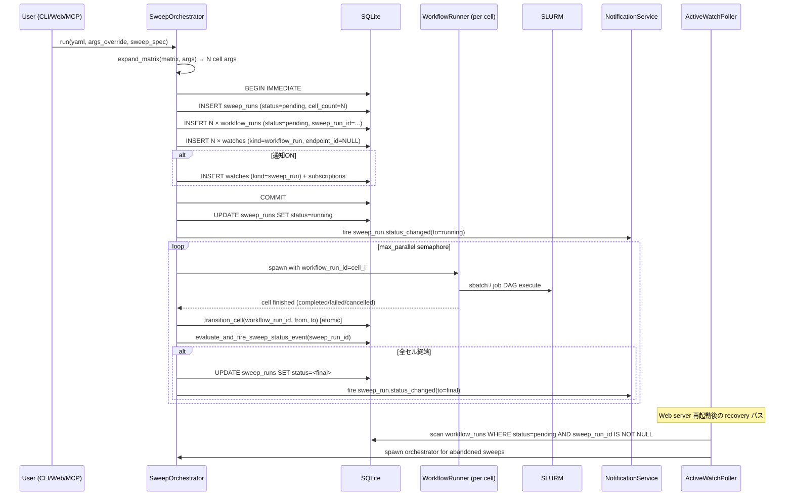
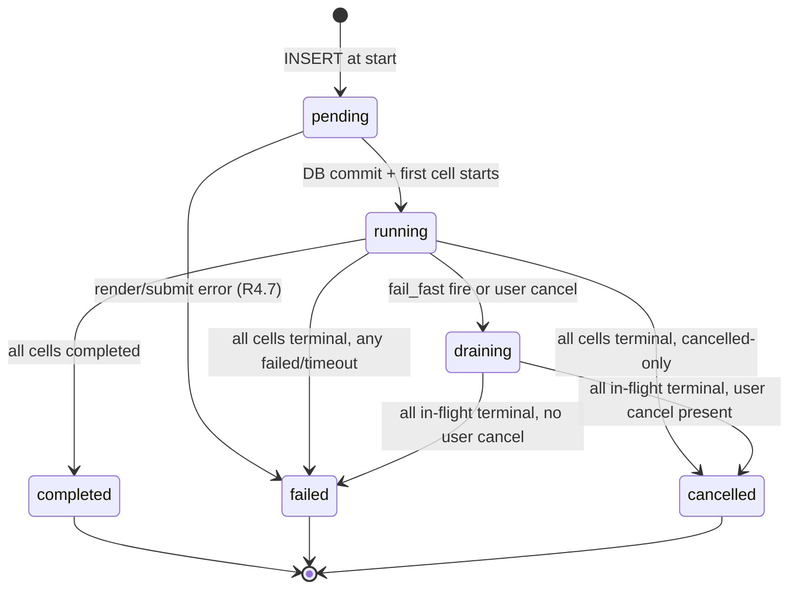

# Design Document

> **Historical naming note** (added during PR #203, the #193 oversized-module
> split): this spec was authored when the SSH-transport SLURM client was
> ``SlurmSSHAdapter`` in ``src/srunx/web/ssh_adapter.py``. It has since been
> renamed to ``SlurmSSHClient`` and moved to ``src/srunx/slurm/clients/ssh.py``.
> The original names are preserved below as historical context; new work
> should target the current paths.

## Overview

srunx ワークフローに `sweep` 概念を追加する。既存の load-time `args` 展開パイプラインを活用しつつ、matrix cross product による N セル生成、各セルの独立 `workflow_run` 永続化、`max_parallel` semaphore による同時実行制御、親 sweep 単位の集約通知を実現する。

実装は **既存 `WorkflowRunner` を再利用した N セル同時実行** モデルを採る。親 sweep オーケストレータ (`SweepOrchestrator`) が matrix 展開 → DB materialize → `anyio.Semaphore(max_parallel)` でセル単位の `WorkflowRunner` を駆動する。各セルの `WorkflowRunner` は事前に materialize 済みの `workflow_run_id` を注入されて動作し、既存の fail-fast なジョブ DAG 実行はそのまま維持される。セル間の failure は親 sweep で吸収され、他セルに波及しない。

通知は親 `sweep_runs.id` にだけ subscription を作り、各セル (子 `workflow_run`) には watch-only を作る。セル status 変化に連動して sweep 集計 (pending/running/terminal) を atomic に更新し、集計が特定ルールに合致すれば `sweep_run.status_changed` イベントを 1 回発火する — これにより 100 セルの sweep でも Slack 通知は 1 通に収束する。

Phase 1 は CLI / Web / MCP の 3 経路すべてで動作する。`sweep:` を書かない既存 YAML は 100% 従来通りに動く。

## Steering Document Alignment

### Technical Standards

`CLAUDE.md` の規約に従う:
- **Python 3.12+** 型ヒント (`str | None`, `list[X]`)
- **Pydantic v2** (`BaseModel`, `Field`, `model_validator`)
- **anyio** ベースの非同期処理 (`asyncio` を直接使わない)
- **uv** で依存管理
- **ruff + mypy + pytest** で品質担保

### Project Structure

既存の `CLAUDE.md` "Current Modular Structure" に新規ファイルを以下配置で追加する:

```
src/srunx/
├── sweep/                              # 新規: sweep ドメイン
│   ├── __init__.py
│   ├── expand.py                       # expand_matrix, merge_sweep_specs(純関数)
│   ├── orchestrator.py                 # SweepOrchestrator(状態機械 + 並列セル駆動)
│   └── aggregator.py                   # evaluate_and_fire_sweep_status_event(共通ヘルパ)
├── db/
│   ├── migrations.py                   # 修正: V2 migration 追加
│   ├── models.py                       # 修正: SweepRun / SweepStatus / EventKind 拡張
│   └── repositories/
│       └── sweep_runs.py               # 新規: SweepRunRepository
├── runner.py                            # 修正: workflow_run_id 注入パラメータ追加
├── notifications/
│   ├── presets.py                       # 修正: sweep_run.status_changed 分岐追加
│   └── adapters/slack_webhook.py        # 修正: sweep メッセージフォーマッタ追加
├── pollers/
│   └── active_watch_poller.py           # 修正: sweep_run 集計ハンドラ追加
├── cli/
│   └── workflow.py                      # 修正: --arg / --sweep / --fail-fast / --max-parallel
├── mcp/
│   └── server.py                        # 修正: run_workflow に args / sweep 追加
└── web/
    ├── routers/
    │   ├── sweep_runs.py                # 新規: /api/sweep_runs 系 API
    │   └── workflows.py                 # 修正: WorkflowRunRequest 拡張、sweep 分岐
    └── frontend/src/
        ├── pages/
        │   ├── SweepRunsPage.tsx        # 新規: 一覧ページ
        │   └── SweepRunDetailPage.tsx   # 新規: 詳細 + セルテーブル
        ├── components/
        │   └── WorkflowRunDialog.tsx    # 修正: args フォームに list toggle + preview
        └── lib/
            └── types.ts                 # 修正: SweepRun 型追加
```

## Code Reuse Analysis

### Existing Components to Leverage

- **`src/srunx/runner.py` (`WorkflowRunner`)**: 現状は `run()` の冒頭で `create_cli_workflow_run()` を呼んで自前で `workflow_run_id` を生成し、`mark_workflow_run_status("running")` / 終了時に `mark_workflow_run_status("completed"/"failed")` を直接呼ぶ (runner.py:718-728, および成功/失敗パスの終了時)。sweep 経路ではこれらの **直接書き込みが `SweepRunRepository.transition_cell` を迂回し、sweep カウンタと event 発火を破壊**する。Phase 1 では以下の改修を行う:
  1. `run()` に新規 kwarg `workflow_run_id: int | None = None` を追加 — 非 None なら `create_cli_workflow_run()` を skip
  2. runner 内部の全 `mark_workflow_run_status(...)` 呼び出しを新設 **`WorkflowRunStateService.update(run_id, from_status, to_status, ...)`** 経由にリファクタする
  3. `WorkflowRunStateService.update` は内部で `workflow_runs.sweep_run_id` を参照し、NULL なら既存 `mark_workflow_run_status` 相当の直書き、非 NULL なら `SweepRunRepository.transition_cell` + `evaluate_and_fire_sweep_status_event` を同一トランザクションで実行する
  
  これにより runner に sweep 知識が漏れず、status 更新の single entry point を通す設計になる。既存の CLI 直接実行 (workflow_run_id=None、通常ワークフロー) は `sweep_run_id=NULL` の分岐で従来通りの挙動。
- **`src/srunx/runner.py:from_yaml`**: YAML ロード + args 展開 + deps 解決の hub。ここに `args_override: dict | None = None` kwarg を追加、YAML `args` にマージしてから既存の Jinja2 レンダリングを行う。変更は局所的 (L459-522 の範囲内)。CLI / Web / MCP すべてここを通るため 1 箇所変更で全経路に波及する。
- **`src/srunx/db/migrations.py`**: `MIGRATIONS` リストに `Migration(version=3, name="v3_sweep_runs", sql=SCHEMA_V3)` を追加(既に V1=v1_initial / V2=v2_dashboard_indexes が存在するので V3)。冪等な `apply_migrations` が既存 DB を V3 まで自動で進める。
- **`src/srunx/db/repositories/base.py` (`BaseRepository`)**: `JSON_FIELDS`, `DATETIME_FIELDS`, `_row_to_model`, `now_iso()` を継承して `SweepRunRepository` を作成。`WorkflowRunRepository` (`db/repositories/workflow_runs.py`) を雛形にする。
- **`src/srunx/notifications/service.py` (`NotificationService.create_watch_for_workflow_run`)**: 現状 `endpoint_id=None` の watch-only 作成に対応済み。各セル (子 workflow_run) に対して `endpoint_id=None` で呼ぶだけで「watch あり、subscription なし」状態が成立する → `fan_out` は空マッチになり delivery を生成しない。新しいヘルパ `NotificationService.create_watch_for_sweep_run(sweep_run_id, endpoint_id, preset)` を追加するが、内部実装は既存 `watches` / `subscriptions` CRUD の薄いラッパー。
- **`src/srunx/notifications/presets.py` (`should_deliver`)**: 分岐を追加するだけで sweep event に対応。`_TERMINAL_SWEEP_RUN_STATUSES = frozenset({"completed", "failed", "cancelled"})` を追加、`_TERMINAL_WORKFLOW_RUN_STATUSES` と同じパターン。
- **`src/srunx/pollers/active_watch_poller.py`**: 現状は job watch と workflow_run watch のみ処理。**workflow_run watch 側の既存 `_process_workflow_watches` (L423-496) の「status 遷移検出 → `workflow_run.status_changed` event 発火」の書き込みを、上述の `WorkflowRunStateService.update` 経由に統一する**。これにより:
  - sweep 配下セル (子 workflow_run) の status 変化が poller 側で検出された場合も、自動的に `transition_cell` + sweep 集計更新 + `evaluate_and_fire_sweep_status_event` が同一トランザクションで実行される
  - poller の既存挙動 (terminal 時に watch close) は `WorkflowRunStateService.update` 成功後に行うので、**集計更新前に watch が close されるバグを防ぐ**
  - 別 poller (sweep_aggregator) を新設しない。Phase 1 は単純さ優先
  
  `WorkflowRunRepository._COLUMNS` に `sweep_run_id` を追加し、poller が観測する `WorkflowRun` に `sweep_run_id` がロード済みで渡るようにする (R5.2)。
- **`src/srunx/callbacks.py` (`NotificationWatchCallback`)**: **変更なし**。sweep でも各セル Runner に既存の `NotificationWatchCallback` を渡せば、セル内ジョブ submission 時の watch 作成は従来通り動く (子 workflow_run の watch は sweep 側で事前作成するので callbacks は重複しない)。
- **`src/srunx/web/routers/workflows.py`**: `WorkflowRunRequest` (L636) に `args_override` / `sweep` フィールドを追加。sweep フィールドが非 None なら `SweepOrchestrator.run()` に委譲、None なら既存のパス。既存 `_reject_python_args` ガードをそのまま `args_override` と `sweep.matrix` 値に適用。

### Phase 1 で変更しない領域

- **`src/srunx/monitor/job_monitor.py`**: CLI 側の継続モニタは触らない。sweep 経路はあくまで `WorkflowRunner` の外側 (親 sweep 層) での orchestration で、セル内部のジョブ監視は既存のまま。
- **SLURM submit 層 (`src/srunx/client.py:Slurm`)**: 変更なし。sweep は N 個の `WorkflowRunner` を並列起動するだけで、sbatch 呼び出しの仕組みは既存通り。
- **既存の CLI --slack フラグ経路 (`SlackCallback`)**: 変更なし。sweep でも CLI `--slack` で旧式 callback を渡せば従来通り動く (sweep レベル通知は別機構、両立する)。

### Integration Points

- **Hub function `WorkflowRunner.from_yaml`**: `args_override` を受ける。3 経路 (CLI/Web/MCP) すべてここを通るので 1 箇所で完結。
- **Sweep 実行エントリ**: 新規 `src/srunx/sweep/orchestrator.py` の `SweepOrchestrator` が CLI/Web/MCP の呼び出し点となる。
- **DB トランザクション境界**: `SweepOrchestrator.materialize_cells()` は 1 つの `BEGIN IMMEDIATE` で `sweep_runs` + N 個 `workflow_runs` + N 個 `watches` (watch-only) を同一 commit する。
- **Status 更新の single entry point**: 新規 `src/srunx/sweep/state_service.py` の `WorkflowRunStateService.update(workflow_run_id, from_status, to_status, *, error=None, completed_at=None, conn: sqlite3.Connection)` — runner / poller / orchestrator のすべての workflow_run 状態遷移を統一。`conn` は必須 (caller が BEGIN IMMEDIATE TX を保持している前提)。呼び出し責務:
  1. **optimistic transition**: `UPDATE workflow_runs SET status=?, completed_at=?, error=? WHERE id=? AND status=?` — rowcount 0 なら return False (他者先行)
  2. **event 発火 (always)**: rowcount=1 なら `events(kind='workflow_run.status_changed', source_ref=f'workflow_run:{id}', payload={from, to, ...})` を INSERT + `NotificationService.fan_out` を同 TX で実行 (既存 active_watch_poller の挙動を runner / orchestrator にも展開、後方互換の副次効果として runner 経路でも `workflow_run.status_changed` イベントが発火するようになる)
  3. **sweep 判定 + 集計**: workflow_runs.sweep_run_id が非 NULL なら `SweepRunRepository.transition_cell(...)` でカウンタ更新 + `evaluate_and_fire_sweep_status_event(sweep_run_id, conn)` を同 TX で実行
  4. event の UNIQUE `(kind, source_ref, payload_hash)` が 2 重呼び出しを吸収するため、runner 経路と poller 経路から同じ transition が観測されても delivery は 1 件以下
  
  この中央集約により、「runner が status を書き換えても event が飛ばない」という現行の仕様差異が解消され、sweep でも非 sweep でも一貫する。
- **Event 発火点**: `evaluate_and_fire_sweep_status_event(sweep_run_id, conn)` が共通ヘルパ。`WorkflowRunStateService.update` が sweep 所属セルの transition を行った直後に同一トランザクション内で呼ぶ。orchestrator は cancel / drain などの sweep 直接操作時にのみ直接呼ぶ。

## Architecture

### Sweep 実行フロー



### 状態遷移 (sweep_runs.status)



`draining` は外部向けには露出しない中間状態。`sweep_run.status_changed` イベントも発火しない。Web UI 表示時は `running` と同じ扱いでよい (または "Cancelling..." バッジ)。

### Concurrency Model

2 つの書き込み経路が同じ workflow_run status を観測しうる:
1. **Orchestrator 経路** (CLI / Web / MCP 内プロセス): `SweepOrchestrator._run_cell` が `WorkflowRunner.run()` 完了後に `WorkflowRunStateService.update(run_id, 'running', <final>)` を呼ぶ
2. **Poller 経路** (Web lifespan): `active_watch_poller._process_workflow_watches` が SLURM 状態集計後に同じ `WorkflowRunStateService.update` を呼ぶ

両経路は `SweepRunRepository.transition_cell` の optimistic lock (`WHERE id=? AND status=?`) で直列化される:

```sql
BEGIN IMMEDIATE;
UPDATE workflow_runs SET status='completed' WHERE id=? AND status='running';
-- rowcount=1 なら transition 実施、0 なら no-op (他方が先行)
```

- 1 回目の呼び出し: rowcount=1、counters 更新 + `evaluate_and_fire_sweep_status_event` 実行
- 2 回目の呼び出し: rowcount=0、何もせず return (idempotent)

`evaluate_and_fire_sweep_status_event` 自体も idempotent (後述)。このため 2 経路が同じ transition を観測しても安全。

**Orchestrator プロセス死亡時の引き継ぎ**: CLI プロセスが SIGKILL で死ぬと orchestrator 経路は停止するが、Web lifespan の poller が引き続き SLURM 状態から transition を検出し、`WorkflowRunStateService.update` を通して sweep status を最終値まで進める。この限りで CLI と Web 単独運用のどちらでも sweep は完了まで走る (前提: Web lifespan が稼働中)。

**両プロセスが共に死亡する場合**: `SweepReconciler` が Web server 再起動時に復旧 (R4.10)。

## Components and Interfaces

### SweepOrchestrator (`src/srunx/sweep/orchestrator.py`)

```python
class SweepOrchestrator:
    """Drives sweep execution: materialize cells, run them with bounded concurrency, aggregate status."""

    def __init__(
        self,
        workflow_yaml_path: Path | None,
        workflow_data: dict,  # 既に YAML パース済み
        args_override: dict[str, Any] | None,
        sweep_spec: SweepSpec,  # matrix, fail_fast, max_parallel
        submission_source: Literal["cli", "web", "mcp"],
        callbacks: list[Callback] | None = None,
        endpoint_id: int | None = None,  # 非 None なら親 sweep に subscription
        preset: str = "terminal",
    ) -> None: ...

    def run(self) -> SweepRun:
        """Execute the sweep. Returns final SweepRun (blocking).

        Raises:
            WorkflowValidationError: matrix 展開失敗 / 空軸 / 型不正
            SweepExecutionError: materialize 段階の DB 失敗
        """
        # 1. matrix 展開
        cells = self._expand_cells()  # len == cell_count
        # 2. DB materialize (sweep_runs + N workflow_runs + N watches)
        sweep_run_id = self._materialize(cells)
        # 3. 実効同時実行数のクランプ (R4.11)
        effective_parallel = min(self.sweep_spec.max_parallel, len(cells))
        if effective_parallel < self.sweep_spec.max_parallel:
            logger.warning(
                f"max_parallel={self.sweep_spec.max_parallel} clamped to "
                f"cell_count={len(cells)}"
            )
        # 注: sweep_runs.max_parallel カラムにはユーザー指定値をそのまま保存する
        # (監査 / reproducibility のため、クランプ値は保存しない)
        # 4. anyio.Semaphore(effective_parallel) で N セルを起動
        ...

    async def arun(self) -> SweepRun:
        """Async variant for Web lifespan tasks."""

    # 内部
    def _expand_cells(self) -> list[dict]: ...  # matrix cross product
    def _materialize(self, cells: list[dict]) -> int: ...  # DB INSERT, returns sweep_run_id
    async def _run_cell(self, sem: anyio.Semaphore, cell_spec: CellSpec) -> None: ...
    def _on_cell_done(self, cell_spec: CellSpec, final_status: str, error: str | None) -> None: ...
    def _should_drain(self) -> bool: ...  # fail_fast 判定
    def _drain(self) -> None: ...  # pending セルを cancelled に一括遷移
```

**キーポイント**:
- `_run_cell` は `WorkflowRunner(..., workflow_run_id=cell.workflow_run_id).run()` を呼ぶ同期ブロッキング処理を `anyio.to_thread.run_sync` でスレッドプールに逃がす(既存 `WorkflowRunner.run()` は同期 API)。
- `_on_cell_done` は **`sweep/aggregator.py:transition_cell_and_evaluate()` を 1 回呼ぶだけ**。atomic transition + event 発火は aggregator 側に委譲する(Web 経路の poller と CLI 経路で共通化)。
- cancel 要求は `SweepOrchestrator.request_cancel()` が `sweep_runs.cancel_requested_at` を UPDATE する。`_run_cell` ループは次セル起動前に `_should_drain()` で判定し、新規セルを起動しない。
- `fail_fast=true` 発火は `_on_cell_done` 内で「failed セル検出 → `_drain()` 呼び出し」経由。`_drain()` は `UPDATE workflow_runs SET status='cancelled' WHERE sweep_run_id=? AND status='pending'` を atomic に実行し sweep カウンタを同期。

### expand_matrix (`src/srunx/sweep/expand.py`)

```python
def expand_matrix(
    matrix: dict[str, list[Any]],
    base_args: dict[str, Any],
) -> list[dict[str, Any]]:
    """Cross product of matrix axes merged into base_args.

    Example:
        expand_matrix({"lr": [0.001, 0.01], "seed": [1, 2]}, {"dataset": "cifar10"})
        # => [
        #   {"lr": 0.001, "seed": 1, "dataset": "cifar10"},
        #   {"lr": 0.001, "seed": 2, "dataset": "cifar10"},
        #   {"lr": 0.01,  "seed": 1, "dataset": "cifar10"},
        #   {"lr": 0.01,  "seed": 2, "dataset": "cifar10"},
        # ]

    Raises:
        WorkflowValidationError: matrix が空 / 空軸 / 非 scalar 値
    """

def merge_sweep_specs(
    yaml_sweep: SweepSpec | None,
    cli_sweep: SweepSpec | None,
    cli_arg_overrides: dict[str, Any] | None,
) -> SweepSpec | None:
    """CLI と YAML の sweep 定義をマージ(CLI が軸単位で上書き)。

    Raises:
        WorkflowValidationError: 同一キーが --arg と --sweep に現れた
    """
```

純関数で実装、unit test しやすい。validation ルール (R2.4 / R2.5 / R2.8 / R2.10 / R3.6 / R3.8) はすべてここに集約。

### SweepSpec / CellSpec (`src/srunx/sweep/__init__.py` or `models.py` 拡張)

```python
class SweepSpec(BaseModel):
    matrix: dict[str, list[ScalarValue]] = Field(default_factory=dict)
    fail_fast: bool = False
    max_parallel: int  # required, validated > 0

class CellSpec(BaseModel):
    workflow_run_id: int
    effective_args: dict[str, Any]  # base_args + matrix axis values
    cell_index: int  # 0-indexed for logging
```

### SweepRunRepository (`src/srunx/db/repositories/sweep_runs.py`)

`WorkflowRunRepository` パターン踏襲:

```python
class SweepRunRepository(BaseRepository):
    JSON_FIELDS = ("matrix", "args")
    DATETIME_FIELDS = ("started_at", "completed_at", "cancel_requested_at")
    _COLUMNS = (...)  # DDL 順

    def create(self, *, name, matrix, args, fail_fast, max_parallel,
               cell_count, submission_source, workflow_yaml_path=None) -> int: ...
    def get(self, id: int) -> SweepRun | None: ...
    def list_all(self, limit: int = 200) -> list[SweepRun]: ...
    def update_status(self, id, status, *, error=None, completed_at=None) -> bool: ...
    def request_cancel(self, id: int) -> bool: ...  # cancel_requested_at = now
    def list_cells(self, id: int) -> list[WorkflowRun]: ...  # JOIN workflow_runs

    def transition_cell(
        self,
        workflow_run_id: int,
        from_status: str,
        to_status: str,
        *,
        error: str | None = None,
        completed_at: str | None = None,
    ) -> bool:
        """Atomic: UPDATE workflow_runs (with optimistic lock) + sweep_runs counters.

        Returns True if transition actually occurred (1 row affected), False if no-op.

        Idempotent: calling with the same from/to twice is safe — second call returns False.
        """
```

### evaluate_and_fire_sweep_status_event (`src/srunx/sweep/aggregator.py`)

```python
def evaluate_and_fire_sweep_status_event(
    sweep_run_id: int,
    conn: sqlite3.Connection,
) -> None:
    """Evaluate sweep status transitions and fire events if needed.

    Called from WorkflowRunStateService.update (both orchestrator and poller paths
    go through the same service), inside an existing BEGIN IMMEDIATE transaction.

    Algorithm:
      1. SELECT sweep_runs row (current status, all cells_* counters, cancel_requested_at)
      2. Compute target status using R4.6 rules:
         - cancel_requested_at IS NOT NULL AND cells_pending + cells_running == 0 → 'cancelled'
         - cells_pending + cells_running == 0 AND cells_failed > 0 → 'failed'
         - cells_pending + cells_running == 0 AND cells_cancelled > 0 (no failed) → 'cancelled'
         - cells_pending + cells_running == 0 AND cells_completed == cell_count → 'completed'
         - cells_running > 0 AND current status == 'pending' → 'running' (first-cell-start)
         - otherwise → keep current status (no-op)
      3. Idempotency guard: if target == current status → return (no UPDATE, no event)
      4. UPDATE sweep_runs SET status=target, completed_at=? WHERE id=? AND status=current_status
         - WHERE 節の status=current_status が optimistic lock (並行呼び出し抑止)
         - rowcount=0 なら他方が先行、return
      5. INSERT events(kind='sweep_run.status_changed', source_ref=f'sweep_run:{id}', payload={...})
         - payload_hash は (kind, source_ref, from, to, counts) で決定的に計算
         - UNIQUE(kind, source_ref, payload_hash) で 2 重 insert は DB 側で吸収 (二次防衛線)
      6. NotificationService.fan_out(event_id, conn) を同一 TX 内で呼ぶ

    Idempotency guarantees:
      - Step 3 で target == current なら何もしない (primary guard)
      - Step 4 の WHERE 節で状態が既に進んでいれば rowcount=0 (secondary guard)
      - Step 5 の UNIQUE index で event レベルの重複を DB が吸収 (tertiary guard)
      
      三重の防衛線により、同一 transition に対し event は多くとも 1 回発火、delivery も多くとも 1 件生成される。
    """
```

### Runner 変更 (`src/srunx/runner.py`)

```python
class WorkflowRunner:
    @classmethod
    def from_yaml(
        cls,
        yaml_path: Path | str,
        callbacks: list[Callback] | None = None,
        single_job: str | None = None,
        args_override: dict[str, Any] | None = None,  # 新規
    ) -> "WorkflowRunner": ...

    def run(
        self,
        from_job: str | None = None,
        to_job: str | None = None,
        single_job: str | None = None,
        *,
        workflow_run_id: int | None = None,  # 新規: sweep で事前 materialize した id を注入
    ) -> dict[str, RunnableJobType]:
        # 冒頭の create_cli_workflow_run を条件分岐
        if workflow_run_id is None:
            workflow_run_id = create_cli_workflow_run(...)
        # 以降は既存ロジック
```

既存の CLI 実行パス (workflow_run_id=None) は現状動作を維持。sweep 経路でのみ非 None を渡す。

### CLI 変更 (`src/srunx/cli/workflow.py`)

`_execute_workflow` に以下オプションを追加 (Typer `--arg` / `--sweep` は `list[str]`):

```python
def run_command(
    ...,
    arg: list[str] = typer.Option(None, "--arg", help="Override args: KEY=VALUE (repeatable)"),
    sweep: list[str] = typer.Option(None, "--sweep", help="Sweep axis: KEY=v1,v2,v3 (repeatable)"),
    fail_fast: bool = typer.Option(False, "--fail-fast"),
    max_parallel: int | None = typer.Option(None, "--max-parallel"),
    ...
) -> None:
    args_override = parse_arg_flags(arg)  # KEY=VALUE → dict
    cli_sweep = parse_sweep_flags(sweep, fail_fast, max_parallel)
    _execute_workflow(
        yaml_path=yaml,
        args_override=args_override,
        sweep_spec=cli_sweep,  # None なら YAML のみ、非 None なら YAML とマージ
        ...
    )
```

`_execute_workflow` 内で:
1. YAML をロード
2. `merge_sweep_specs(yaml_sweep, cli_sweep, args_override)` で最終仕様を決定
3. 最終仕様が sweep 有り → `SweepOrchestrator(...).run()`
4. sweep 無し → 従来の `WorkflowRunner.from_yaml(..., args_override=...).run()`

### Web API 変更 (`src/srunx/web/routers/workflows.py`)

```python
class WorkflowRunRequest(BaseModel):
    from_job: str | None = None
    to_job: str | None = None
    single_job: str | None = None
    dry_run: bool = False
    notify: bool = False
    endpoint_id: int | None = None
    preset: str = "terminal"
    args_override: dict[str, Any] = Field(default_factory=dict)  # 新規
    sweep: SweepSpecRequest | None = None  # 新規

class SweepSpecRequest(BaseModel):
    matrix: dict[str, list[Any]] = Field(default_factory=dict)
    fail_fast: bool = False
    max_parallel: int = 4  # サーバ側デフォルト (R7.9)

@router.post("/workflows/{name}/run", status_code=202)
async def run_workflow(name: str, body: WorkflowRunRequest, ...) -> ...:
    _reject_python_args(body.args_override)  # 既存ガード
    if body.sweep:
        _reject_python_args_in_matrix(body.sweep.matrix)
        orchestrator = SweepOrchestrator(...)
        sweep_run = await orchestrator.arun()
        return {"sweep_run_id": sweep_run.id, ...}
    else:
        # 従来パス
        ...
```

新規ルーター:

```python
# src/srunx/web/routers/sweep_runs.py
@router.get("/sweep_runs")
def list_sweep_runs(repo = Depends(...)) -> list[SweepRun]: ...

@router.get("/sweep_runs/{sweep_run_id}")
def get_sweep_run(sweep_run_id: int, repo = Depends(...)) -> SweepRun: ...

@router.get("/sweep_runs/{sweep_run_id}/cells")
def list_cells(sweep_run_id: int, repo = Depends(...)) -> list[WorkflowRun]: ...

@router.post("/sweep_runs/{sweep_run_id}/cancel")
async def cancel_sweep(sweep_run_id: int, repo = Depends(...)) -> ...: ...
```

既存 `/workflows/runs` のレスポンスモデルに `sweep_run_id: int | None = None` を追加 (後方互換)。

**Phase 1 限定事項**:
- ~~**Web sweep は常にローカル SLURM を使う**~~ **(Phase 2 で解消済み)**: `_dispatch_sweep` は `SlurmSSHExecutorPool(adapter.connection_spec, size=min(max_parallel, 8))` を構築し `SweepOrchestrator(..., executor_factory=pool.lease)` として注入する。各セルの `WorkflowRunner` は pool からリースした `SlurmSSHAdapter` クローン経由で submit + monitor し、pool は `_run_sweep_background` の finally で close される。`executor_factory=None` default は CLI / MCP 経路で維持され、既存のローカル `Slurm` シングルトン挙動は変わらない。
- **MCP sweep の `triggered_by` は `'web'` で記録される**: `workflow_runs.triggered_by` CHECK は v1 で `('cli','web','schedule')` に固定されている。MCP sweep の子セルは暫定的に `'web'` に寄せる (`_TRIGGERED_BY_BY_SOURCE['mcp'] = 'web'`)。Phase 2 で CHECK を `'mcp'` まで広げる migration を追加した後、この対応を正しく `'mcp'` に変更する。

### Web UI 変更

**Phase 1 の UI スコープ注意**: バックエンド (DB / orchestrator / 通知統合) の state machine 整合性を先に固定する。UI は以下の 3 要素に限定、それ以外の拡張 (bulk retry、export、filter 等) は Phase 2 スコープ:

- **`WorkflowRunDialog.tsx`**: 既存 args フォームの各フィールドに `<Switch>` (単一値 / リスト)。リストモードではカンマ区切り input。list 化されたフィールドを検出して `sweep.matrix` を組み立て、cell_count プレビュー (`Math.max(1, axes.reduce((a,v)=>a*v.length, 1))`)。
- **Advanced セクション**: `fail_fast` checkbox + `max_parallel` number input (デフォルト 4)。
- **`SweepRunsPage.tsx`** (新規): `/api/sweep_runs` をフェッチ、table 表示。列: name / status / progress (cells_completed / cell_count) / created_at / actions (view, cancel)。
- **`SweepRunDetailPage.tsx`** (新規): 上段 meta (matrix JSON / fail_fast / max_parallel / status / cell counts), 下段 cells テーブル。セル行クリックで既存 `/workflow_runs/:id` 詳細ページへドリルダウン (新規ページを作らず再利用)。

### MCP 変更 (`src/srunx/mcp/server.py`)

```python
@mcp.tool()
def run_workflow(
    yaml_path: str,
    from_job: str | None = None,
    to_job: str | None = None,
    single_job: str | None = None,
    dry_run: bool = False,
    args: dict[str, Any] | None = None,  # 新規
    sweep: dict[str, Any] | None = None,  # 新規
) -> dict[str, Any]:
    if args: _reject_python_args(args)  # 既存ガード相当
    if sweep: _reject_python_args_in_matrix(sweep.get("matrix", {}))
    ...
```

## Data Models

### SweepRun (Pydantic, `src/srunx/db/models.py`)

```python
SweepStatus = Literal["pending", "running", "draining", "completed", "failed", "cancelled"]
SweepSubmissionSource = Literal["cli", "web", "mcp"]

class SweepRun(BaseModel):
    model_config = ConfigDict(extra="forbid")

    id: int
    name: str
    workflow_yaml_path: str | None = None
    status: SweepStatus
    matrix: dict[str, list[Any]]
    args: dict[str, Any] | None = None
    fail_fast: bool
    max_parallel: int
    cell_count: int
    cells_pending: int
    cells_running: int
    cells_completed: int
    cells_failed: int
    cells_cancelled: int
    submission_source: SweepSubmissionSource
    started_at: datetime
    completed_at: datetime | None = None
    cancel_requested_at: datetime | None = None
    error: str | None = None
```

### EventKind 拡張

```python
# src/srunx/db/models.py
EventKind = Literal[
    "job.submitted",
    "job.status_changed",
    "workflow_run.status_changed",
    "sweep_run.status_changed",  # 新規
]
```

### WatchKind 拡張

```python
WatchKind = Literal["job", "workflow_run", "sweep_run"]  # 新規 'sweep_run' 追加
```

### SCHEMA_V3 (`src/srunx/db/migrations.py`)

**重要**: `apply_migrations` は既に `BEGIN IMMEDIATE` で各マイグレーションをラップするため、SCHEMA_V3 内で `BEGIN` / `COMMIT` は書かない。`PRAGMA foreign_keys=OFF;` は migration 単位でマネージする必要があるため、マイグレーション実行前に `apply_migrations` 側で OFF を明示するか、もしくは SQLite の autocommit モードで run すれば良い — 実装時の詳細は tasks.md 側で `apply_migrations` の既存 TX 管理を確認しつつ決定する。

```sql
-- ============================================================
-- V3: sweep_runs table, workflow_runs.sweep_run_id, CHECK 拡張
-- ============================================================

-- 1) sweep_runs 新設
CREATE TABLE sweep_runs (
    id                  INTEGER PRIMARY KEY AUTOINCREMENT,
    name                TEXT NOT NULL,
    workflow_yaml_path  TEXT,
    status              TEXT NOT NULL CHECK (status IN ('pending','running','draining','completed','failed','cancelled')),
    matrix              TEXT NOT NULL,
    args                TEXT,
    fail_fast           INTEGER NOT NULL DEFAULT 0 CHECK (fail_fast IN (0,1)),
    max_parallel        INTEGER NOT NULL,
    cell_count          INTEGER NOT NULL,
    cells_pending       INTEGER NOT NULL DEFAULT 0,
    cells_running       INTEGER NOT NULL DEFAULT 0,
    cells_completed     INTEGER NOT NULL DEFAULT 0,
    cells_failed        INTEGER NOT NULL DEFAULT 0,
    cells_cancelled     INTEGER NOT NULL DEFAULT 0,
    submission_source   TEXT NOT NULL CHECK (submission_source IN ('cli','web','mcp')),
    started_at          TEXT NOT NULL,
    completed_at        TEXT,
    cancel_requested_at TEXT,
    error               TEXT
);
CREATE INDEX idx_sweep_runs_status ON sweep_runs(status);
CREATE INDEX idx_sweep_runs_started_at ON sweep_runs(started_at);

-- 2) workflow_runs に sweep_run_id 追加
ALTER TABLE workflow_runs
    ADD COLUMN sweep_run_id INTEGER REFERENCES sweep_runs(id) ON DELETE SET NULL;
CREATE INDEX idx_workflow_runs_sweep_run_id ON workflow_runs(sweep_run_id);

-- 3) events.kind CHECK 拡張 (table rebuild)
--    既存 v1_initial の events CHECK 許可値 (migrations.py L154-160):
--      'job.submitted', 'job.status_changed', 'workflow_run.status_changed',
--      'resource.threshold_crossed', 'scheduled_report.due'
--    → V3 で 'sweep_run.status_changed' を追加
CREATE TABLE events_v3 (
    id           INTEGER PRIMARY KEY AUTOINCREMENT,
    kind         TEXT NOT NULL CHECK (kind IN (
        'job.submitted',
        'job.status_changed',
        'workflow_run.status_changed',
        'sweep_run.status_changed',
        'resource.threshold_crossed',
        'scheduled_report.due'
    )),
    source_ref   TEXT NOT NULL,
    payload      TEXT NOT NULL,
    payload_hash TEXT NOT NULL,
    observed_at  TEXT NOT NULL
);
INSERT INTO events_v3 (id, kind, source_ref, payload, payload_hash, observed_at)
    SELECT id, kind, source_ref, payload, payload_hash, observed_at FROM events;
DROP TABLE events;
ALTER TABLE events_v3 RENAME TO events;
CREATE UNIQUE INDEX idx_events_dedup      ON events(kind, source_ref, payload_hash);
CREATE INDEX        idx_events_source_ref ON events(source_ref, observed_at);
CREATE INDEX        idx_events_kind       ON events(kind, observed_at);

-- 4) watches.kind CHECK 拡張 (table rebuild)
--    既存 v1_initial の watches CHECK 許可値 (migrations.py L132):
--      'job', 'workflow_run', 'resource_threshold', 'scheduled_report'
--    → V3 で 'sweep_run' を追加
CREATE TABLE watches_v3 (
    id         INTEGER PRIMARY KEY AUTOINCREMENT,
    kind       TEXT NOT NULL CHECK (kind IN ('job','workflow_run','sweep_run','resource_threshold','scheduled_report')),
    target_ref TEXT NOT NULL,
    filter     TEXT,
    created_at TEXT NOT NULL,
    closed_at  TEXT
);
INSERT INTO watches_v3 (id, kind, target_ref, filter, created_at, closed_at)
    SELECT id, kind, target_ref, filter, created_at, closed_at FROM watches;
DROP TABLE watches;
ALTER TABLE watches_v3 RENAME TO watches;
CREATE INDEX idx_watches_kind_target ON watches(kind, target_ref);
CREATE INDEX idx_watches_open        ON watches(closed_at) WHERE closed_at IS NULL;
```

**watches スキーマの重要確認**: 既存 `watches` テーブルに **endpoint_id / preset カラムは存在しない**。subscription は別テーブル `subscriptions(watch_id, endpoint_id, preset)` が link する構造 (migrations.py L141-150)。「watch-only」とは `watches` 行を作るが `subscriptions` 行を作らないことを指す。`NotificationService.create_watch_for_workflow_run(endpoint_id=None)` は内部で watches 行だけ作って subscriptions は作らない挙動になる。sweep 設計でもこの分離を維持する。

**注意**:
- **V1 の既存カラム定義を正確に写経**する必要がある。上記 DDL は `migrations.py:152-168` を直接参照して作成済み。実装タスクでは migrations.py から再確認する。
- **V3 migration の完了後**、`PRAGMA foreign_key_check` / `PRAGMA index_list('events')` / `PRAGMA index_list('watches')` を自動テストで検証する (R5.3 準拠)。
- **既存 `resource.threshold_crossed` / `scheduled_report.due` kind の CHECK 制約保持**: 明示的に列挙済み。`watches.kind` でも `resource_threshold` / `scheduled_report` の短縮形が別に定義されている点に注意 (events.kind と watches.kind は別体系)。

### Cell args の保存

各セルの実効 args (base_args + matrix 軸値マージ後) は `workflow_runs.args` カラム (既存) に JSON で保存する。`sweep_runs.matrix` は起動時の matrix 宣言 snapshot のみ保存し、展開後の per-cell 値は子 workflow_run 側に責務分散する。

**値順序の決定性**: `sweep_runs.matrix` の JSON は `json.dumps(..., sort_keys=False)` で insertion order を保持する。cell_index は `itertools.product(*matrix.values())` の列挙順に一致し、これを reproducibility の契約とする。CPython 3.7+ の dict 順序保証と SQLite TEXT 列の byte-safe 保存でラウンドトリップが成立する。

### submission_source / triggered_by 対応表

sweep の起動経路と、配下 `workflow_runs.triggered_by` / `jobs.submission_source` の CHECK 制約との対応:

| 起動経路 | `sweep_runs.submission_source` | 子 `workflow_runs.triggered_by` | 孫 `jobs.submission_source` |
|---|---|---|---|
| CLI | `'cli'` | `'cli'` | `'workflow'` (既存) |
| Web | `'web'` | `'web'` | `'workflow'` (既存) |
| MCP | `'mcp'` | `'web'` (**後述**) | `'workflow'` (既存) |

**MCP 経由の子 workflow_run の triggered_by**: 既存 `workflow_runs.triggered_by` CHECK 制約は `('cli','web','schedule')` で `'mcp'` を含まない。Phase 1 では既存 CHECK 制約を壊さないため **子 workflow_run は `'web'` で記録** し、親 sweep は `submission_source='mcp'` で記録する。両者の不一致は設計意図 (sweep レベルで MCP 経由を識別できる、子セルは既存集計と互換) を意図した妥協案。Phase 2 で `workflow_runs.triggered_by` CHECK 拡張を検討可能 (本 spec スコープ外)。

### representative_error の決定ルール

R6.4 で payload に含める `representative_error` の選択ルール:

- **対象**: `sweep_runs.id = sweep.id AND status = 'failed'` の workflow_run のみ。`cancelled` / `timeout` のセル error は対象外 (Phase 1 では SLURM 側 TIMEOUT を 'failed' 扱いで記録する設計なので、明示的 `'cancelled'` のみ除外される)
- **タイブレーク**: `completed_at ASC, id ASC` で昇順ソートし最初の 1 行の `error` フィールドを採用
- **該当なし**: 全セル成功 / cancelled のみ → `representative_error = None`

この規則は純粋な SQL クエリで再現可能で、並行観測に対しても決定的。

## Error Handling

### Error Categories

1. **Load-time validation errors** (`WorkflowValidationError`): matrix 空軸 / 非 scalar / 未指定 max_parallel / --arg と --sweep のキー衝突 / cell_count 上限超過 / matrix 0 軸
   - ハンドリング: orchestrator 起動前に捕捉、`sweep_runs` 行は作成せず、CLI は exit 1、Web は 422 を返す。

2. **Materialize errors** (R4.7): matrix 展開は成功したが DB INSERT で失敗 (FK violation, disk full 等)
   - ハンドリング: 同一トランザクションを rollback (`sweep_runs` + `workflow_runs` どちらも残さない)。別トランザクションで `sweep_runs` に `status='failed', error=<原因>, cell_count=0` の行を書き込み、失敗の可視性を確保。

3. **Cell submit errors** (個別セルの sbatch 失敗 / `WorkflowRunner.run()` 例外): セル単位で `workflow_runs.status='failed'` に遷移、他セルに波及させない。
   - `fail_fast=true` なら `_drain()` 発火、他 pending をキャンセル。`fail_fast=false` なら続行。

4. **Cancel races** (ユーザー cancel と sweep 完了が同時): `cancel_requested_at` が set されているかで R4.6 の優先度判定。atomic な評価は `evaluate_and_fire_sweep_status_event` が単一トランザクションで行う。

5. **Crash recovery** (Web server 再起動): 起動時の reconciler (`SweepReconciler.scan_and_resume()`) が `sweep_runs.status IN ('pending', 'running', 'draining')` を走査。具体的アルゴリズム:

```python
def scan_and_resume(now: datetime) -> None:
    """Lifespan 開始時に 1 度だけ実行。active_watch_poller 起動より前に走る。"""
    for sweep in SweepRunRepository.list_incomplete():  # status IN (pending, running, draining)
        if sweep.status == 'draining':
            # ユーザー cancel or fail_fast 発火済み → 新規起動しない
            # 実行中セル (status='running') は active_watch_poller が既存機構で完走を検出
            # すべて完走後、WorkflowRunStateService.update → evaluate_and_fire_sweep_status_event が
            # 最終 status (cancelled or failed) を確定する
            continue
        
        running_cells = WorkflowRunRepository.count(sweep_run_id=sweep.id, status='running')
        pending_cells = WorkflowRunRepository.list(sweep_run_id=sweep.id, status='pending')
        
        if not pending_cells and not running_cells:
            # 全セル終端済みだが sweep status が更新されずに残ったケース
            # → evaluate_and_fire_sweep_status_event を強制呼び出しで final status 確定
            evaluate_and_fire_sweep_status_event(sweep.id, conn)
            continue
        
        # headroom: max_parallel から既に running 中のセル数を引く
        headroom = max(0, sweep.max_parallel - running_cells)
        if headroom > 0 and pending_cells:
            # SweepOrchestrator.resume_from_db(sweep, pending_cells[:headroom + rest]) を起動
            # orchestrator は pending セルを順次 semaphore で制御しながら消化
            SweepOrchestrator.resume_from_db(sweep_run=sweep, pending_cells=pending_cells)
        # running セル自体は active_watch_poller が status 遷移検出を引き継ぐ (既存機構)
```

`SweepReconciler` は **lifespan 開始時点で 1 度だけ** 走る。`active_watch_poller` より先に起動して `running` セルの transition 観測権限を poller に引き渡す。CLI 経路では SIGINT ハンドラが同等のマーク (cancel_requested_at) を打ち、プロセス内の orchestrator が drain を行う (Web server 不在でも CLI 単独 graceful 終了可能)。

### Error Propagation Matrix

| Source | CLI | Web API | MCP |
|---|---|---|---|
| matrix 展開エラー | exit 1 + stderr | 422 JSON | error dict |
| max_parallel 未指定 | exit 1 | サーバ側 default 4 適用 (R7.9) | error dict |
| `python:` in args (Web/MCP) | (CLI は許可) | 422 | error dict |
| Cell sbatch 失敗 | cell='failed'、続行 (fail_fast=false) | 同 | 同 |
| Cancel during sweep | SIGINT → request_cancel | POST cancel → 202 | N/A (Phase 1) |

## Testing Strategy

### Unit Tests (新規)

1. **`tests/sweep/test_expand.py`**:
   - cross product 基本ケース (2軸x2軸 = 4 セル)
   - 1軸1値 → 1 セル(R2.11)
   - 空軸 `[]` → ValueError
   - 空 matrix `{}` → ValueError
   - 非 scalar 値 → ValueError
   - base_args と matrix 軸の merge 優先順位
   - `merge_sweep_specs`: YAML+CLI の軸単位上書き、--arg と --sweep の衝突検出

2. **`tests/sweep/test_orchestrator.py`**:
   - materialize の atomic 性 (FK違反をモックして rollback 検証)
   - `_drain` の一括 pending → cancelled atomic UPDATE
   - cancel 要求後に failed セルが到達しても final status が cancelled (R4.6 優先度)
   - `max_parallel > cell_count` で semaphore がクランプされる
   - R4.10 crash 回復: sweep_runs.status='running' + pending セル残 → reconciler で再開
   - fail_fast=true で pending セル cancel、実行中セル継続

3. **`tests/db/test_sweep_repository.py`**:
   - `transition_cell` の optimistic locking (同じ from で 2 回呼んで 2 回目は False)
   - カウンタ整合性 (from-1, to+1 が atomic)
   - マイグレーション V1→V2 の冪等性
   - table rebuild 後に既存 UNIQUE/FK/index が保持されていること (`PRAGMA` 検証)

4. **`tests/notifications/test_sweep_events.py`**:
   - `should_deliver(preset='terminal', 'sweep_run.status_changed', 'running')` → False
   - `should_deliver(preset='terminal', 'sweep_run.status_changed', 'completed')` → True
   - `evaluate_and_fire_sweep_status_event`: pending→running で 1 event、全終端で 1 event
   - 中間 draining では event 発火しない
   - `representative_error` 決定性 (completed_at 最早、id タイブレーク)

5. **`tests/cli/test_workflow_sweep.py`**:
   - `--arg KEY=VALUE` パース
   - `--sweep lr=0.001,0.01` パース
   - `--arg` と `--sweep` のキー衝突で exit 1
   - `=` 複数含みの値 (`--arg cmd=echo=hi`)
   - 空要素 (`--sweep x=a,,b`) で空文字列保持

### Integration Tests

6. **`tests/integration/test_sweep_end_to_end.py`**:
   - Fake SLURM (既存 test infra の `fake_slurm`) で 9 セル sweep、1 セル強制 fail
   - sweep_run.status=failed、cells_completed=8, cells_failed=1
   - sweep_run.status_changed イベントが pending→running で 1、終端で 1 の計 2 回発火
   - 子 workflow_run の watch は endpoint_id=NULL で created、delivery は作られない
   - 親 sweep watch には 1 件の delivery (preset=terminal)

7. **`tests/integration/test_sweep_cancel.py`**:
   - Sweep 起動中に POST cancel、未起動セルが cancelled、実行中完走後 sweep=cancelled

8. **`tests/integration/test_sweep_crash_recovery.py`**:
   - sweep 起動中に Web server プロセスを kill → 再起動
   - `SweepReconciler` が pending セルを再開、最終的に完走

### E2E Tests (Playwright)

9. **`src/srunx/web/frontend/e2e/sweep-builder.spec.ts`**:
   - Run ダイアログで args フィールドを list mode に切替、cell_count プレビュー表示
   - cell_count=12 で確認ダイアログ (閾値 10 超え)
   - submit → SweepRunsPage に遷移、新規行が pending で現れる
   - セルテーブルから workflow_run 詳細へドリルダウン

### Regression Tests

10. **既存テスト 1370 件**が全て pass する(R10.4)。特に `tests/test_runner.py` と `tests/test_workflows.py` は `WorkflowRunner.run()` の `workflow_run_id` kwarg 追加で回帰しやすい。

## Open Points (design 完了時点で残る判断)

どれも tasks.md でカバー可能な粒度:

1. `SweepReconciler` の実装場所 → **`src/srunx/sweep/reconciler.py` で確定**。lifespan からは単発の `scan_and_resume()` を `active_watch_poller` 起動より前に 1 回だけ呼ぶ。
2. `SweepOrchestrator.arun` の並列制御 → **`anyio.create_task_group()` + `anyio.Semaphore(effective_parallel)` の標準パターンで確定**。既存 `PollerSupervisor` 実装に準拠。
3. CLI sweep 実行時の出力 → **Rich の `Progress` で cells_completed / cell_count ライブ表示を Phase 2 に延期**。Phase 1 は最低限、セル開始・終了のログ行 + 最終集計ログで済ませる。
4. `SCHEMA_V3` マイグレーションの `PRAGMA foreign_keys=OFF` 発行タイミング → tasks.md の Phase A で `apply_migrations` のロジックを再確認し、table rebuild ステップが `apply_migrations` の既存 `BEGIN IMMEDIATE` と衝突しない方式を採用 (migration の単一 SQL 内で `PRAGMA` を書けないので、`apply_migrations` 側に「table rebuild migration は TX 外で実行」の分岐を足すか、FK OFF のまま apply する前提で設計を見直す)。
