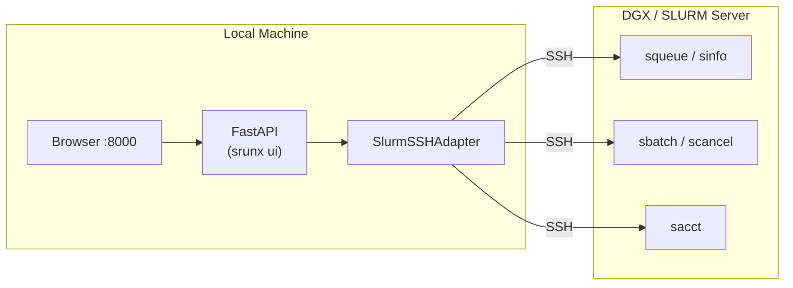
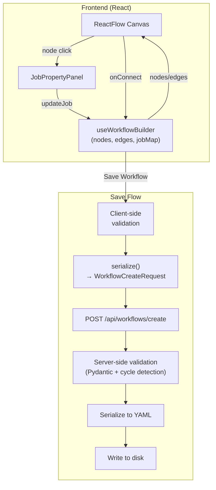
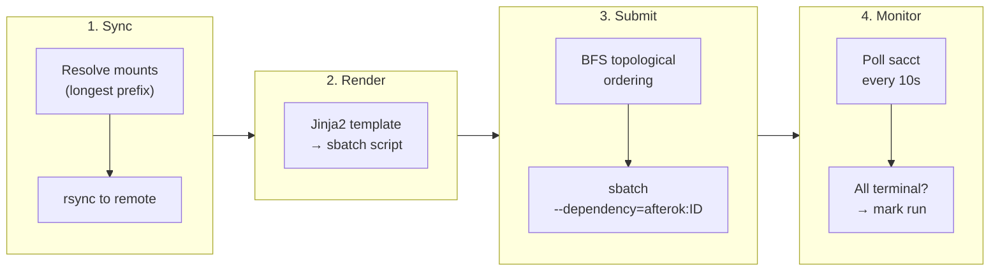

# Architecture

This document explains the internal architecture and design decisions of srunx.

## Overview

srunx is organized as a modular Python library with clear separation of concerns:

``` text
src/srunx/
├── models.py          # Data models and validation (Pydantic)
├── client.py          # Local SLURM client (subprocess-based)
├── client_protocol.py # Client + JobSnapshot (shared interface)
├── runner.py          # Workflow execution engine
├── callbacks.py       # Notification system (Slack, etc.)
├── config.py          # Configuration management
├── exceptions.py      # Custom exceptions
├── formatters.py      # Output formatting utilities
├── logging.py         # Centralized logging (Loguru)
├── template.py        # SLURM script template rendering
├── utils.py           # Utility functions
├── cli/               # Command-line interface (Typer)
├── containers/        # Container runtime adapters (Pyxis, Apptainer)
├── db/                # SQLite-backed state persistence + repositories
├── mcp/               # MCP server for AI agent integration
├── monitor/           # Job and resource monitoring
├── notifications/     # Notification domain (events → deliveries fan-out)
├── pollers/           # Background lifespan tasks (watch / delivery / snapshots)
├── ssh/               # SSH integration for remote SLURM
├── sync/              # rsync-based file synchronization
├── templates/         # SLURM script templates (Jinja2)
└── web/               # Web UI (FastAPI + React)
```

## Two Execution Paths

srunx has two independent paths for interacting with SLURM:

**Local execution** (`srunx.slurm.local.Slurm`)  
Calls `sbatch` directly via `subprocess`. Used when the CLI runs on the
same machine (or a login node) where SLURM is available.

**Remote/SSH execution** (`srunx.ssh.core.client.SSHSlurmClient`)  
Connects to a remote SLURM server via Paramiko SSH and executes `sbatch`
remotely. Supports ProxyJump for multi-hop connections.

## File Transfer Strategy

The SSH path uses two complementary file transfer mechanisms:

**SFTP (Paramiko)** — for ephemeral single-file staging  
`upload_file()` transfers a single script to `/tmp/srunx/` on the
remote server. `_write_remote_file()` writes in-memory script content.
Both use Paramiko's SFTP subsystem.

**rsync (subprocess)** — for project directory synchronization  
`sync_project()` uses the `RsyncClient` to sync an entire project
directory to `~/.config/srunx/workspace/{repo_name}/` on the remote
server. This enables scripts that import local modules to work correctly
on the remote side. rsync provides delta transfers, exclude patterns, and
works through ProxyJump via the `-e` flag.

## Web UI Architecture

The Web UI adds a third execution path: a browser-based interface that runs
locally and connects to SLURM clusters via SSH.



**Key design decisions:**

REST polling over WebSocket  
SSH adds latency that makes real-time WebSocket updates impractical.
The frontend polls REST endpoints at configurable intervals (3–15 seconds)
depending on the page and job state.

SlurmSSHAdapter  
A thin adapter wrapping `SSHSlurmClient` that adds missing operations
(`list_jobs`, `cancel_job`, `get_resources`) using
`_execute_slurm_command()` for SLURM path resolution and environment
setup. The adapter manages SSH reconnection and keep-alive.

No core modifications  
The Web UI is implemented entirely in `src/srunx/web/` without modifying
existing core modules. It accesses `SSHSlurmClient`'s private
`_execute_slurm_command()` method for proper SLURM path handling.

Input validation  
All user-supplied identifiers (user names, partition names, workflow
filenames) are validated against a strict regex pattern before being
interpolated into SSH commands to prevent command injection.

Frontend architecture  
React + TypeScript with Vite. Pages use a custom `useApi` hook for
data fetching with automatic polling. React Flow provides DAG
visualization for workflow dependencies.

## Sweep Architecture

Parameter sweeps extend the single-workflow execution model into a bounded
fan-out of "cells" -- each cell is an ordinary workflow run, but the
whole set is tracked and orchestrated as one unit. The design deliberately
reuses the workflow runner rather than inventing a parallel execution
mechanism: a sweep is "one sweep_run, N workflow_runs", not "one
workflow_run with N internal branches".

### Load-time matrix materialization

A sweep is expanded at **load time**, before any job is submitted to
SLURM. `expand_matrix` takes the `sweep.matrix` block and produces the
scalar cross-product, rejecting nested structures and capping the total
cell count at 1000 (SLURM's `MaxSubmitJobs` is typically ~4096, so this
is a safety valve and not a hard ceiling).

Each resulting cell becomes its own `workflow_runs` row that is persisted
up front, with the child's `sweep_run_id` pointing back to the parent
`sweep_runs` row. Rendering substitutes the cell's args into every job
field using Jinja2 with `StrictUndefined`, so a missing key fails loudly
at expansion time instead of producing an empty arg inside `sbatch`.

This is the same design judgement that underlies `exports` / `deps`:
inter-job values are resolved at workflow load time rather than through
a runtime env-file mechanism. Load-time resolution gives sweeps three
properties that runtime expansion could not: the full plan is inspectable
before submission (enabling `--dry-run`), every cell's args are stable
and auditable in the DB, and reconciliation after a crash is purely a
function of the persisted rows.

### Orchestration and concurrency control

The `SweepOrchestrator` runs cells under an `anyio.Semaphore` whose
capacity is `min(max_parallel, cell_count)`. When `max_parallel` is
larger than the actual cell count the semaphore is silently clamped
(with a warning log) instead of erroring, keeping the CLI / Web /
MCP surfaces tolerant of "over-provisioned" sweeps.

Cell failures interact with `fail_fast` in one direction only: when
`fail_fast=true` and a cell reaches a terminal failure state, the
orchestrator transitions the sweep into `draining` and cancels not-yet-
running cells. Cells already running are allowed to finish -- draining
is cooperative, not pre-emptive. With the default `fail_fast=false` a
single failure has no effect on peers, which matches how hyperparameter
sweeps are typically run in practice.

### Per-cell execution paths

The orchestrator constructs each cell's `WorkflowRunner` with two
injected dependencies:

- **`executor_factory`** -- `None` for local execution (`Slurm`
  singleton, `subprocess`-based), or a callable that leases a
  `SlurmSSHExecutor` from a pool for remote execution.
- **`submission_context`** -- a `SubmissionRenderContext` that
  encapsulates the per-cell render concerns: mount-aware translation of
  `work_dir` and `log_dir` from local paths to their remote equivalents,
  and the canonical rendering step for `ShellJob` scripts that are
  staged via SFTP.

This keeps the local path and the SSH path on the **same code path**:
the runner does not branch on execution mode. CLI and MCP sweeps
without a `mount=` argument pass `executor_factory=None`, which
preserves the pre-sweep behaviour bit-for-bit -- cells go through the
`Slurm` singleton exactly as a non-swept workflow would. Web UI
sweeps, and MCP sweeps with `mount=<profile>`, pass an
`executor_factory` backed by a per-sweep `SlurmSSHExecutorPool`.

### SSH pool and mount-aware rendering

`SlurmSSHExecutorPool` is a bounded pool of pre-built SSH executors,
sized at `max(1, min(max_parallel, 8))`. The floor at 1 guards against
a zero-sized pool when `max_parallel=0` would otherwise be pathological;
the ceiling at 8 avoids drowning the remote SSH server in long-lived
control sessions even when the sweep's nominal parallelism is higher.
The pool's lifecycle is strictly **per sweep**: the Web UI's
`_run_sweep_background` closes it in a `finally` block, and the MCP
`run_workflow` tool closes it in its own `finally` -- there is no
process-wide pool.

`SubmissionRenderContext` is the responsibility boundary for
path translation. Where the local `Slurm` client can use absolute local
paths verbatim, the SSH path must convert a job's `work_dir` /
`log_dir` from the developer's machine into the matching remote path
under the SSH mount. The render context owns that conversion (plus
`ShellJob` script rendering), so the runner itself stays agnostic
about whether it is submitting locally or through SSH.

A related SSH-path subtlety is the **scontrol fallback** in the status
query: the lookup chain is `sacct` → `squeue` → `scontrol`. The third
stage exists specifically for Pyxis-style environments where
`slurmdbd` is unreachable and `sacct` returns empty, which previously
surfaced as silent `FAILED` statuses. If even `scontrol` cannot find
the job we return `JobStatus.UNKNOWN` rather than coercing it to
`FAILED` -- the ambiguity is preserved for the caller.

### Aggregation via the sweep_runs counters

Every cell transition goes through `WorkflowRunStateService`, which
performs an optimistic-lock `UPDATE` on the cell's `workflow_runs` row
and, in the same transaction, increments or decrements the parent
sweep's `cells_*` counters. The counters on `sweep_runs`
(`cells_pending` / `cells_running` / `cells_completed` /
`cells_failed` / `cells_cancelled`) converge atomically with each cell
transition rather than being re-derived from a scan, so the parent
status is always a consistent snapshot of its children.

Notifications follow a parent-only rule: only the `sweep_run` gets a
`watch` + `subscription`, and only the parent fires a
`sweep_run.status_changed` event (at first-cell-start and at the final
terminal transition). Individual cells do not produce Slack messages.
This is the opposite of the workflow-run default, and is a deliberate
choice -- a 9-cell sweep would otherwise produce 18+ Slack messages
for a single intent.

### Crash recovery

The `SweepReconciler` runs during Web lifespan startup and scans for
sweeps in non-terminal states whose pending cells have no active
orchestrator. For each such sweep it resumes execution from the DB
snapshot -- the cells' args are already persisted, so reconciliation
is a matter of rebuilding the orchestrator with the right
`executor_factory` and letting it pick up the pending cells.

The executor factory is reconstructed via an
`executor_factory_provider` callback that the Web lifespan injects.
The provider inspects the persisted sweep (submission source, mount
profile) and returns either `None` (local path) or a fresh SSH pool
lease factory. This indirection exists because the reconciler itself
must stay pure with respect to transport choice: it does not know about
SSH profiles, and it should not have to.

## DB schema migrations

The SQLite schema at `$XDG_CONFIG_HOME/srunx/srunx.observability.storage` evolves through
numbered migrations. Each migration is applied idempotently and leaves a
row in a `schema_migrations` table; the runtime refuses to start against
a DB whose latest migration is unknown to the current binary.

**V1 -- initial persistence layer.** Introduces the five core concepts
for notification and state (`jobs`, `workflow_runs`, `workflow_run_jobs`,
`job_state_transitions`, `resource_snapshots`, plus
`endpoints` / `watches` / `subscriptions` / `events` / `deliveries`).
The original allowlists are conservative: `workflow_runs.triggered_by`
is `('cli', 'web', 'schedule')` and `events.kind` / `watches.kind`
do not yet know about sweeps.

**V3 -- sweep tables and widened allowlists.** Adds the `sweep_runs`
table with the per-cell counters described above, and adds
`workflow_runs.sweep_run_id` as a nullable FK that links each cell
back to its parent. The `events.kind` CHECK is widened via a table
rebuild to admit `sweep_run.status_changed`, and `watches.kind` is
widened to admit `sweep_run`. The rebuild is required because SQLite
cannot `ALTER CHECK` in place. (V2 is reserved for dashboard indexes
and does not change the schema shape.)

**V4 -- widen `workflow_runs.triggered_by` to include `'mcp'`.** V3
shipped with MCP-originated cells marked `triggered_by='web'` as a
workaround, because the V1 CHECK allowlist did not admit `'mcp'`
and the CHECK can only be widened by rebuilding the table. V4 does
exactly that: the migration is flagged `requires_fk_off=True` so
SQLite can temporarily disable foreign-key enforcement while the old
table is renamed, the new table is created, rows are copied with
their preserved `sweep_run_id`, and the old table is dropped.
`'schedule'` is kept in the widened allowlist as a reserved value
for planned scheduled-workflow triggers even though no writer emits
it yet.

After V4, MCP-originated sweeps record their true provenance end-to-end:
the parent `sweep_runs.submission_source` is `'mcp'` and each cell's
`workflow_runs.triggered_by` is also `'mcp'`, which the notification
fan-out and audit queries consume verbatim.

## DAG Builder Architecture

The DAG builder is an interactive workflow editor that lets users construct
SLURM pipelines visually instead of writing YAML by hand.

ReactFlow canvas and state management  
The builder page renders a ReactFlow canvas where each job is a custom
node (`BuilderJobNode`) with source and target handles for edge
connections. The `useWorkflowBuilder` hook encapsulates all builder
state: a ReactFlow node array, an edge array, and a `Map<string, BuilderJob>`
ref for O(1) job lookups. Node positions, edge connections, and job
property edits all flow through this single hook, keeping the page
component thin.

Job property panel  
Clicking a node opens the `JobPropertyPanel` sidebar, which exposes
every field from the `BuilderJob` type: name, command, resources
(nodes, GPUs, memory, time limit, partition), environment (conda, venv,
container, env vars), working directory, log directory, and retry
settings. Changes propagate immediately to the ReactFlow node data,
updating the canvas in real time.

Client-side validation  
Before saving, `useWorkflowBuilder.validate()` checks four rules:
every job must have a non-empty name, every job must have a non-empty
command, job names must be unique, and the graph must be acyclic
(detected via DFS with an explicit recursion-stack set). Validation
errors are displayed in a banner above the canvas.

Serialization and persistence  
`useWorkflowBuilder.serialize()` converts the ReactFlow graph into a
`WorkflowCreateRequest` payload: job names, commands (split on
whitespace), `depends_on` lists (derived from incoming edges, with
optional dependency type prefixes like `afternotok:preprocess`),
resources, and environment settings. The payload is POSTed to
`/api/workflows/create`, which validates it again server-side using
Pydantic models and `Workflow.validate()`, serializes it to YAML, and
writes it to the workflow directory on disk.



Mount-based path resolution  
The file browser bridges local development directories and remote SLURM
paths. Mount points are stored in the SSH profile configuration and define
a `local` path (on the developer's machine) and a `remote` path (on the
SLURM cluster). When the user browses files, the backend reads the local
filesystem under the mount root and returns entries with their computed
remote paths. The frontend never sees local filesystem paths.

The translation is straightforward: for a mount with
`local=/home/user/project` and `remote=/scratch/user/project`, a file
at `local + /src/train.py` maps to `remote + /src/train.py`. The
`rsync` sync operation pushes local contents to the remote side so that
selected paths are valid when the workflow executes.

Security model  
The file browser enforces strict containment:

- **Path traversal prevention** — The resolved path must be relative to
  the mount root. Attempts to escape via `../` return `403 Forbidden`.
- **Symlink containment** — Symlinks are resolved and checked against
  the mount boundary. Links pointing outside are marked
  `accessible: false` and cannot be followed in the browser.
- **Local path isolation** — The API response includes only the remote
  prefix, mount name, and entry metadata. Local filesystem paths are
  never sent to the frontend.

### Workflow Execution Pipeline

When the user clicks **Run Workflow**, the backend orchestrates a multi-phase
pipeline that bridges the local development environment and the remote SLURM
cluster.

**Phase 1: Mount resolution and sync**

The backend inspects each job's `work_dir` and matches it against the mount
remote paths using longest-prefix matching. For example, if a job has
`work_dir=/scratch/user/ml-project/experiments` and a mount maps
`/scratch/user/ml-project` to `~/projects/ml-project`, that mount is
selected. If the workflow has a `default_project` field, that mount is
included as well. Each matched mount is synced via rsync before any jobs are
submitted, ensuring the remote cluster has the latest source files.

**Phase 2: Script rendering**

Each `Job` in the workflow is rendered through the `base.slurm.jinja`
template to produce a complete `sbatch` script. `ShellJob` instances use
their script content directly. Rendering happens in a temporary directory and
is purely CPU-bound (no network I/O).

**Phase 3: Topological submission**

Jobs are submitted in BFS topological order. For each job, the backend
constructs a `--dependency` flag from the SLURM job IDs of its parent jobs,
using the dependency type specified on each edge (`afterok`, `after`,
`afterany`, or `afternotok`). This delegates scheduling entirely to SLURM:
the backend does not wait between submissions.

**Phase 4: Background monitoring**

After all jobs are submitted, a background `anyio` task polls each job's
status via `sacct` every 10 seconds. When all jobs reach a terminal state
(`COMPLETED`, `FAILED`, `CANCELLED`, or `TIMEOUT`), the run is marked
accordingly. If the backend loses contact with SLURM for 30 consecutive
polling failures (~5 minutes), the run is marked as failed.



The entire pipeline is tracked by an in-memory `RunRegistry` that stores the
run ID, status, per-job SLURM IDs, and per-job statuses. The frontend polls
`GET /api/workflows/runs/{run_id}` to reflect live progress in the DAG view.

## Settings UI Architecture

The Settings page is a tab-based configuration interface that exposes the full
srunx config surface through the Web UI.

Stateless per-request reads  
The `ConfigManager` is instantiated fresh on every API request, reading
config from disk each time. This avoids stale in-memory state when the user
modifies config files outside the Web UI (e.g. via CLI). The tradeoff is
slightly higher I/O per request, but SSH profile configs are small JSON
files and the overhead is negligible.

Mount-based project model  
Projects are not derived from the current working directory (which is
meaningless for a web server). Instead, each SSH profile mount defines a
project: the mount's `local` directory is scanned for `srunx.json`.
This makes project configuration remote-friendly — the same mount mapping
used for file browsing and rsync sync also drives per-project settings.

Environment variable read-only design  
The `/api/config/env` endpoint exposes active `SRUNX_*` variables for
inspection but does not allow modification. Environment variables are set
at server startup and cannot be safely mutated at runtime. The UI makes
this explicit by rendering the tab as read-only.

## File Explorer Architecture

The file explorer is a VS Code-style tree panel integrated into the Web UI
sidebar for browsing project files and submitting scripts to SLURM.

Lazy directory loading  
The explorer does not fetch the entire file tree upfront. Each directory
is loaded on demand when the user clicks to expand it, calling
`GET /api/files/browse?mount={name}&path={relative}` per expansion.
This keeps initial load fast and avoids transferring large directory trees.

Mount-scoped state isolation  
Each mount maintains its own expanded-directory state in the frontend.
Internally, paths are tracked as `{mountName}:{fullPath}` to prevent
collisions between mounts that may have similarly-named subdirectories.
Syncing, refreshing, and expanding are all per-mount operations.

Right-click submission flow  
The context menu identifies submittable files by extension (`.sh`,
`.slurm`, `.sbatch`, `.bash`). On submit, the frontend reads the
script content via `GET /api/files/read` and posts it to
`POST /api/jobs` with the script body and a user-editable job name.
This two-step flow lets the user preview the script before submission.

Security model  
The file explorer enforces the same containment rules as the DAG builder
file browser:

- **Path traversal prevention** — Resolved paths must stay within the
  mount root. Attempts to escape via `../` return `403 Forbidden`.
- **Symlink containment** — Symlinks are resolved and checked against
  the mount boundary. Links outside are marked `accessible: false`.
- **Local path isolation** — The browse and read APIs include only remote
  prefixes and entry metadata. Local filesystem paths are not sent to the
  frontend. Note that the config/project management APIs intentionally
  expose local paths for administration purposes.
- **File size limit** — `GET /api/files/read` rejects files over 1 MB.

## Configuration Hierarchy

Configuration is loaded in order of precedence (lowest to highest):

1.  System-wide: `/etc/srunx/config.json`
2.  User-wide: `~/.config/srunx/config.json`
3.  Project-wide: `srunx.json` in the working directory
4.  Environment variables: `SRUNX_DEFAULT_*`
