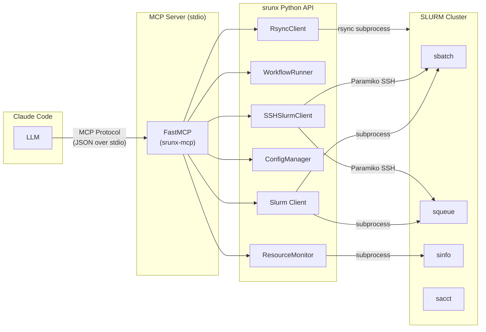
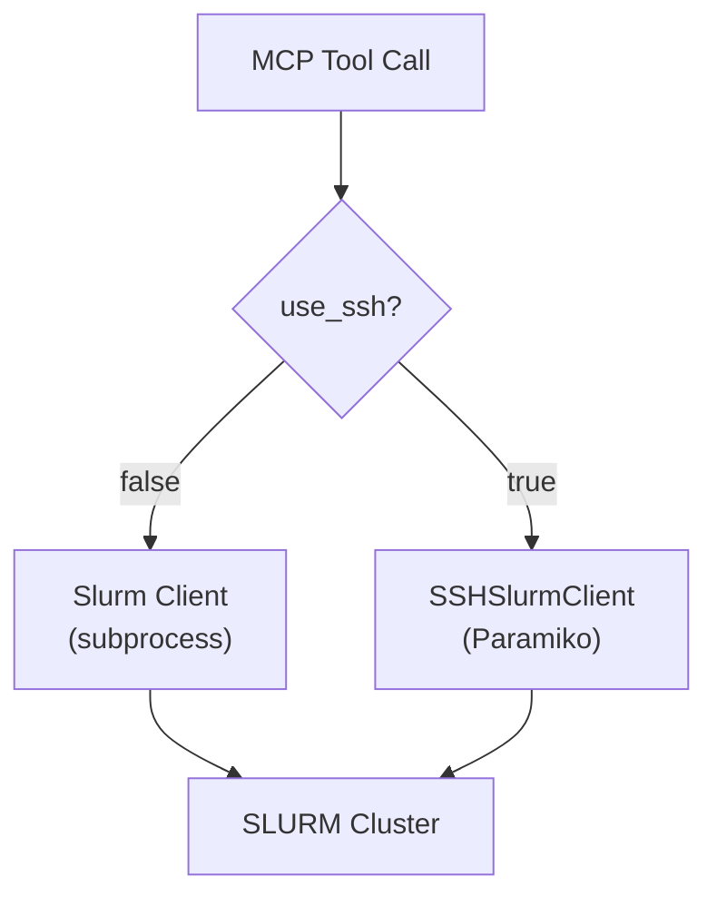
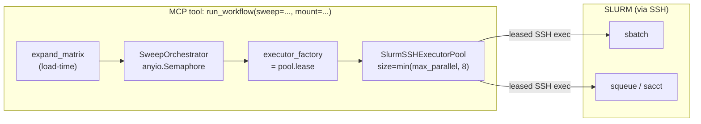

# MCP Integration Architecture

This document explains the design decisions behind the srunx MCP server and
how it fits into the broader srunx architecture.

## Why MCP

srunx already has a CLI, a Python API, and a Web UI. The MCP integration adds
a fourth interface optimized for LLM-driven interaction. The key advantages
over wrapping the CLI with shell commands:

**Structured data in, structured data out.**  
Every tool accepts typed parameters and returns JSON. The LLM never needs
to parse `squeue` table output or construct `sbatch` flags from free
text.

**Tool selection by the model.**  
MCP provides a tool catalog with descriptions and parameter schemas. The
model picks the right tool based on intent rather than pattern-matching
against CLI help text.

**No subprocess parsing.**  
The MCP server calls the srunx Python API directly. There is no shell
invocation, no stdout capture, and no regex extraction of job IDs from
human-readable output.

**Composability.**  
The model can chain multiple tool calls in a single turn (check resources,
sync files, submit job) without writing a shell script.

## Architecture

The MCP server is a thin wrapper around existing srunx modules. It does not
add business logic -- it translates between MCP tool calls and the Python API.



The server process is started by Claude Code using the command configured in
`.mcp.json`:

``` json
{
  "mcpServers": {
    "srunx": {
      "command": "uvx",
      "args": ["--from", "srunx[mcp]", "srunx-mcp"]
    }
  }
}
```

Communication uses stdio (stdin/stdout JSON messages). The server runs for
the duration of the Claude Code session and handles tool calls sequentially.

## Thin Wrapper Pattern

Each MCP tool function follows the same pattern:

1.  Validate inputs (job IDs, partition names).
2.  Import and call the relevant srunx module.
3.  Convert the result to a JSON-serializable dict.
4.  Return `{"success": true, ...}` or `{"success": false, "error": ...}`.

The server file (`src/srunx/mcp/server.py`) contains no SLURM logic.
All SLURM interaction happens through existing modules:

- **Job management** (`submit_job`, `list_jobs`, etc.) uses `srunx.slurm.local.Slurm`
  for local execution and `srunx.ssh.core.client.SSHSlurmClient` for remote.
- **Workflows** (`create_workflow`, `run_workflow`, etc.) uses `srunx.runtime.workflow.runner.WorkflowRunner`
  and `srunx.domain.Workflow`.
- **Resources** (`get_resources`) uses `srunx.observability.monitoring.resource_monitor.ResourceMonitor`.
- **File sync** (`sync_files`) uses `srunx.sync.RsyncClient` via the SSH profile.
- **Configuration** (`get_config`, `list_ssh_profiles`) uses `srunx.common.config`
  and `srunx.ssh.core.config.ConfigManager`.

## Local vs SSH Execution

Most tools accept a `use_ssh` boolean parameter. The execution path diverges
early in each tool:

**Local path** (`use_ssh=false`):  
Imports `srunx.slurm.local.Slurm` and calls SLURM commands via `subprocess`.
Requires the MCP server to run on a machine with SLURM access (login node
or compute node).

**SSH path** (`use_ssh=true`):  
Reads the active SSH profile from `ConfigManager`, creates an
`SSHSlurmClient`, and routes commands through Paramiko SSH. The MCP
server runs on the developer's local machine while SLURM runs on a
remote cluster.



For SSH mode, the `work_dir` parameter is required on `submit_job` because
the local working directory has no meaning on the remote cluster.

## Parameter Sweeps Through MCP

`run_workflow` accepts an optional `sweep={...}` argument that expands a
matrix at load time into N independent `workflow_runs` under one
`sweep_run` parent. From the MCP server's perspective this is a single
blocking tool call: the tool only returns once the whole sweep has
converged (all cells terminal, or a `fail_fast` drain has completed).
This is the opposite of the Web UI, which returns `202 Accepted` the
moment the background task is scheduled.



**Shared code path with the Web UI.** The SSH-backed execution path is
not reimplemented inside the MCP server. Both `srunx ui` and
`srunx-mcp` build their sweep executor factories on top of
`srunx.web.ssh_adapter` + `srunx.web.ssh_executor`. The MCP server is a
side-effect-free caller that borrows the Web UI's abstractions; all
reconciliation, pool lifecycle, and mount-aware render logic live in
one place. The Web UI's `_run_sweep_background` closes the pool in a
`finally` block; the MCP `run_workflow` tool closes its own pool in a
matching `finally`. There is no process-wide pool.

**Provenance: `submission_source='mcp'`.** A sweep triggered through
MCP writes `sweep_runs.submission_source='mcp'` for audit. After the V4
schema migration (see the architecture guide), each child cell also
writes `workflow_runs.triggered_by='mcp'`, so notification fan-out and
sweep listings can tell MCP-originated cells apart from Web and CLI
cells without guessing. Before V4, MCP cells were recorded as
`triggered_by='web'` because the V1 CHECK allowlist did not admit
`'mcp'`; the V4 rebuild removed that workaround.

**CLI-style sweeps without `mount=`.** When `run_workflow` is called
with a `sweep` argument but **without** `mount=<profile>`, execution
stays on the local `Slurm` singleton path -- exactly as if the user
had run `srunx flow run --sweep ...` on a login node. Passing
`mount=<profile>` switches the tool to the SSH + pool path above. This
mirrors the CLI / Web split: the same tool call, the same blocking
semantics, but a different transport determined by one argument.

## Security

**Input validation.**  
Job IDs are validated against `^\d+(_\d+)?$` (numeric with optional
array index). Partition names are validated against `^[a-zA-Z0-9_\-]+$`.
These checks prevent command injection when values are interpolated into
SLURM commands executed over SSH.

**No shell interpolation.**  
Local SLURM commands use `subprocess` with argument lists, not shell
strings. SSH commands go through Paramiko's `exec_command`, which does
not invoke a login shell.

**Scope limitation.**  
The MCP server exposes only read and submit operations. It cannot modify
SLURM configuration, access other users' jobs, or execute arbitrary
commands on the cluster. File sync is constrained to configured mount
points or explicit paths.

**Shared security guards.**  
The argument inspection that rejects dangerous Python invocations
(`find_python_prefix`) and dangerous shell-script patterns
(`find_shell_script_violation`) lives in `srunx.runtime.security` and is
imported by both the Web UI router and the MCP tool surface. Keeping
these checks in one module avoids drift between the two entry points:
a pattern blocked in the Web UI is necessarily blocked in MCP, and
vice versa.

## Relationship to Other Interfaces

srunx provides four interfaces to the same underlying functionality:

| Interface | Entry point | Transport | Best for |
|----|----|----|----|
| CLI | `srunx` | Terminal | Manual job management, scripting |
| Python API | `from srunx import ...` | In-process | Programmatic integration, notebooks |
| Web UI | `srunx ui` | HTTP (browser) | Visual workflow building, monitoring dashboards |
| MCP | `srunx-mcp` | stdio (JSON) | LLM-driven operations via Claude Code |

All four share the same core modules (`client.py`, `models.py`,
`runner.py`, `ssh/`, `sync/`, `monitor/`). The MCP server adds
no new capabilities -- it is a translation layer that makes existing
functionality accessible to the model.
