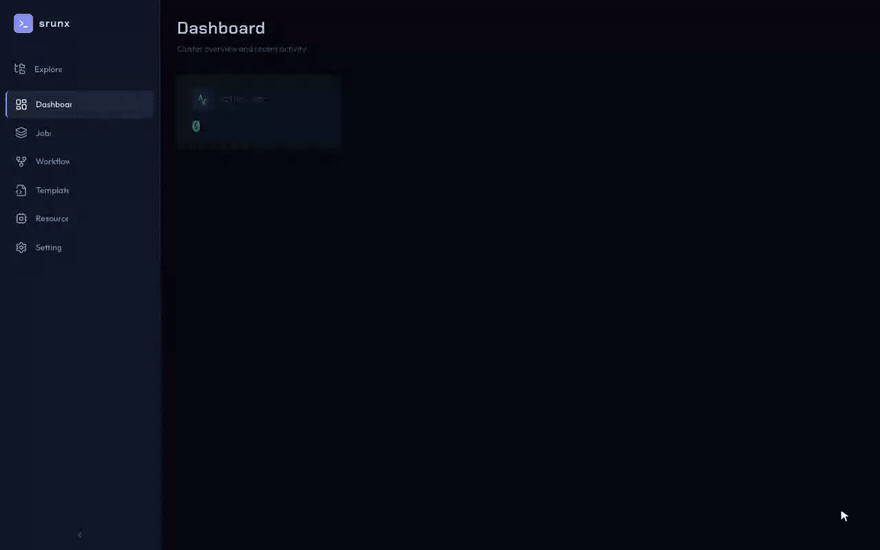

# File Explorer

The file explorer is a VS Code-style tree panel that lets you browse local project files and submit scripts to SLURM directly from the Web UI.

## Open the Explorer

Click the **Explorer** button (folder icon) at the top of the sidebar. The panel slides in between the sidebar and the main content area.

## Browse Project Files

The explorer shows one tree root per configured mount. Each mount corresponds to a local project directory.

1.  Click a mount name to expand it and load the top-level entries
2.  Click a folder to expand it (directories are loaded lazily on demand)
3.  Shell scripts (`.sh`, `.slurm`, `.sbatch`, `.bash`) are shown with a code file icon in the running-status color (green)
4.  Symlinks are shown with a link icon; links outside the mount boundary are marked inaccessible and cannot be followed. Accessible symlinks pointing to directories can be expanded like regular folders

!!! note
    Hidden files (names starting with `.`) are automatically filtered out.

## Submit a Script as sbatch

1.  Right-click any shell script (`.sh`, `.slurm`, `.sbatch`, `.bash`) in the tree
2.  Select **Submit as sbatch** from the context menu
3.  In the submit dialog:
    - The script path is shown as a read-only field
    - The job name defaults to the filename (editable)
4.  Click **Submit** — the script content is read from the mount and sent to the SLURM cluster
5.  The result shows the assigned job ID or an error message

!!! note
    Only shell script files show the submit option. Right-clicking other file types shows a grayed-out "Not a submittable script" message.

## Sync Files to Remote

Each mount has a **Sync** button. Click it to push local files to the remote SLURM server via rsync.

- During sync, the button shows a loading spinner
- After a successful sync, a green checkmark appears briefly
- Sync state is tracked per mount (syncing one mount does not affect others)

!!! warning
    If you modify local files after syncing, sync again before running jobs that depend on the updated files.

## Add Mounts

The explorer shows mounts from the active SSH profile. To add mounts:

- **From Settings**: Navigate to **Settings \> SSH Profiles**, expand a profile, and add a mount (see `settings`)
- **From CLI**: `srunx ssh profile mount add <profile> <name> --local <path> --remote <path>`
- **From DAG builder**: Click the gear icon in the workflow builder toolbar

## Keyboard Navigation

- Press **Escape** to close the context menu
- Click outside the context menu to dismiss it
- Click the **Explorer** button again to close the panel
