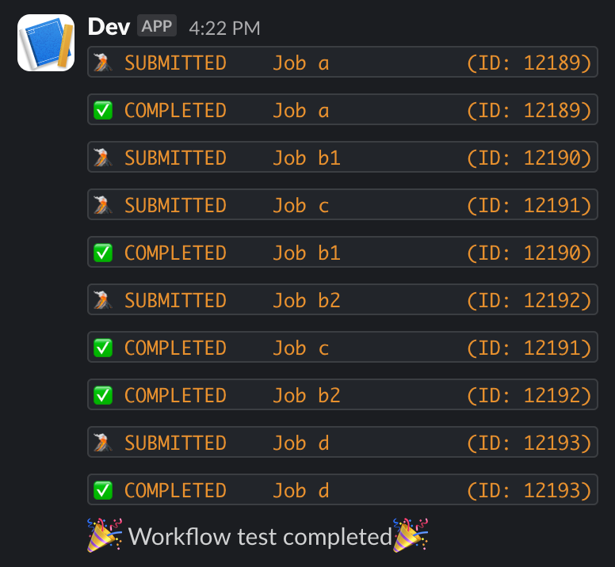
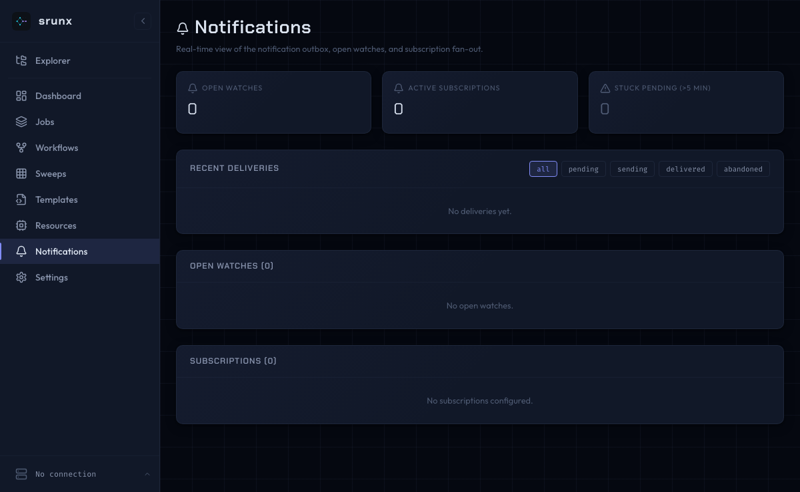
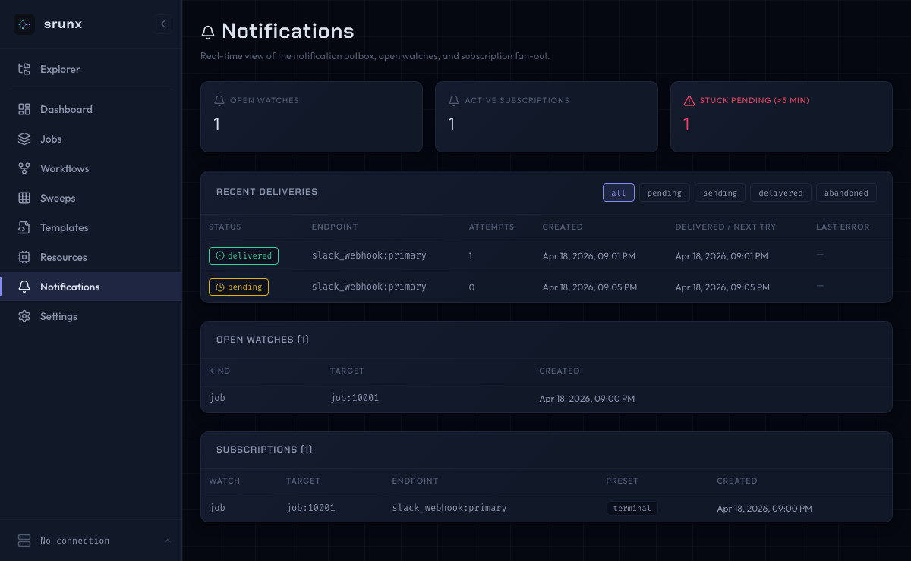
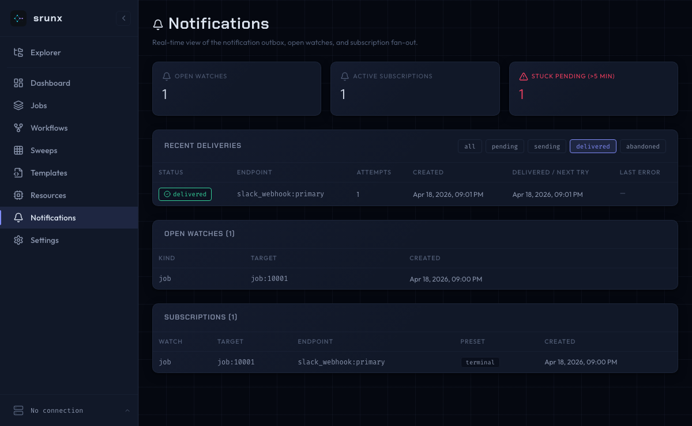

# Smoke-testing the notification pipeline against real SLURM

Manual procedure for verifying `ActiveWatchPoller` → `DeliveryPoller` →
`SlackWebhookDeliveryAdapter` end-to-end on a real SLURM cluster. Run
this before cutting a release that touches the `srunx.pollers` /
`srunx.notifications` modules.

Estimated wall time: **~15 minutes**.

## Prerequisites

- An SSH profile configured for a reachable SLURM cluster
  (`srunx ssh profile list` shows it as current).
- A Slack Incoming Webhook URL you own — the adapter POSTs to it during
  the test, so use a test channel.
- Local Python env with the latest changes installed:
  `uv sync && uv run srunx --version`.
- **This procedure assumes PR #84 (`srunx sbatch --endpoint`) and PR #85
  (poller payload enrichment including `job_id` / `job_name`) are both
  merged.** If they are not yet on `main`, skip to the
  "Pre-#84 fallback" note below before running step 4.

## Procedure

1. **Isolate the state DB.** The pollers will write to
   `~/.config/srunx/srunx.db`. To keep the smoke clean:
   ```bash
   export XDG_CONFIG_HOME="$(mktemp -d)"
   ```

2. **Register an endpoint.** Either via the Web UI (Settings →
   Notifications) or the API:
   ```bash
   curl -s http://127.0.0.1:8000/api/endpoints \
     -H 'content-type: application/json' \
     -d '{"kind":"slack_webhook","name":"smoke","config":{"webhook_url":"<YOUR_URL>"}}'
   ```

3. **Start the Web UI with pollers enabled.** (Never use `--reload`
   during this test — the reload guard will skip poller startup.)
   ```bash
   uv run srunx ui --port 8000
   ```
   The banner should say `● connected`.

4. **Submit a quick job via the CLI with an endpoint subscription.**
   Use `--preset all` — the `job.submitted` event is only delivered
   under `preset='all'` (see `srunx/notifications/presets.py`;
   `terminal` and `running_and_terminal` will skip the first Slack
   message and only deliver once the job reaches RUNNING / COMPLETED):
   ```bash
   uv run srunx sbatch --wrap "\"
     bash -c 'echo hi && sleep 10' \
     --name smoke --endpoint smoke --preset all
   ```
   Verify in the server logs that
   `Starting 2 background poller(s)` appeared at startup.

   **Pre-#84 fallback.** If this branch hasn't merged yet, create the
   watch + subscription manually instead of relying on `--endpoint`:
   ```bash
   # 4a. Submit with the legacy --slack flag (uses SLACK_WEBHOOK_URL env)
   SLACK_WEBHOOK_URL='<YOUR_URL>' uv run srunx sbatch --wrap "\"
     bash -c 'echo hi && sleep 10' --name smoke --slack
   # 4b. Grab the returned SLURM job id and create a watch+sub:
   curl -s http://127.0.0.1:8000/api/watches \
     -H 'content-type: application/json' \
     -d '{"kind":"job","target_ref":"job:<JOB_ID>"}'
   # Then POST /api/subscriptions with the watch_id + endpoint_id + "all".
   ```

5. **Expected Slack messages** (chronological, typically within ~30 s
   each). A delivered message looks like:

   { width="360" }

   The `job_id` / `job_name` keys are only present once PR #85
   has landed; before that, the Slack adapter falls back to parsing
   the id out of `source_ref`, rendering `Name: ?`:

   | Event | Slack block | Payload keys (post-#85) |
   |-------|------------|--------------|
   | `job.submitted`       | `*Job submitted*`         | `job_id`, `job_name` |
   | `job.status_changed`  | `PENDING → *RUNNING*`     | `job_id`, `job_name`, `from_status`, `to_status`, `started_at`, `completed_at` |
   | `job.status_changed`  | `RUNNING → *COMPLETED*`   | same |

   The Notifications Center (at `http://127.0.0.1:8000/notifications`)
   walks through three states during this test — it should look like:

   === "Empty"

       

   === "Populated"

       

   === "Filter: delivered"

       

6. **Verify persistence.** Before inspecting, stop the web server (Ctrl+C)
   and reopen the DB directly:
   ```bash
   sqlite3 "$XDG_CONFIG_HOME/srunx/srunx.db"
   sqlite> SELECT id, status, attempt_count, delivered_at FROM deliveries;
   sqlite> SELECT from_status, to_status, source FROM job_state_transitions;
   ```
   All deliveries should be `delivered`, and the transition log should
   contain exactly one `(None, PENDING, source='webhook')` row followed
   by the poller-sourced transitions.

7. **Reload guard check.** Restart the server with `--reload`:
   ```bash
   UVICORN_RELOAD=1 uv run uvicorn srunx.web.app:create_app --factory --reload
   ```
   The server log should say
   `Background pollers disabled (reload mode or SRUNX_DISABLE_POLLER=1)`.

## Troubleshooting

- **Slack says "no_active_hooks"**: the webhook URL is malformed or the
  app was removed from the workspace.
- **Job.status_changed event never fires**: check that the seed
  `job_state_transitions` row is present for the job (step 6 query).
  Without it, the poller treats its first observation as "unknown prior
  state" and skips the event on purpose.
- **Stuck pending deliveries**: `SELECT * FROM deliveries WHERE
  status='pending' AND next_attempt_at <= strftime('%Y-%m-%dT%H:%M:%fZ','now');`
  should return 0 rows after a minute. If not, the DeliveryPoller may
  be disabled — check `SRUNX_DISABLE_DELIVERY_POLLER`.
