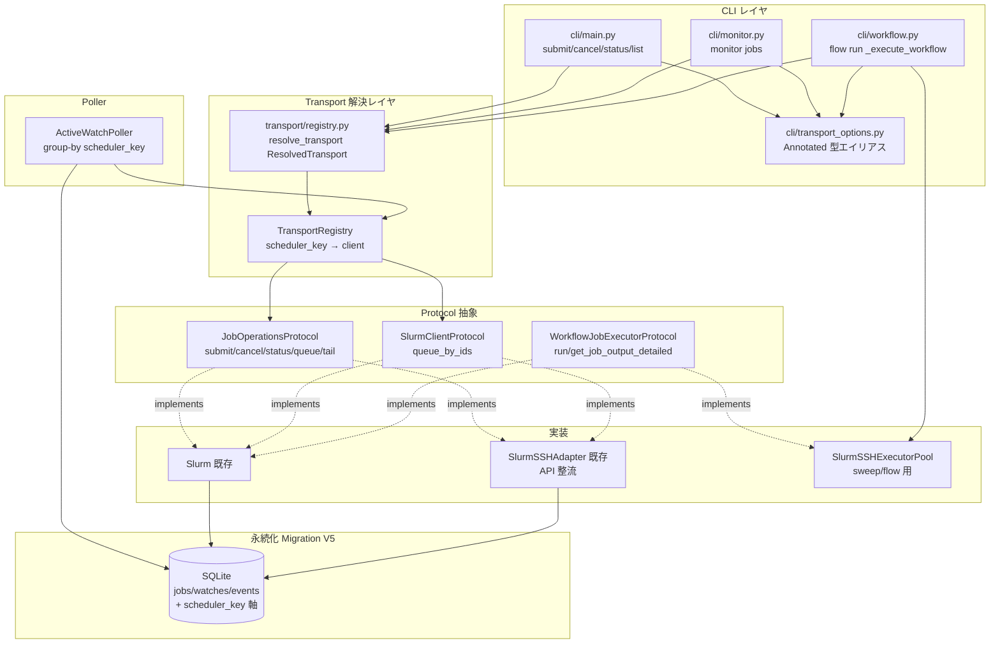
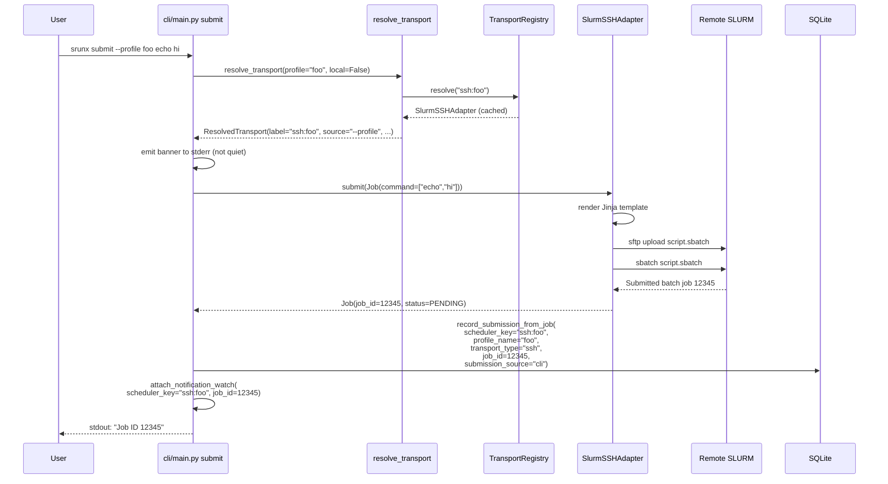
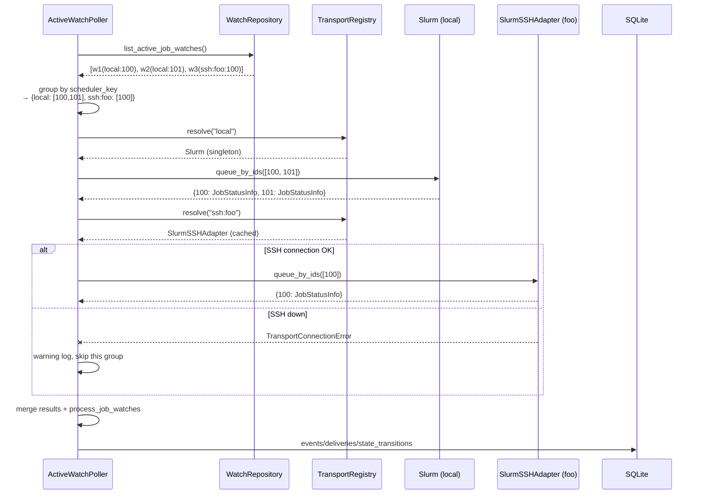
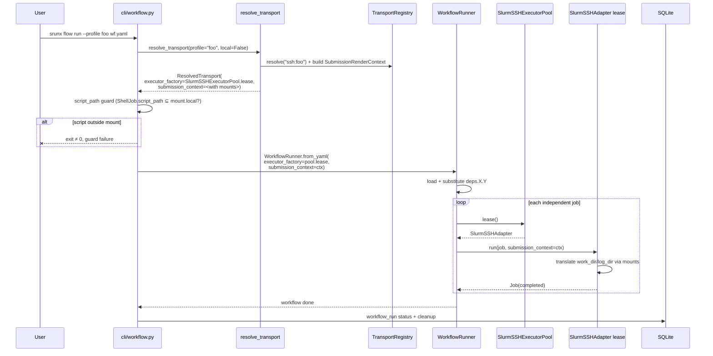

# Plan: CLI Transport 統一リファクタリング

## Spec Reference

`specs/cli-transport-unification/spec.md` を参照。

本 plan は spec の REQ-1 〜 REQ-10 と Known Pitfalls (P-1 〜 P-14) を
実装ロードマップに落とし込んだものであり、再設計はしない。spec の決定
(3 本 Protocol / transport 解決順序 / Migration V5 = Option A / `ssh`
サブツリー deprecation 温存) をそのまま施工計画として具体化する。

核となる実装ストーリは以下の 1 行:

> CLI 起動 → `resolve_transport()` が `ResolvedTransport` を返す → CLI は
> `JobOperationsProtocol` と `WorkflowJobExecutorFactory` のみを介して
> `Slurm` と `SlurmSSHAdapter` を等価に扱う。DB は `scheduler_key` 軸
> (Migration V5) で多クラスタ `job_id` 衝突に耐える。Poller は
> `TransportRegistry` 経由で scheduler_key ごとに group-by 問い合わせる。

## Approach

### 選択したアプローチ: Phase 分割 + 前方互換優先 + Option A (FK retarget)

- **Phase 分割**: spec の Known Pitfalls と整合するよう、下位レイヤ
  (protocol 定義 → adapter 整流 → migration → repository) から順に積み上げ、
  CLI の書き換えは後半にまとめる。各 phase は「CLI の挙動が変わらない」
  状態で commit 可能になるように組む (reviewer gate が回りやすい)。
- **前方互換優先**: フラグなし・env なしの `srunx submit python foo.py` の
  stdout / stderr / exit code を Phase 終了時点で常に守る (AC-10.2)。
  transport banner は「明示指定時のみ」出すという spec 決定がこれを支える。
- **Option A (FK retarget)**: `jobs.id` (AUTOINCREMENT PK) を子テーブル FK の
  ターゲットにし、`UNIQUE(scheduler_key, job_id)` を自由にする。SQLite の
  FK 後付け不能制約を受け入れて、3 テーブル rebuild migration で一気に入れる。

### Trade-offs Considered

| Option | Pros | Cons |
|--------|------|------|
| **[Chosen] Phase 分割 + Option A FK retarget** | 各 phase で CLI 挙動が壊れない中間地点を作れる / reviewer gate が回しやすい / FK 健全性を永続的に維持 | migration が 3 テーブル rebuild で重い / repository 層の signature 変更が広範 (`job_id` → `(scheduler_key, job_id)` or `jobs_row_id`) |
| Big-bang 書き換え (Protocol + CLI + DB 同時) | PR が 1 本で済む | 中間状態が動かず reviewer gate が使えない / 後方互換テストが migration と CLI 変更のどちらで壊れたか切り分けづらい |
| Option B (子テーブル FK を `(scheduler_key, job_id)` 複合 FK) | 概念上は自然 | SQLite は複合 FK を rebuild でしか追加できず、child 側も列追加が要る / 既存 query の `WHERE job_id=?` が scheduler_key を知らない場所で壊れる |
| CLI のみ書き換え、DB は据え置き (`scheduler_key` 軸なし) | PR 小さい | P-1 (クラスタ間 `job_id` 衝突) を解決できない / `target_ref` の legacy 2 セグメントと新 3 セグメントが共存し poller parser が複雑化 |

## Architecture

### High-Level Component Map



### Components

| # | Component | File Path | 責務 | 対応 REQ |
|---|-----------|-----------|------|----------|
| 1 | `JobOperationsProtocol` | `src/srunx/client_protocol.py` (追記) | CLI 向け 5 メソッド (submit/cancel/status/queue/tail_log_incremental) の型契約 | REQ-2, REQ-3 |
| 2 | `LogChunk` | `src/srunx/client_protocol.py` (追記) | `tail_log_incremental` の戻り型 (Pydantic v2)。フィールド名は WebUI wire に合わせ `stdout_offset` / `stderr_offset` | REQ-3 |
| 3 | `ResolvedTransport` + `resolve_transport()` | `src/srunx/transport/registry.py` (新規) | CLI が 1 コマンドで使う transport を確定。context manager で close を持つ | REQ-1, REQ-7 |
| 4 | `TransportRegistry` | `src/srunx/transport/registry.py` (新規) | scheduler_key → `SlurmClientProtocol` / `JobOperationsProtocol` の解決。CLI は 1 コマンド 1 instance、lifespan は 1 プロセス 1 instance | REQ-8 |
| 5 | Transport 例外階層 | `src/srunx/exceptions.py` (追記) | `TransportError` / `TransportConnectionError` / `TransportAuthError` / `TransportTimeoutError` / `JobNotFound` / `SubmissionError` / `RemoteCommandError` | REQ-4 |
| 6 | `SlurmSSHAdapter` API 整流 | `src/srunx/web/ssh_adapter.py` | `submit(Job) -> Job` / `cancel` / `status(BaseJob)` / `queue(list[BaseJob])` / `tail_log_incremental`。paramiko 例外を transport 例外にラップ。旧メソッド名は backcompat alias で温存 | REQ-4 |
| 7 | `Slurm` に `tail_log_incremental` 追加 | `src/srunx/client.py` | SSH 側と等価な offset ベース incremental tail (local file の `tell`/`seek`) | REQ-3 |
| 8 | Migration V5 | `src/srunx/db/migrations.py` | `jobs` / `workflow_run_jobs` / `job_state_transitions` rebuild + `watches.target_ref` / `events.source_ref` 一括 UPDATE。`_apply_fk_off_migration` template 再利用 | REQ-5 |
| 9 | Repository 書き換え | `src/srunx/db/repositories/{jobs,job_state_transitions,workflow_run_jobs}.py` | `job_id` 単独 → `(scheduler_key, job_id)` or `jobs_row_id` | REQ-5 |
| 10 | `cli_helpers.record_submission_from_job` 拡張 | `src/srunx/db/cli_helpers.py` | `transport_type` / `profile_name` / `scheduler_key` を kwargs で受ける | REQ-5 |
| 11 | CLI 共通オプション | `src/srunx/cli/transport_options.py` (新規) | `ProfileOpt` / `LocalOpt` / `ScriptOpt` / `QuietOpt` Annotated エイリアス | REQ-6 |
| 12 | CLI コマンド書き換え | `src/srunx/cli/main.py` / `cli/monitor.py` / `cli/workflow.py` | `Slurm()` 直接 new を `resolve_transport()` に置換。`submit --script`, `flow run --profile` (mount translation + script_path guard) | REQ-1, REQ-6 |
| 13 | Transport banner | `src/srunx/cli/transport_options.py` (emit helper) | `Console(stderr=True)` で 1 行出力。default は無出力 (AC-10.2) | REQ-7 |
| 14 | `ActiveWatchPoller` transport-aware 化 | `src/srunx/pollers/active_watch_poller.py` | `__init__(registry=...)` / `run_cycle` で scheduler_key group-by / `_parse_target_ref` 実装 / source_ref ライタを 3+ セグメントに | REQ-8 |
| 15 | `target_ref` / `source_ref` パーサ | `src/srunx/pollers/active_watch_poller.py`, `src/srunx/db/repositories/events.py`, `src/srunx/notifications/adapters/slack_webhook.py` | 3 セグメント (`job:local:N`) / 4 セグメント (`job:ssh:profile:N`) 対応、2 セグメントは `None` | REQ-8 |
| 16 | `NotificationWatchCallback` 拡張 | `src/srunx/callbacks.py`, `src/srunx/notifications/service.py` | `attach_notification_watch(..., scheduler_key, profile_name)` を受ける | REQ-8 |
| 17 | `ssh submit` / `ssh logs` deprecation | `src/srunx/ssh/cli/commands.py` | stderr に 1 行 warning、ロジック温存 | REQ-9 |
| 18 | Web app lifespan 更新 | `src/srunx/web/app.py` | `ActiveWatchPoller(slurm_client=adapter)` を `ActiveWatchPoller(registry=registry)` に置換 | REQ-8 |

### Directory Tree (new / modified)

```
src/srunx/
├── client_protocol.py              # +JobOperationsProtocol, +LogChunk
├── client.py                       # +tail_log_incremental
├── exceptions.py                   # +TransportError 階層, +JobNotFound, +SubmissionError, +RemoteCommandError
├── transport/                      # NEW
│   ├── __init__.py
│   └── registry.py                 # NEW: resolve_transport, ResolvedTransport, TransportRegistry
├── cli/
│   ├── main.py                     # rewrite Slurm() direct instantiation → resolve_transport()
│   ├── monitor.py                  # same
│   ├── workflow.py                 # _execute_workflow: mount translation + executor_factory
│   └── transport_options.py        # NEW: ProfileOpt/LocalOpt/ScriptOpt/QuietOpt + banner emitter
├── db/
│   ├── migrations.py               # +SCHEMA_V5
│   ├── cli_helpers.py              # record_submission_from_job signature 拡張
│   └── repositories/
│       ├── jobs.py                 # signature 書き換え (job_id → (scheduler_key, job_id) or jobs_row_id)
│       ├── workflow_run_jobs.py
│       ├── job_state_transitions.py
│       └── events.py               # _extract_source_id を 3+ セグメント対応
├── pollers/
│   └── active_watch_poller.py      # registry-based group-by, _parse_target_ref
├── notifications/
│   ├── service.py                  # target_ref/source_ref ライタを 3+ セグメントに
│   └── adapters/
│       └── slack_webhook.py        # _id_from_source_ref を 3+ セグメント対応
├── callbacks.py                    # NotificationWatchCallback: scheduler_key/profile_name 受領
├── ssh/
│   ├── cli/commands.py             # ssh submit/logs に deprecation warning
│   └── core/client.py              # 変更なし (ロジック温存)
├── web/
│   ├── app.py                      # lifespan: ActiveWatchPoller(registry=...)
│   ├── ssh_adapter.py              # SlurmSSHAdapter API 整流 (Phase 2)
│   ├── ssh_executor.py             # SlurmSSHExecutorPool (Phase 1 触らない、参照のみ)
│   └── routers/*.py                # repository signature 変更の追従 (Phase 3)
└── web/frontend/                   # 触らない
```

### Interfaces

#### `JobOperationsProtocol` (新規)

```python
# src/srunx/client_protocol.py

from typing import Protocol, runtime_checkable
from pydantic import BaseModel

class LogChunk(BaseModel):
    """Incremental tail chunk for WebUI wire-compat field names."""
    stdout: str
    stderr: str
    stdout_offset: int = Field(ge=0)  # 負値は reject (未読状態を表す値ではない)
    stderr_offset: int = Field(ge=0)


@runtime_checkable
class JobOperationsProtocol(Protocol):
    """CLI-facing job operations. Pure (no stdout side-effects, no blocking)."""

    def submit(self, job: "RunnableJobType") -> "RunnableJobType": ...
    def cancel(self, job_id: int) -> None: ...
    def status(self, job_id: int) -> "BaseJob": ...
    def queue(self, user: str | None = None) -> list["BaseJob"]: ...
    def tail_log_incremental(
        self,
        job_id: int,
        stdout_offset: int,
        stderr_offset: int,
    ) -> LogChunk: ...
```

契約:
- `cancel(未知_id)` / `status(未知_id)` は `JobNotFound` を raise。
- `queue(None)` は transport の current user を使う。`queue(user)` は明示。
- 戻り値は常に Pydantic モデル。stdout / TTY 操作は CLI レイヤの責務。

#### `ResolvedTransport` + `resolve_transport()` (新規)

```python
# src/srunx/transport/registry.py

from contextlib import contextmanager
from dataclasses import dataclass
from typing import Literal

@dataclass(frozen=True)
class ResolvedTransport:
    """CLI 1 コマンドで確定した transport (TransportHandle + 銘板)."""
    label: str                        # banner 表示用: "local" / "ssh:dgx"
    source: Literal["--profile", "--local", "env", "default"]
    handle: TransportHandle           # scheduler_key / job_ops / queue_client / executor_factory / submission_context

    # convenience properties (handle へのショートカット)
    @property
    def scheduler_key(self) -> str: return self.handle.scheduler_key
    @property
    def job_ops(self) -> "JobOperationsProtocol": return self.handle.job_ops
    # ...以下同じパターン


@contextmanager
def resolve_transport(
    *,
    profile: str | None,
    local: bool,
    quiet: bool = False,
) -> Iterator[ResolvedTransport]:
    """Resolve once per CLI invocation; close SSH on exit.

    優先順: --profile > --local > SRUNX_SSH_PROFILE > local fallback.
    Conflict (--profile + --local) は ClickException で起動時拒否。
    """
```

#### `TransportRegistry` (新規)

```python
@dataclass(frozen=True)
class TransportHandle:
    """scheduler_key → client 解決結果の統一型."""
    scheduler_key: str
    profile_name: str | None
    transport_type: Literal["local", "ssh"]
    job_ops: "JobOperationsProtocol"
    queue_client: "SlurmClientProtocol"
    executor_factory: "WorkflowJobExecutorFactory"
    submission_context: "SubmissionRenderContext | None"


class TransportRegistry:
    """scheduler_key → TransportHandle の解決."""

    def __init__(
        self,
        *,
        local_client: "Slurm",
        profile_loader: "Callable[[str], SSHProfile | None]",
        db_connection_factory: "Callable[[], sqlite3.Connection]",
    ) -> None: ...

    def resolve(self, scheduler_key: str) -> "TransportHandle | None":
        """'local' / 'ssh:<profile>' を解決。
        未知 profile の場合は None。caller は warning + skip。
        `ResolvedTransport` は本メソッドが返す `TransportHandle` を
        銘板 (label / source) でラップしたもの。"""

    def known_scheduler_keys(self) -> set[str]:
        """DB の jobs.scheduler_key DISTINCT を返す。Poller の group-by 起点.
        db_connection_factory を経由して都度 DISTINCT を問い合わせる."""

    def close(self) -> None:
        """プロセス終了時に全 SSH 接続を close."""
```

### Data Flow

#### Flow 1: `srunx submit --profile foo echo hi` (単発 submit)



#### Flow 2: `ActiveWatchPoller.run_cycle` (group-by)



#### Flow 3: `srunx flow run --profile foo workflow.yaml`



## Build Sequence

phase は依存関係順。各 phase の末尾で CLI 挙動の後方互換テストを pass
させる (AC-10.2)。

### Phase 1: Protocol と例外階層 (足場)

- **Inputs**: なし (clean start)
- **Outputs**:
  - `src/srunx/client_protocol.py` に `JobOperationsProtocol` / `LogChunk` 追加
  - `src/srunx/exceptions.py` に `TransportError` / `TransportConnectionError` / `TransportAuthError` / `TransportTimeoutError` / `JobNotFound` / `SubmissionError` / `RemoteCommandError` 追加
- **検証**:
  - `mypy` / `ruff` が通る
  - `isinstance(Slurm(), JobOperationsProtocol)` が False (未実装なのでこの時点では)
  - 既存テストが全部通る (純追加のみ)

### Phase 2: `Slurm` と `SlurmSSHAdapter` の Protocol 準拠 (LSP 整流)

- **Inputs**: Phase 1 の Protocol 定義
- **Outputs**:
  - `src/srunx/client.py:Slurm` に以下を追加:
    - `tail_log_incremental(job_id, stdout_offset, stderr_offset)` 新規実装 (local log file の `open` / `seek` / `read`)
    - `status(job_id) -> BaseJob` を **既存の `retrieve` への thin alias** として追加 (`status = retrieve` あるいは `def status(self, ...): return self.retrieve(...)`)。既存 `retrieve` は caller 互換のため残す。
    - `cancel` / `queue` は既存メソッド名と `JobOperationsProtocol` の名前が一致するので変更不要。
    - `submit` は Protocol シグネチャと一致するので変更不要。
  - `src/srunx/web/ssh_adapter.py` の `SlurmSSHAdapter`:
    - `submit_job(script_content)` を呼ぶ内部実装はそのままに、**新メソッド** `submit(job: RunnableJobType) -> RunnableJobType` を追加 (Jinja render → sftp upload → sbatch → `job.job_id` セット)。
    - `cancel_job` → `cancel` に改名 (旧メソッドは `cancel_job = cancel` で alias 温存)。
    - `get_job_status(str)` の上に `status(int) -> BaseJob` を実装。
    - `list_jobs` の上に `queue(user: str | None) -> list[BaseJob]` を実装 (LSP: `user=None` で profile の username 使用)。
    - `tail_log_incremental(job_id, stdout_offset, stderr_offset)` 新規実装 (SSH 越しの `wc -c` + `tail -c +offset`)。
    - paramiko の `AuthenticationException` / `SSHException` / `socket.timeout` 等を `TransportAuthError` / `TransportConnectionError` / `TransportTimeoutError` にラップ。
- **検証**:
  - 単体テスト:
    - `isinstance(Slurm(), JobOperationsProtocol)` が True (AC-2.1)
    - `isinstance(SlurmSSHAdapter(...), JobOperationsProtocol)` が True
    - `SlurmSSHAdapter.submit(Job)` が `Job(job_id=int)` を返す (AC-4.1)
    - `SlurmSSHAdapter.status(未知)` が `JobNotFound` を raise (AC-4.2)
    - `SlurmSSHAdapter.queue(user="alice")` が `list[BaseJob]` (AC-4.3)
    - `SlurmSSHAdapter.tail_log_incremental(id, 0, 0)` の戻りが `LogChunk` (AC-4.4)
    - paramiko.AuthenticationException → `TransportAuthError` (AC-4.5)
  - 既存 CLI テストは無修正で pass (新メソッド追加のみなので非破壊)

### Phase 3: Migration V5 + Repository 書き換え + 全 caller 修正

**PR 粒度の制約**: Phase 3 は **単一 PR で出す**。schema 変更と repository API 変更と全 caller 修正 (Web routers / poller / cli_helpers / notifications / tests) を同じ PR に収めないと、途中 commit で `job_id` 参照がビルドエラーになる。個別 PR に分けてはいけない。

**レガシー open watch 対応**: pre-V5 時点で WebUI 経由で投入された SSH ジョブ (`submission_source='web'` + `mount=` ルート) は `transport_type` カラムが無かったため、backfill で全て `'local'` に記録される。これは historical record (閉じた jobs) には無害だが、**open watch には誤作動リスク**がある (poller が local SLURM に remote job を問い合わせる)。対策として V5 migration の最後に `UPDATE watches SET status='closed', closed_at=now(), closed_reason='v5_migration' WHERE status='open'` で全 open watch を強制クローズする。user は migration 後に必要なら watch を再張する想定。これは本 migration の documented breaking behavior として README / release note に明記する。

- **Inputs**: Phase 1-2
- **Outputs**:
  - `src/srunx/db/migrations.py` に `SCHEMA_V5` Migration を追加 (`requires_fk_off=True`)。内容は spec REQ-5 の通り:
    1. `jobs` rebuild: +`transport_type` / `profile_name` / `scheduler_key` / CHECK 制約 / `UNIQUE(scheduler_key, job_id)` に変更
    2. `workflow_run_jobs` rebuild: `job_id` → `jobs_row_id`, FK 先を `jobs.id` へ
    3. `job_state_transitions` rebuild: 同上
    4. `watches.target_ref` / `events.source_ref` を一括 UPDATE (`job:N` → `job:local:N`)
    5. **open watch 強制クローズ** (レガシー SSH ジョブ誤作動対策): `UPDATE watches SET status='closed', closed_at=now(), closed_reason='v5_migration' WHERE status='open'`
  - `src/srunx/db/repositories/jobs.py`: `record_submission` / `get` / `update_status` / `update_completion` / `delete` の引数を `(scheduler_key, job_id)` or `jobs_row_id` に変更 + `transport_type` / `profile_name` を保存
  - `src/srunx/db/repositories/workflow_run_jobs.py` / `job_state_transitions.py`: 同上
  - `src/srunx/db/cli_helpers.py:record_submission_from_job`: `scheduler_key` / `transport_type` / `profile_name` kwargs 追加 (default は local)
  - `src/srunx/db/models.py` の Pydantic row モデルに新列追加
  - **全 caller 修正 (同一 PR)**:
    - `src/srunx/web/routers/jobs.py` / `workflows.py` / `sweep_runs.py`: `JobRepository.get(job_id)` 等の呼出を新 signature に追従 (wire API は unchanged、persistence call site のみ変更)
    - `src/srunx/pollers/active_watch_poller.py`: `job_repo.get(...)` 等の呼出を追従 (Phase 6 の本格 transport-aware 化より前に、signature 互換を Phase 3 で完了)
    - `src/srunx/cli/notification_setup.py`: 同上
    - `src/srunx/notifications/service.py`: 同上
    - `tests/` 配下の repository / CLI helper テスト: signature 変更に追従
  - **DB 記録責務の一元化**: `Slurm.submit()` / `SlurmSSHAdapter.submit()` の**内部で** `record_submission_from_job(transport_type=..., profile_name=..., scheduler_key=...)` を呼ぶ。CLI レイヤでは再度呼ばない (double-record 防止)。Phase 2 の adapter 整流時に `SlurmSSHAdapter.submit()` にもこの責務を持たせる。
- **検証**:
  - in-memory SQLite で V4 fixture → V5 migration 適用 → assert:
    - `PRAGMA table_info(jobs)` に新列あり (AC-5.1)
    - `scheduler_key IS NULL` の行数が 0 (AC-5.2)
    - `watches.target_ref` に 2 セグメント残存なし (AC-5.3)
    - `(scheduler_key='local', job_id=12345)` と `(scheduler_key='ssh:dgx', job_id=12345)` が同時挿入可能 (AC-5.4)
    - `PRAGMA foreign_key_list(workflow_run_jobs)` / `PRAGMA foreign_key_list(job_state_transitions)` の FK 先が `jobs.id` (AC-5.5)
    - `submission_source` カラム値 diff なし (AC-5.6)
  - DB row モデルテスト (`tests/.../test_repositories_*.py`) は signature 変更に追従して修正込みで pass (AC-10.1 の repository レベル)

### Phase 4: Transport 解決レイヤ (`resolve_transport` / `TransportRegistry`)

- **Inputs**: Phase 1-3
- **Outputs**:
  - `src/srunx/transport/__init__.py` (新規)
  - `src/srunx/transport/registry.py` (新規):
    - `ResolvedTransport` dataclass
    - `resolve_transport()` context manager (conflict 検査 → 優先順で resolve → banner emit → close 保証)
    - `TransportRegistry` (DB の scheduler_key DISTINCT + profile loader)
  - `src/srunx/cli/transport_options.py` (新規):
    - Annotated 型エイリアス (`ProfileOpt` / `LocalOpt` / `ScriptOpt` / `QuietOpt`)
    - `emit_transport_banner(resolved: ResolvedTransport, quiet: bool)` 補助関数 (stderr に 1 行、default ソースは無出力)
- **検証**:
  - 単体テスト (table-driven):
    - `resolve_transport(profile="foo", local=True)` → `ClickException`
    - `resolve_transport(profile="foo", local=False)` → `source="--profile"`, `scheduler_key="ssh:foo"`
    - `resolve_transport(profile=None, local=True)` → `source="--local"`, `scheduler_key="local"`
    - env `SRUNX_SSH_PROFILE=foo` のみ → `source="env"`, `scheduler_key="ssh:foo"`
    - 何もなし → `source="default"`, `scheduler_key="local"`, banner 無出力
    - `--local` が env を上書き (AC-1.4)
  - `TransportRegistry.resolve("ssh:nonexistent")` が `None` (AC-8.5)

### Phase 5a: CLI コマンド書き換え — main.py コア (submit / cancel / status / list / logs)

- **Inputs**: Phase 1-4
- **Outputs**:
  - `src/srunx/cli/main.py`:
    - `Slurm()` 直接 new 箇所のうち、CLI コマンドスコープの 6 箇所 (line 564 submit, 613 status, 655 list, 734 cancel, 830 logs, 1276 template_apply) を `with resolve_transport(...) as rt: ops = rt.job_ops` に置換
    - **line 57 の特殊ケース** (`DebugCallback.on_job_submitted` 内の `Slurm().default_template`): これは callback コンテキストで template パス取得のみ用途。`resolve_transport()` は使わず、module-level 定数または `Slurm._get_default_template()` class method への書き換えで対応。通常の CLI transport 解決経路ではない。
    - `submit` に `--profile` / `--local` / `--quiet` / `--script` 追加。`--script` と command list は排他 (Typer の callback で検査)。`--script` 指定時は `ShellJob` を構築
    - `cancel` / `status` / `list` / `logs` に `--profile` / `--local` / `--quiet` 追加
    - line 660 の "No jobs in queue" 出力を `format == "json"` 判定後に移す (pre-existing bug の incidental fix — **別コミットで分離**、PR 記述に "incidental fix" と明記)
    - `list` で `--format json` のとき banner が stdout に絶対出ないことを `quiet` 判定 + stderr 出力で担保
- **検証**:
  - CLI E2E:
    - `srunx submit echo hi` (フラグなし) の stdout / stderr / exit code が V4/V5 前後で完全一致 (AC-1.1, AC-10.2) — golden test
    - `srunx submit --profile foo --local echo hi` が exit ≠ 0 (AC-1.2)
    - `SRUNX_SSH_PROFILE=foo srunx list` が SSH 経由 (AC-1.3)
    - `SRUNX_SSH_PROFILE=foo srunx list --local` が local (AC-1.4)
    - `srunx list --format json --quiet` の stdout が `jq .` を通る (AC-7.1)
    - `srunx list --format json` (quiet なし) の stdout が純粋 JSON、stderr に banner (AC-7.2)
    - `srunx submit --profile foo echo hi` の stderr 1 行 banner (AC-7.3)
    - `srunx cancel --profile foo 12345` が SSH `scancel` (AC-6.1, mock)
    - **`srunx status --profile foo 12345` が SSH 経由で BaseJob 取得 (AC-6.2)**
    - `srunx submit --script train.sh --profile foo` (AC-6.4)
    - `srunx submit --script train.sh python foo.py` exit ≠ 0 (AC-6.5)

### Phase 5b: CLI コマンド書き換え — monitor + workflow

- **Inputs**: Phase 5a
- **Outputs**:
  - `src/srunx/cli/monitor.py`:
    - `Slurm()` 2 箇所 (line 116, 369) を `resolve_transport()` に置換
    - `monitor jobs` に `--profile` / `--local` / `--quiet` 追加
    - `JobMonitor(client=rt.queue_client)` を明示注入 (内部 `client or Slurm()` の default 生成パスを使わない)
  - `src/srunx/cli/workflow.py:_execute_workflow`:
    - `--profile` / `--local` / `--quiet` 追加
    - `resolve_transport()` で `executor_factory` と `submission_context` を取得
    - sweep / 非 sweep の注入点 (line 376, 483, 495) を両方 `executor_factory=rt.executor_factory, submission_context=rt.submission_context` に書き換え
    - ShellJob.script_path guard: `rt.submission_context.mounts` の `local` root 配下にない場合 `ClickException` で exit ≠ 0 (WebUI / MCP sweep と同じガード)
- **検証**:
  - `srunx monitor jobs --profile foo 12345` (AC-6 延伸、mock)
  - `srunx flow run --profile foo wf.yaml` (AC-6.3, dry-run mock)
  - `srunx flow run --profile foo wf.yaml` で ShellJob.script_path が mount 外の場合 exit ≠ 0 (REQ-6 guard)

### Phase 6: Poller transport-aware 化

- **Inputs**: Phase 1-5
- **Outputs**:
  - `src/srunx/pollers/active_watch_poller.py`:
    - `__init__(registry: TransportRegistry, ...)` に変更 (既存 `slurm_client` 引数は Phase 6 で置換、lifespan の互換は Web app 側で吸収)
    - `run_cycle` で watches を `scheduler_key` で group-by、各 group ごとに `registry.resolve(scheduler_key).queue_by_ids(ids)` を呼ぶ
    - 未知 scheduler_key は warning + skip (AC-8.5)
    - `_parse_target_id` → `_parse_target_ref` に改名、3+ セグメント rsplit 実装
    - `source_ref` ライタを `f"job:{scheduler_key}:{job_id}"` に変更。`scheduler_key` は `local` または `ssh:<profile>` (ser/des で直接使えるよう `f"job:{scheduler_key}:{job_id}"` にすると `job:ssh:foo:N` になる)
  - `src/srunx/db/repositories/events.py`:
    - `_extract_source_id` を 3+ セグメント対応 (legacy 2 セグメントは None)
  - `src/srunx/notifications/adapters/slack_webhook.py`:
    - `_id_from_source_ref` を同様に 3+ セグメント対応
  - `src/srunx/notifications/service.py:126`:
    - `source_ref` 書込を新文法に
  - `src/srunx/web/routers/jobs.py:173,177` と `src/srunx/cli/notification_setup.py:133,151`:
    - `target_ref` 書込を新文法に (呼出側に `scheduler_key` を伝搬)
  - `src/srunx/callbacks.py:NotificationWatchCallback` と `attach_notification_watch`:
    - `scheduler_key` / `profile_name` kwargs 追加、watches.target_ref 構築に使う
  - `src/srunx/web/app.py` lifespan:
    - `ActiveWatchPoller(slurm_client=adapter)` を `ActiveWatchPoller(registry=registry)` に置換
    - `TransportRegistry` を lifespan で 1 instance 構築、app.state に保持、shutdown で close
- **検証**:
  - `_parse_target_ref("job:local:12345")` → `("local", 12345)` (AC-8.2)
  - `_parse_target_ref("job:ssh:dgx:12345")` → `("ssh:dgx", 12345)` (AC-8.3)
  - `_parse_target_ref("job:12345")` → `None` (AC-8.4)
  - mock で scheduler_key=local と scheduler_key=ssh:dgx の両方を含む watch セットを作り、1 cycle で両 transport に `queue_by_ids` が呼ばれる (AC-8.1)
  - 既存 poller テスト (`test_active_watch_poller.py`) が修正込みで pass (AC-2.2)

### Phase 7: `srunx ssh submit` / `ssh logs` deprecation + Web 整合

- **Inputs**: Phase 1-6
- **Outputs**:
  - `src/srunx/ssh/cli/commands.py`:
    - `submit` / `logs` の最初に `typer.echo("WARNING: ...", err=True)` を 1 行追加
    - 推奨コマンド名を示す (`srunx submit --script <path> --profile <name>` / `srunx logs --profile <name> <job_id>`)
    - ロジックは一切変更しない (ssh test / ssh sync / ssh profile * も変更なし)
  - `src/srunx/web/app.py` の lifespan が Phase 6 で変わっているので、dev reload mode (`SRUNX_DISABLE_POLLER=1`) 経路の回帰確認
  - MCP (`src/srunx/mcp/server.py`): 変更なし (既に transport 抽象に乗っている。確認のみ)
  - WebUI (`/api/jobs/{id}/logs`): `tail_log_incremental` の Protocol 化により Phase 2 で SlurmSSHAdapter / Slurm の両方が同じ wire 型を返すようになる。ルータ側の変更は不要 (確認のみ)
- **検証**:
  - `srunx ssh submit foo.sh` の stderr に deprecation warning、exit 0 (AC-9.1)
  - `srunx ssh profile list` に warning なし (AC-9.2)
  - `srunx ssh sync` に warning なし (AC-9.3)

### Nice to Have (REQ-N1 / REQ-N2): Phase 1 では扱わない

spec REQ-N1 (`SRUNX_DEBUG_TRANSPORT=1` 詳細出力) と REQ-N2 (`srunx config show` に transport 候補表示) は**本 Phase 1 スコープ外として明示的に延期**する。コア transport 統一が安定した後の Phase 2 で単独 issue として扱う。

### Phase 8: 後方互換検証 + ドキュメント微修正

- **Inputs**: Phase 1-7
- **Outputs**:
  - 手動検証手順の runbook (docstring コメント、`.md` ファイルは新規作成しない)
  - V4 DB の fixture を `tests/fixtures/v4_db/` に配置 → V5 migration 自動適用 → CLI が動作の integration test
- **検証**:
  - AC-10.1 (既存 CLI behavioral テスト全 pass + repo テスト修正込み pass)
  - AC-10.2 (フラグなし submit の stdout / stderr / exit code golden 一致)
  - AC-10.3 (V4 → V5 auto migration → CLI 動作、手動検証の pass 確認)
  - `uv run pytest && uv run mypy . && uv run ruff check .` が全部通る

## Integration Points

| 接続先 | 場所 | Phase 1 での扱い |
|---|---|---|
| WebUI `/api/jobs/{id}/logs` + 他 routers | `src/srunx/web/routers/*` | **wire API は触らない**。ただし Phase 3 で `JobRepository.get` 等の signature が変わるため、persistence call site (routers 内の repository 呼出) は追従修正。frontend / API 契約は unchanged |
| MCP `run_workflow(mount=...)` | `src/srunx/mcp/server.py` | **ツール API は触らない**。ただし Phase 3 で repository signature が変わるため、MCP 経由の job 記録箇所も追従修正。tool 契約は unchanged |
| Web app lifespan poller | `src/srunx/web/app.py:300-445` | `ActiveWatchPoller(slurm_client=adapter)` を `ActiveWatchPoller(registry=registry)` に差し替え (Phase 6)。`TransportRegistry` を lifespan で 1 instance 構築 |
| `WorkflowRunner` | `src/srunx/runner.py:486-495` | 既に `executor_factory` + `submission_context` を受ける。CLI 側で `resolve_transport()` 結果を渡すだけ |
| `SlurmSSHExecutorPool` | `src/srunx/web/ssh_executor.py:128-134` | 既に `WorkflowJobExecutorFactory` 互換。CLI `flow run --profile` で直接流用 |
| `JobMonitor` | `src/srunx/monitor/job_monitor.py:57` | `__init__(client=None)` default 生成を廃止せず、CLI 側から明示的に `rt.queue_client` を渡す。internal fallback は残してよい (他 caller の互換維持) |

## Dependencies

### Internal

- `src/srunx/models.py` の `Job` / `BaseJob` / `RunnableJobType` / `JobStatus`
- `src/srunx/rendering.py` の `SubmissionRenderContext`
- `src/srunx/client_protocol.py` の既存 `SlurmClientProtocol` / `WorkflowJobExecutorProtocol` / `JobStatusInfo`
- `src/srunx/db/connection.py` の `open_connection` / `transaction`
- `src/srunx/db/migrations.py` の `_apply_fk_off_migration` template
- `src/srunx/web/ssh_executor.py` の `SlurmSSHExecutorPool`
- `src/srunx/ssh/core/client.py` の `SSHSlurmClient` (adapter が内部で利用)
- `src/srunx/pollers/supervisor.py` の `PollerSupervisor` (lifespan で registry を渡す)

### External

追加依存ゼロ。既存の `paramiko` / `pydantic` / `typer` / `rich` / `sqlite3` (stdlib) / `loguru` / `anyio` の範囲で実装する。

## Error Handling

### CLI 起動時エラー (exit ≠ 0)

| 状況 | 例外 / 挙動 | ユーザーへの出力 |
|---|---|---|
| `--profile foo --local` 併用 | `typer.BadParameter` (ClickException) | stderr: `"--profile と --local は同時指定できません"` |
| `--profile foo` で `foo` が profile 未登録 | `TransportError` | stderr: `"SSH profile 'foo' が見つかりません。'srunx ssh profile list' で確認してください"` |
| SSH 接続確立失敗 (`resolve_transport()` 内で health check) | `TransportConnectionError` | stderr: `"SSH profile 'foo' への接続に失敗しました: <reason>"` |
| SSH 認証失敗 | `TransportAuthError` | stderr: `"SSH 認証失敗 (profile='foo'): <reason>"` |
| `flow run --profile` で `ShellJob.script_path` が mount.local 配下外 | `ClickException` | stderr: `"script_path <path> は profile 'foo' の mount (<local_root>) の配下にありません"` |

### CLI 実行中エラー (submit / cancel / status / queue)

| 状況 | 例外 | CLI 出力 |
|---|---|---|
| `cancel 未知_id` | `JobNotFound` | stderr: `"Job <id> not found on <transport>"`, exit 1 |
| `status 未知_id` | `JobNotFound` | 同上 |
| SSH 切断 (mid-operation) | `TransportConnectionError` | stderr: `"Transport error: <reason>"`, exit 1 |
| `sbatch` 非 0 exit | `SubmissionError` | stderr: `"Submission failed: <sbatch stderr>"`, exit 1 |

### Poller cycle 中エラー

| 状況 | 挙動 |
|---|---|
| `registry.resolve("ssh:foo")` が `None` (profile 削除済み) | warning log + 当該 scheduler_key group skip、次 group へ進む (AC-8.5) |
| SSH 接続失敗 (`queue_by_ids` 中) | `TransportConnectionError` を catch、当該 group の watches を skip、次 cycle で retry |
| DB エラー | 既存の `PollerSupervisor` の crash/grace 機構に委譲 (spec 外、変更なし) |

### Migration エラー

- `_apply_fk_off_migration` template が transaction rollback を保証。部分適用は不可。
- migration 失敗時は app 起動失敗として propagation。user には stderr に migration name + 詳細 error。
- `~/.config/srunx/srunx.db` はユーザー判断でバックアップ推奨 (README に一文追加案件だが Phase 1 スコープ外、必要なら別 issue)。

## Performance Considerations

### CLI latency

- `srunx submit --profile foo echo hi` は SSH 1 round-trip (sftp upload + sbatch) で ~2-3 秒遅延増 (local の ~200ms 比)。user facing UX として WARNING ではなく、初回接続時のみ paramiko handshake の約 500ms を追加負担。2 回目以降 (同一プロセス内) は connection reuse で高速化。
- `TransportRegistry` は lazy init。local fallback のみ使うユーザーには SSH module の import すら起きないよう、`SlurmSSHAdapter` import を `resolve_transport()` 内の conditional import にする (起動時間回帰を防ぐ)。
- 「2 回目以降 connection reuse で高速化」は `flow run --profile` など**同一プロセス内で複数回 submit が発生するケース限定**。単発 `srunx submit` / `srunx status` のような短命 CLI では毎回 SSH handshake が走る (想定通り)。

### Poller cycle

- 既存 interval 15 秒を維持。
- scheduler_key group は Phase 1 では**直列処理** (spec REQ-8)。SSH connect timeout を**既存 adapter の 30s から 10s に短縮** (`SSHSlurmClient.connect_timeout` の既存オプション経由、poller 起動時に設定)。これで最悪 `local (<1s) + ssh:A (10s) + ssh:B (10s) = ~20s` となり 15s interval を少し超える程度に収まる。
- 実用想定: local + 1-2 profile までなら合計 15s 以内に収まる。3 profile 以上や頻繁な SSH タイムアウトが発生する環境は Phase 2 の profile-per-poller 並列化まで待つ。
- cycle 時間が interval を超えた場合でも `leased_until` + `worker_id` のリース機構が保護するため、重複処理や crash loop は発生しない。
- DB 読み書きは単一 SQLite 接続の transaction で完結。

### Migration V5

- 3 テーブル rebuild (`jobs` / `workflow_run_jobs` / `job_state_transitions`) + 2 テーブル UPDATE (`watches` / `events`)。
- `jobs` 1 万行規模でも SQLite の rebuild は index 再構築込みで 1 秒未満 (経験則)。10 万行規模でも 10 秒以内。
- app 起動時の block time は運用上許容範囲 (CLI の初回起動は元々 ~200ms → 最悪 10s 程度の遅延、migration は 1 回限り)。

## Risks & Mitigations

| # | Risk | Impact | Mitigation |
|---|---|---|---|
| R-1 | V5 migration が途中で失敗し DB が中途半端な状態になる | High | `_apply_fk_off_migration` の BEGIN IMMEDIATE + rollback template を必ず使う。FK OFF → ON は finally で保証。3 テーブル rebuild を 1 migration 内にまとめ、全体 atomic |
| R-2 | `SlurmSSHAdapter` の API 改名で既存 WebUI / MCP 経路が壊れる | High | 旧メソッド (`submit_job`, `cancel_job`, `get_job_status`, `list_jobs`) を alias として残す。新メソッドは追加のみ、削除は Phase 2 以降で別 spec |
| R-3 | `resolve_transport()` の SSH health check が遅く CLI 起動が体感悪化 | Med | health check は `ssh profile list` 相当の cheap call (e.g. `true` を越える必要なし)。`--local` や default path ではそもそも SSH import しない (conditional import) |
| R-4 | poller が SSH 切断時に cycle 全体を巻き込んで落ちる | High | `run_cycle` で `TransportConnectionError` / `TransportError` を scheduler_key group 単位で catch + warning log + skip。次 cycle で retry |
| R-5 | `target_ref` parser の 3+ セグメント化で legacy 2 セグメントに遭遇 | Med | Migration V5 で全行 backfill 済みが前提。parser は `None` を返して caller が skip する防御。migration 未適用 DB を拒否する check を Web app startup に追加 (既存 schema_version 機構) |
| R-6 | `flow run --profile` の mount translation が WebUI / MCP 実装と微妙に乖離 | Med | `SubmissionRenderContext` を共通経路として使う。sweep / single-run ともに同じ context を `WorkflowRunner` に注入するので、ロジックは 1 箇所 (web/sweep 既存実装) に集約 |
| R-7 | profile_name に `:` が含まれると scheduler_key が壊れる | High | Phase 3 の Migration V5 で `jobs.profile_name` / `scheduler_key` に CHECK 制約追加。また profile CRUD (`ssh profile add`) 側でも `:` を含む名前を reject する validation を追加 (P-12) |
| R-8 | `--profile foo --local` の conflict を CLI callback で検出しそこねて silently wins 動作になる | Low | Typer の命令形 validator で起動時に必ず raise。unit test で table-driven に網羅 |
| R-9 | MCP / Web から投入されたジョブが CLI の V5 書式 (`job:ssh:X:N`) ではなく旧書式で target_ref を書いて、poller parser が swallow する | Med | MCP / Web ルータの書込箇所 (`web/routers/jobs.py:173,177`) も Phase 6 で新文法に合わせる。parser が `None` 返したら warning + skip (debuggability) |
| R-10 | legacy CLI の golden test (AC-10.2) が transport banner の stderr 変化で壊れる | Med | default path (フラグなし・env なし) では banner を出さないと spec 決定。golden test は stderr 完全一致で書く |
| R-11 | `main.py:660` の pre-existing bug (json 出力前の print) を直すと既存テストが壊れる | Low | 既存テストが当該 print に依存していれば修正。Phase 5a で commit を分離 (別 commit、PR description に incidental fix と明記) |
| R-12 | `events.payload_hash` が V5 backfill 後に stale になる (P-6) | Low | documented, acceptable。backfill 直後の初回 event は dedup ヒットせず 1 件余分に記録される可能性があるが、以降は正常 dedup。影響範囲は migration 直後のごく短期間のみ |
| R-13 | profile 名同じで hostname を変えると別クラスタが同じ `scheduler_key` 衝突 (P-13) | Med | Phase 1 は「profile 名 = scheduler identity」と仮定。profile 編集時に既存 `jobs.scheduler_key='ssh:<profile>'` 行との整合は保証しない。README に運用上の注意として明記 |
| R-14 | `BaseJob.status` lazy refresh で SSH adapter が返した BaseJob を CLI が触ると local sacct fallback (P-14) | Med | Phase 2 で `SlurmSSHAdapter.status()` が返す BaseJob は lazy refresh を disable にする (frozen snapshot として返す)、または `JobStatusInfo` を返すよう spec Open Question を決着させる |
| R-15 | Pre-V5 の WebUI SSH ジョブが backfill で `'local'` 扱いになり、open watch が local SLURM を問い合わせて誤状態検知 | High | Phase 3 の V5 migration 最後に `UPDATE watches SET status='closed'` で全 open watch を強制クローズ。documented breaking behavior として release note 明記 |

## Testing Strategy

### Unit

- **`resolve_transport()` の優先順序** (table-driven): flag / env / default / conflict の 5 パターン
- **`_parse_target_ref`**: `job:local:N` / `job:ssh:foo:N` / `job:N` / malformed の 4 パターン
- **`TransportRegistry.resolve`**: known scheduler_key / unknown profile / local
- **`SlurmSSHAdapter.submit` / `status` / `cancel` / `queue` / `tail_log_incremental`**: paramiko を mock、メソッド呼出 sequence を assert
- **例外ラッピング**: `paramiko.AuthenticationException` → `TransportAuthError`, `socket.timeout` → `TransportTimeoutError`, `SSHException` → `TransportConnectionError`
- **`LogChunk` Pydantic v2 validation**: stdout_offset / stderr_offset が int、負値を reject
- **`isinstance` 検査**: `Slurm()` / `SlurmSSHAdapter(...)` 双方が 3 Protocol 全部を満たす

### Integration

- **Migration V5 (happy path)**: in-memory SQLite に V4 schema + fixture data を流し込み、`apply_migrations` → schema assert (AC-5.1 〜 AC-5.6)
- **Migration V5 (rollback)**: `jobs_v5` 作成後の `INSERT...SELECT` で意図的に例外注入 → 元 schema / rows / indexes / FK が完全に残っていることを assert (atomicity)
- **Migration V5 (open watch close)**: V4 DB に open watch を 2 件含めた fixture を適用 → V5 migration 後に全 open watch が closed + reason='v5_migration' になっていることを assert
- **Poller transport-aware**: 2 scheduler_key を含む watches を DB に insert → `run_cycle` mock で両 transport に `queue_by_ids` が呼ばれることを assert (AC-8.1)
- **TransportRegistry failure policy**: `ssh:foo` watch を残したまま profile 削除 → cycle 全体 crash せず、warning log 出力 + 次 group 進行 (AC-8.5)
- **Web app lifespan**: `SRUNX_DISABLE_POLLER=1` / `SRUNX_DISABLE_ACTIVE_WATCH_POLLER=1` / `UVICORN_RELOAD=1` の各経路で startup / shutdown が regression していない

### E2E (CLI, subprocess ベース)

- **Golden test**: `srunx submit python foo.py` (フラグなし) の stdout / stderr / exit code の bytewise 一致 (AC-10.2)
- **JSON 整合**: `srunx list --format json --quiet` / `srunx list --format json` の両方で stdout が純粋 JSON (`jq .` 通過) (AC-7.1, AC-7.2)
- **Banner**: `srunx submit --profile foo echo hi` の stderr に `→ transport: ssh:foo (from --profile)` 1 行 (AC-7.3)
- **Conflict**: `srunx submit --profile foo --local echo hi` が exit ≠ 0 (AC-1.2)
- **Env**: `SRUNX_SSH_PROFILE=foo srunx list` / `SRUNX_SSH_PROFILE=foo srunx list --local` (AC-1.3, AC-1.4)
- **Script mode**: `srunx submit --script train.sh --profile foo` / `srunx submit --script train.sh python foo.py` (AC-6.4, AC-6.5)
- **flow run**: `srunx flow run --profile foo wf.yaml` (mock SSH、AC-6.3)
- **Deprecation**: `srunx ssh submit foo.sh` / `srunx ssh profile list` / `srunx ssh sync` (AC-9.1 〜 AC-9.3)

### Manual Verification (推奨)

- 実 SSH 環境 (dgx サーバー等) で `srunx submit --profile dgx python train.py` → 投入 → `srunx status --profile dgx <id>` → `srunx logs --profile dgx <id>` の end-to-end 確認
- V4 DB (Migration V5 未適用) を `~/.config/srunx/srunx.db` に置き、srunx 起動で auto-migration が走って既存 CLI が動くことを確認 (AC-10.3)
- `srunx ssh submit` を実行して deprecation warning が表示されることを目視確認

### Quality Gate

- `uv run pytest` 全通過
- `uv run mypy .` 全通過 (新 Protocol / dataclass の型整合含む)
- `uv run ruff check .` 全通過
- 全 Phase 終了後、reviewer subagent (CLAUDE.md "Review Gate") に回して second opinion 取得
