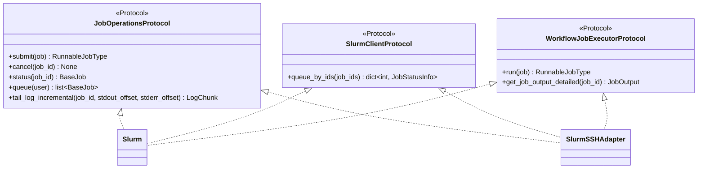
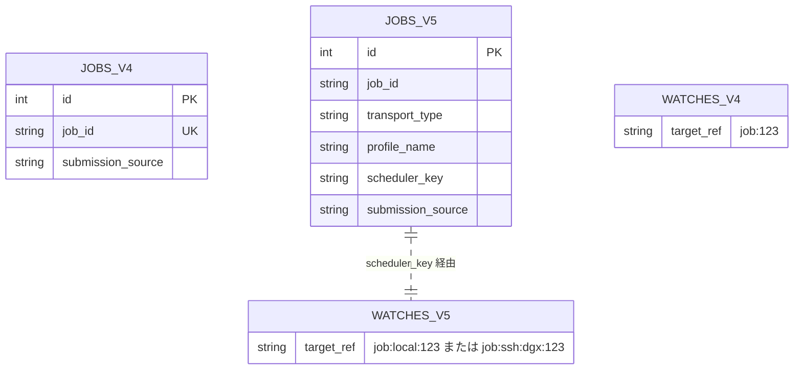
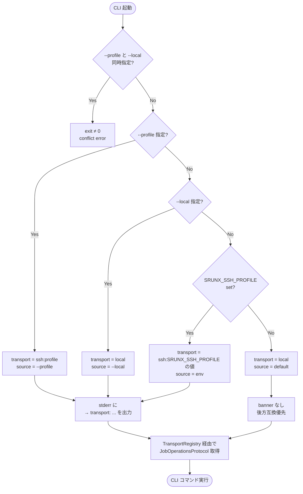

# Spec: CLI Transport 統一リファクタリング

## User Intent

- **Goal**: `srunx submit` / `cancel` / `status` / `list` / `logs` / `flow run` / `monitor jobs` などの top-level CLI を、WebUI と MCP sweep で既に稼働している transport 抽象 (local SLURM / SSH アダプタ) に統一的に載せる。「どのクラスタに投げるか」を transport 選択として直交化し、ユーザーは同一 CLI で local にも remote にも投入できるようにする。
- **Why**: 現状の CLI はローカル `Slurm` シングルトンに直結しており、remote SLURM 向けに `srunx ssh submit` という並行 CLI ツリーが存在する。両者は submit / cancel / status / list / logs ですべて別実装・別引数・別例外型を持ち、機能差 (例: logs の incremental 化、JSON 出力、workflow 連携) が SSH 側で後手に回っている。この二重化が修正コストを毎リリース 2 倍にし、ユーザーにも「どっちを使えばよいか分からない」混乱を生んでいる。
- **Why this approach**: WebUI と MCP sweep は既に `SlurmSSHExecutorPool` と transport 抽象を経由しているため、CLI もその同じ抽象に乗せれば 3 経路 (CLI/Web/MCP) がひとつの Protocol 系で揃う。`srunx ssh` サブツリーを即削除せず deprecation に留めるのは、profile 管理コマンド (`ssh profile *`) や `ssh sync` が transport 非依存で現役のため。

## Overview

CLI が使う実行基盤を `JobOperationsProtocol` 経由の抽象に切り替え、`--profile <name>` / `--local` フラグと `$SRUNX_SSH_PROFILE` 環境変数で local / SSH を選択できるようにする。併せて `SlurmSSHAdapter` のメソッド名・引数・戻り型を既存の `Slurm` クライアントに揃え (LSP 準拠)、DB スキーマに `scheduler_key` 軸を導入してクラスタ間の `job_id` 衝突に耐える構造へ移行する。

## Background

### 現状の二重化

| 側面 | top-level CLI (`srunx submit` 等) | `srunx ssh *` サブツリー |
|---|---|---|
| 実装起点 | `Slurm` シングルトン (`client.py`) | `SSHSlurmClient` (`ssh/core/client.py`) |
| submit API | `submit(job: RunnableJobType) -> RunnableJobType` | `submit_sbatch_job(script_content: str) -> dict` |
| status API | `retrieve(job_id) -> BaseJob` | `get_job_status(job_id) -> str` |
| cancel API | `cancel(job_id)` | `cancel_job(job_id)` |
| logs | なし (都度実装) | 都度 `cat`、offset なし |
| 例外型 | `srunx.exceptions.*` | SSH 固有の例外クラス |
| workflow 連携 | `WorkflowRunner` が直結 | なし (単発投入のみ) |

WebUI / MCP sweep は既に `SlurmSSHExecutorPool` を介して `SlurmSSHAdapter` を利用しており、adapter 側の protocol 準拠はそこでは部分的に達成されている。しかし CLI は一切その抽象を通らない。

### 既に確定済みの設計判断

本 spec は conversation で合意済みの以下の判断を前提にする:

1. Protocol は 3 本立て (ISP 準拠)。`JobOperationsProtocol` を新設し、既存の `SlurmClientProtocol` (poller 用) と `WorkflowJobExecutorProtocol` (runner 用) はそのまま残す。`Slurm` と `SlurmSSHAdapter` は 3 本すべてを実装する (LSP)。
2. Protocol メソッドは純粋関数。stdout 出力や follow-blocking を含めない。follow / streaming は CLI レイヤの責務。
3. transport 解決は「明示フラグ → env → local fallback」。active profile config fallback は Phase 1 ではやらない。
4. DB 側は migration V5 で `scheduler_key` 軸を追加。子テーブル FK は `jobs.id` (内部 AUTOINCREMENT PK) への retarget (exploration で合意した Option A)。
5. `submission_source` (`cli`/`web`/`workflow`/`mcp`) は transport とは独立な軸。ここに `ssh:*` を混ぜない。
6. `srunx ssh submit` / `srunx ssh logs` は deprecation warning のみ。ロジックは温存する。`ssh profile *` / `ssh sync` / `ssh test` は変更しない。

## Requirements

### Must Have

#### REQ-1: Transport 解決順序

CLI は以下の優先順で transport を選択する。複数指定時のコンフリクトは起動時エラー (exit code ≠ 0) で即座に拒否する。

| 優先度 | 指定方法 | 備考 |
|---|---|---|
| 1 | `--profile <name>` | SSH profile を明示 |
| 2 | `--local` | ローカル SLURM を明示。`--profile` との併用は禁止 |
| 3 | `$SRUNX_SSH_PROFILE` 環境変数 | 既存変数を再利用。`SRUNX_PROFILE` は新設しない |
| 4 | fallback | local `Slurm` シングルトン |

- 「`srunx ssh profile set` で設定した active profile」は Phase 1 では読まない。既存 `srunx ssh` サブツリー用のセマンティクスを温存する。

#### REQ-2: Protocol 3 本立て (ISP)

- `JobOperationsProtocol` (新規): CLI 用。`submit` / `cancel` / `status` / `queue` / `tail_log_incremental` を定義。
- `SlurmClientProtocol` (既存、維持): poller 用の `queue_by_ids` を定義。
- `WorkflowJobExecutorProtocol` (既存、維持): runner 用の `run` / `get_job_output_detailed` を定義。
- `Slurm` と `SlurmSSHAdapter` は 3 本すべてを実装する。CLI・poller・runner のいずれからも両実装が差し替え可能でなければならない (LSP)。



#### REQ-3: Protocol メソッドは純粋関数

- 戻り型は既存 Pydantic モデル (`Job` / `BaseJob` / `JobStatusInfo`) を再利用し、新しい tuple / dict 型を作らない。例外として `tail_log_incremental` のみ以下の新規 Pydantic モデル `LogChunk` を返す:

  ```python
  # src/srunx/client_protocol.py
  class LogChunk(BaseModel):
      stdout: str
      stderr: str
      stdout_offset: int  # 次回呼出で渡すべき新オフセット (WebUI wire 名と一致)
      stderr_offset: int
  ```
  WebUI の `/api/jobs/{id}/logs` が返す JSON (`web/routers/jobs.py:352-357`) のフィールド名と揃える (`stdout_offset` / `stderr_offset`)。Python 内部変数 `new_stdout_offset` は実装ディテールで、公開名は `stdout_offset`。
- Protocol メソッドは副作用 (stdout への出力・ブロッキングストリーム・TTY 操作) を持たない。
- follow / polling / live-tail は CLI レイヤ (`src/srunx/cli/*.py`) で protocol を呼び出すループとして実装する。
- 返却モデル (`BaseJob` 等) は呼出後に追加の SLURM 問い合わせ (lazy refresh) を起こさないこと。SSH adapter が返した `BaseJob` を CLI が触って local `sacct` にフォールバックする事故を防ぐため、ステータス系は原則 `JobStatusInfo` を使う。`BaseJob` を使う箇所は refresh をトリガしない path に限定する。

#### REQ-4: SlurmSSHAdapter の API 乖離解消

`SlurmSSHAdapter` のメソッドを `Slurm` の API 形に揃える。

| Before | After | 備考 |
|---|---|---|
| `submit_job(script_content: str) -> dict` | `submit(job: RunnableJobType) -> RunnableJobType` | Jinja レンダと sftp upload は adapter 内部に閉じる |
| `cancel_job(job_id)` | `cancel(job_id)` | 改名のみ |
| `get_job_status(job_id) -> str` | `status(job_id) -> BaseJob` | 戻り型を Pydantic モデルへ |
| `list_jobs(...) -> list[dict]` | `queue(user: str \| None) -> list[BaseJob]` | 戻り型を統一 |
| (都度 `cat` 実装) | `tail_log_incremental(job_id, stdout_offset, stderr_offset) -> LogChunk` | WebUI 準拠の offset incremental 方式 |

**`queue(user=None)` のセマンティクス** (LSP 制約上重要):
- `user=None` は「transport が認識する current user」を意味する。
- local `Slurm.queue(None)` は `$USER` (または `getpass.getuser()`) を使う (既存挙動)。
- SSH `SlurmSSHAdapter.queue(None)` は接続プロファイルの `username` (= `squeue -u $USER_ON_REMOTE`) を使う。
- 明示的に `user="alice"` を渡したら local / SSH ともに同じ意味 (その user のキュー)。

**`cancel(job_id)` / `status(job_id)` の契約**:
- `cancel(未知_id)` は `JobNotFound` を raise する。黙って通さない。
- `status(未知_id)` は `JobNotFound` を raise する。
- `queue(user)` はジョブゼロ件でも空 list を返す。例外にはしない。

**例外階層** (`srunx.exceptions` で transport-agnostic に定義):

```
TransportError                    # base (SSH / local どちらでも起き得る)
├─ TransportConnectionError       # SSH 接続失敗 / local sbatch FileNotFoundError
├─ TransportAuthError             # SSH 認証失敗
└─ TransportTimeoutError          # SSH / scontrol タイムアウト
JobNotFound                       # job_id が SLURM 側に存在しない
SubmissionError                   # sbatch 自体が非0 exit (構文エラー等)
RemoteCommandError                # SSH 越しの任意コマンドが失敗 (scontrol show job 等)
```

- SSH 固有の例外 (paramiko.AuthenticationException 等) は上記にラップして送出する。CLI レイヤは transport を問わず同じ except 節で処理できる。
- `SubmissionError` と `TransportError` は排他: sbatch プロセスは起動したが sbatch が非0 exit → `SubmissionError`。sbatch まで到達できない (SSH 切断・認証失敗) → `TransportError`。

#### REQ-5: DB スキーマ Migration V5

**実装方式**: `requires_fk_off=True` のテーブル rebuild migration (既存 V3/V4 の template を踏襲)。SQLite は後付けで UNIQUE 変更や FK 追加ができないため、`jobs` / `workflow_run_jobs` / `job_state_transitions` の 3 テーブルすべて `*_v5` を CREATE → `INSERT...SELECT` → `DROP` → `RENAME` で差し替える。1 トランザクション内で完遂し、途中失敗時はロールバック。

**`jobs` テーブル**:
- 新規カラム:
  - `transport_type` TEXT NOT NULL DEFAULT `'local'` CHECK IN (`'local'`, `'ssh'`)
  - `profile_name` TEXT NULL (transport_type = 'ssh' のときのみ意味を持つ)
  - `scheduler_key` TEXT NOT NULL DEFAULT `'local'` (`'local'` または `'ssh:<profile_name>'`)
- CHECK 制約で不整合行を生成不能にする:
  ```sql
  CHECK (
      (transport_type = 'local' AND profile_name IS NULL AND scheduler_key = 'local')
      OR
      (transport_type = 'ssh'   AND profile_name IS NOT NULL AND scheduler_key = 'ssh:' || profile_name)
  )
  ```
- `UNIQUE(jobs.job_id)` を `UNIQUE(jobs.scheduler_key, jobs.job_id)` に変更。
- 既存行は全て `transport_type='local'`, `profile_name=NULL`, `scheduler_key='local'` で backfill。

**子テーブル FK retarget (Option A)**:
- `workflow_run_jobs.job_id` → `workflow_run_jobs.jobs_row_id` に改名、FK を `jobs(id)` (内部 AUTOINCREMENT PK) へ変更。
- `job_state_transitions.job_id` → `job_state_transitions.jobs_row_id`、同上。
- backfill は `LEFT JOIN jobs ON old.job_id = jobs.job_id` で `jobs.id` を取得してセット。

**`watches.target_ref` / `events.source_ref`**:
- 文法: `job:local:<job_id>` または `job:ssh:<profile_name>:<job_id>` (REQ-8 で詳細)。
- 既存行は一括 UPDATE で `job:<id>` → `job:local:<id>` に backfill。
- migration 中は poller を停止させる運用前提 (Web app lifespan の起動順で、migration 完了後に poller を起動)。

**Repository / CLI helpers の API 変更** (この migration に伴って必須):
- `JobRepository.record_submission` / `get` / `update_status` / `update_completion` / `delete`: `job_id` 単独引数を `(scheduler_key, job_id)` 複合、または `jobs_row_id` に変更。
- `JobStateTransitionRepository.latest_for_job` / `history_for_job`: 同上。
- `WorkflowRunJobRepository.upsert` / `get`: 同上。
- `cli_helpers.record_submission_from_job`: `transport_type` / `profile_name` / `scheduler_key` を受け取る kwargs を追加。
- すべての `WHERE job_id = ?` クエリが `WHERE scheduler_key = ? AND job_id = ?` か `WHERE id = ?` (jobs_row_id) に書き換わる。

**submission_source は一切変更しない**。transport と submission_source は別軸 (CLI から SSH 経由で投入したジョブは `submission_source='cli'` かつ `transport_type='ssh'`)。



#### REQ-6: CLI 横断統合

- `submit` / `cancel` / `status` / `list` / `logs` / `flow run` / `monitor jobs` に以下のオプションを追加する:
  - `--profile <name>`
  - `--local`
- `submit` に `--script <path>` を追加する。command list と排他。`--script` 指定時は ShellJob 経由で投入する。これは既存 `ssh submit` の script 投入パスを top-level に橋渡しする役割を担う。
- 共通オプションは `src/srunx/cli/transport_options.py` (新規) に Annotated 型エイリアスで集約する (DRY)。
- `-p` の短縮形は `--profile` には割り当てない。`resources` / `monitor resources` で既に `-p` が `--partition` に使われているため、同一 CLI 内で意味が衝突する。
- `flow run --profile` は remote path 問題を抱える (workflow YAML の `work_dir` / `log_dir` / `ShellJob.script_path` は local path 前提)。Phase 1 では:
  - `flow run --profile <name>` を使うとき、**profile に `mounts` 設定があれば自動的に mount translation を適用** (WebUI / MCP sweep と同じロジック = `SubmissionRenderContext`)。
  - profile に `mounts` が無ければ、workflow YAML 内の path が remote 上に既に存在する前提で render される (warning 出力)。
  - `ShellJob.script_path` が mount の `local` 配下にない場合は**起動時エラー**で拒否する (WebUI / MCP と同じ security guard)。

#### REQ-7: Transport 可視化

- コマンド開始時に解決された transport を 1 行表示する (**明示指定時のみ**):
  - `--profile foo` → `→ transport: ssh:foo (from --profile)`
  - `$SRUNX_SSH_PROFILE=foo` → `→ transport: ssh:foo (from env)`
  - `--local` → `→ transport: local (from --local)`
  - **default (何も指定なし・env なし) は banner を出さない** — AC-10.2 (後方互換) を破らないため、かつ従来 CLI との stderr 出力の完全一致を維持するため。
- 出力先は **stderr** 固定。`--format json` の stdout を汚染しない。
- `Console(stderr=True)` または loguru (既に stderr 出力) を使用する。
- `--quiet` フラグで明示指定時の banner も抑制可能 (全 CLI 共通のフラグとして追加する)。

#### REQ-8: Poller transport-aware 化

**`target_ref` / `source_ref` の文法** (precise grammar):
- `job:local:<job_id>` (local transport)
- `job:ssh:<profile_name>:<job_id>` (SSH transport)
- `workflow_run:<run_id>` (transport 非依存、既存のまま)
- `sweep_run:<sweep_run_id>` (同上)

**パーサ契約** (`_parse_target_ref(ref: str) -> tuple[scheduler_key: str, job_id: int] | None`):
```python
# 擬似コード
parts = ref.split(":")
if parts[0] != "job":
    return None
if len(parts) < 3:
    return None  # legacy 2-segment は migration で消える前提。防御的対応は AC には含めない
job_id = int(parts[-1])                  # 末尾は必ず数値
scheduler_tokens = parts[1:-1]           # 中間トークン
if scheduler_tokens == ["local"]:
    scheduler_key = "local"
elif scheduler_tokens[0] == "ssh" and len(scheduler_tokens) == 2:
    scheduler_key = f"ssh:{scheduler_tokens[1]}"  # profile_name は `:` を含まない前提
else:
    return None
return (scheduler_key, job_id)
```

- **profile_name に `:` を含めることは禁止** (CHECK 制約で追加、または `add_profile` 段階で reject)。これが崩れると parser が破綻するため、REQ-5 の CHECK 制約に併せて profile name validation も実装する。
- legacy 2-segment (`job:<id>`) は V5 migration で全行 backfill されるので、パーサは 3+ セグメントのみ受ける。migration 中のレースは「migration 完了後に poller を起動」の運用 (Web app lifespan) で回避する。

**`ActiveWatchPoller` の group-by**:
- watches を `scheduler_key` で group-by し、transport ごとに該当する `SlurmClientProtocol.queue_by_ids()` を呼ぶ。
- 戻り値 `dict[int, JobStatusInfo]` を scheduler_key ごとに merge して後段の `_process_job_watches` に渡す。

**`TransportRegistry`**:
- 新規、薄い解決レイヤ。`src/srunx/transport/registry.py` (新規 module) に配置。
- DB の `jobs.scheduler_key` DISTINCT から既知キーを列挙、`SlurmClientProtocol` 実装を解決。
- ライフサイクル:
  - **CLI 経路**: コマンドごとに構築、`close()` で SSH 接続を閉じる (context manager)。
  - **Web app lifespan / poller**: lifespan で 1 インスタンス保持、プロセス終了まで再利用。
- Failure policy: DB に `scheduler_key='ssh:foo'` の watch があるが profile `foo` が削除済みの場合、**当該 scheduler_key group の処理を skip し、warning をログ**する (poller cycle 全体を落とさない)。該当 watch の自動 close はしない (Phase 2)。

**Phase 2 スコープ** (今回は扱わない):
- profile-per-poller (ssh profile ごとに専用 poller を起動) — 現行の group-by で遅い SSH が fast local を巻き込む問題は Phase 1 では許容。
- SSH `queue_by_ids` のバッチ並列化 — Phase 1 は直列。

**性能ガイドライン** (Phase 1 の目安):
- poller cycle の interval は既存の 15 秒を維持。
- 1 cycle 内で scheduler_key group は直列に処理。SSH timeout は既存 adapter の値 (通常 30 秒) を継承。
- 1 cycle 内の scheduler_key group 数は実用上 1-3 程度 (local + 2-3 profile) を想定。それ以上増えたら Phase 2 の並列化を検討。

#### REQ-9: `srunx ssh` サブツリーの deprecation

- `srunx ssh submit` / `srunx ssh logs` に deprecation warning を追加する。stderr への 1 行で、新 CLI (`srunx submit --script ... --profile` / `srunx logs --profile`) を案内する。ロジックは温存し、Phase 1 では削除しない。
- `srunx ssh test` / `srunx ssh sync` / `srunx ssh profile *` は transport 非依存なので変更しない。保守用として残す。

#### REQ-10: 後方互換

- フラグなしの `srunx submit python foo.py` (従来 CLI) は挙動を完全に変えない。local fallback で従来通り動く。stderr banner も出さない (REQ-7)。
- 既存 DB は migration V5 により自動的に:
  - `jobs.scheduler_key = 'local'`、`jobs.transport_type = 'local'`、`jobs.profile_name = NULL`
  - `workflow_run_jobs.jobs_row_id` / `job_state_transitions.jobs_row_id` に既存の `jobs.id` を backfill
  - `watches.target_ref`, `events.source_ref` を `job:local:<id>` に backfill
- SQLite + 単一マシン運用前提のため、V5 のロールバックは想定しない。DB は常に CLI / Web を実行している control machine の local SQLite で、remote host 側の `~/.config/srunx/srunx.db` は触らない。
- 既存テスト:
  - **CLI レベルの behavioral テスト**は全て無修正で pass する。
  - **DB row モデル・repository レベルのテスト**は `job_id` → `jobs_row_id` / `(scheduler_key, job_id)` のキー変更に伴い修正が入る (REQ-5 の repository API 変更に比例)。これは migration 本体と 1 つの PR に収める。
- プラットフォーム: **macOS / Linux のみ Phase 1 サポート**。Windows は local SLURM が動かない前提のため、`--profile` 指定時の SSH transport のみ best-effort で動く想定 (公式サポート外)。

### Nice to Have

- REQ-N1: transport 解決のトレースを `SRUNX_DEBUG_TRANSPORT=1` で詳細出力 (どのステップで解決したか)。
- REQ-N2: `srunx config show` に現在の active transport 候補 (env / default) を表示。

## Acceptance Criteria

以下の AC は各 REQ と 1:N で対応する。すべて pytest もしくは CLI 手動検証で verifiable。

### REQ-1 対応

- AC-1.1: `srunx submit echo hi` (フラグなし・env なし) がローカル SLURM を呼び、従来 CLI と同じ exit code / stdout を返す。
- AC-1.2: `srunx submit --profile foo --local echo hi` は exit code ≠ 0 で起動時エラー終了し、stderr に「`--profile` と `--local` は同時指定できません」旨のメッセージを出力する。
- AC-1.3: `SRUNX_SSH_PROFILE=foo srunx list` が SSH profile `foo` 経由で `squeue` を実行し、結果を表示する。
- AC-1.4: `SRUNX_SSH_PROFILE=foo srunx list --local` は env を上書きして local SLURM を呼ぶ。

### REQ-2 / REQ-3 対応

- AC-2.1: `isinstance(Slurm(), JobOperationsProtocol)` と `isinstance(SlurmSSHAdapter(...), JobOperationsProtocol)` の両方が True (runtime_checkable または構造的検査で確認)。
- AC-2.2: 既存 poller テスト (`tests/.../test_active_watch_poller.py`) が `Slurm` / `SlurmSSHAdapter` の双方を `SlurmClientProtocol` として注入しても pass する。
- AC-3.1: `JobOperationsProtocol.tail_log_incremental` は stdout / stderr に直接書き出さず、構造化された戻り値のみ返す (単体テスト: mock した `run_remote_command` の呼出が `print` / `sys.stdout.write` と結び付いていないことを保証)。
- AC-3.2: follow 付きログ表示は `src/srunx/cli/` 配下のループ実装で行われ、protocol 自体には follow 引数がない。

### REQ-4 対応

- AC-4.1: `SlurmSSHAdapter.submit(Job(...))` が `RunnableJobType` を返し、戻り値の `job_id` が設定されている。
- AC-4.2: `SlurmSSHAdapter.status(existing_job_id)` が `BaseJob` を返し、存在しない ID は `JobNotFound` を raise する。
- AC-4.3: `SlurmSSHAdapter.queue(user="alice")` が `list[BaseJob]` を返し、要素の Pydantic 検証が通る。
- AC-4.4: `SlurmSSHAdapter.tail_log_incremental(job_id, 0, 0)` が `stdout / stderr / new_stdout_offset / new_stderr_offset` を返し、同 API が `Slurm` 実装でも同一シグネチャで呼べる。
- AC-4.5: SSH 接続失敗時に `TransportError` が raise され、既存の paramiko 固有例外は外部に漏れない。

### REQ-5 対応

- AC-5.1: Migration V5 適用後、`PRAGMA table_info(jobs)` に `transport_type` / `profile_name` / `scheduler_key` が含まれ、`scheduler_key` は NOT NULL である。
- AC-5.2: V5 適用後に `SELECT COUNT(*) FROM jobs WHERE scheduler_key IS NULL` が 0 を返す。
- AC-5.3: V5 適用後に `SELECT COUNT(*) FROM watches WHERE kind = 'job' AND (target_ref NOT LIKE 'job:local:%' AND target_ref NOT LIKE 'job:ssh:%:%')` が 0 を返す (legacy 2 セグメント形式が完全に消えている)。
- AC-5.4: 同一 `job_id=12345` が `scheduler_key='local'` と `scheduler_key='ssh:dgx'` で同時に存在できる (UNIQUE 制約が複合キーになっている)。
- AC-5.5: `PRAGMA foreign_key_list(workflow_run_jobs)` および `PRAGMA foreign_key_list(job_state_transitions)` の結果が `jobs.id` を FK 先として返す (structural assertion)。
- AC-5.6: `submission_source` の CHECK 制約とカラム値が V4 から変化していない (diff で確認)。

### REQ-6 対応

- AC-6.1: `srunx cancel --profile foo 12345` が SSH 経由で `scancel 12345` を実行する。
- AC-6.2: `srunx status --profile foo 12345` が SSH 経由で該当 job の `BaseJob` を表示する。
- AC-6.3: `srunx flow run --profile foo workflow.yaml` が workflow 全体を SSH 経由で実行する。
- AC-6.4: `srunx submit --script train.sh --profile foo` が ShellJob として SSH 経由で投入される。
- AC-6.5: `srunx submit --script train.sh python foo.py` は command list と排他のため起動時エラー。

### REQ-7 対応

- AC-7.1: `srunx list --format json --quiet` の stdout が純粋な JSON であり、transport 表示行が混ざらない (`jq .` が成功する)。
- AC-7.2: `srunx list --format json` (quiet なし) の stderr に `→ transport:` 行が出力され、stdout は依然として純粋 JSON である。
- AC-7.3: `srunx submit --profile foo echo hi` の stderr に `→ transport: ssh:foo (from --profile)` が 1 行だけ表示される。

### REQ-8 対応

- AC-8.1: V5 適用後、active watches が `scheduler_key='local'` と `scheduler_key='ssh:dgx'` の両方を含む場合、`ActiveWatchPoller` 1 サイクルで両方の transport に対して `queue_by_ids` が呼ばれる (mock で検証)。
- AC-8.2: `_parse_target_ref("job:local:12345")` が `("local", 12345)` を返す。
- AC-8.3: `_parse_target_ref("job:ssh:dgx:12345")` が `("ssh:dgx", 12345)` を返す。
- AC-8.4: `_parse_target_ref("job:12345")` (legacy 2 セグメント) は `None` を返す (migration 後は存在しないため)。
- AC-8.5: `TransportRegistry.resolve("ssh:nonexistent_profile")` が `None` を返し、poller は cycle 全体を落とさず warning ログを出して次の scheduler_key group へ進む (mock で検証)。

### REQ-9 対応

- AC-9.1: `srunx ssh submit foo.sh` が stderr に deprecation warning を出し、exit code 0 で従来通り動作する。
- AC-9.2: `srunx ssh profile list` は warning なしで従来通り動作する (保守コマンドとして温存)。
- AC-9.3: `srunx ssh sync` は warning なしで従来通り動作する。

### REQ-10 対応

- AC-10.1: CLI レベルの behavioral テストスイートが pass する。DB row モデル・repository テストは `job_id` → `jobs_row_id` キー変更に追従した修正込みで pass する。
- AC-10.2: 既存の `srunx submit python foo.py` (フラグなし・env なし) の stdout / stderr / exit code が V4 / V5 前後で完全一致する (golden test)。transport banner は default では出ないので stderr も同一。
- AC-10.3: V4 DB を用意して srunx 起動 → V5 migration 自動適用 → 既存 CLI が動作、という一連のフローが手動検証で通る。

## Out of Scope

以下は本 spec のスコープ外 (Phase 2 以降 or 採用しない):

- **active profile config fallback** (`srunx ssh profile set` の設定を CLI の default transport に使う): Phase 2 以降。既存 `srunx ssh` サブツリーのセマンティクスを変えないため Phase 1 では見ない。
- **profile-per-poller**: Phase 2 以降。今回は `ActiveWatchPoller` 内で `scheduler_key` group-by する単一 poller 方式。
- **cwd ベース transport 自動判定** (profile の `local_root` と cwd を突き合わせる): 採用しない。暗黙挙動が多すぎて混乱のもと。
- **`srunx ssh submit` の即時削除**: Phase 1 は deprecation warning のみ。削除は未来の breaking release で実施。
- **WebUI の変更**: 既に transport 抽象化済み。触らない。
- **MCP の変更**: 既に `mount=` 引数で transport 選択に対応済み。触らない。
- **`submission_source` に transport 軸を混ぜる変更**: 意味論違反として拒否 (CLI から SSH 経由で投入したジョブは `submission_source='cli'` かつ `transport_type='ssh'` として記録する)。

## Constraints

### Technical Constraints

- SQLite + `sqlite3` 標準ライブラリのみ使用 (既存方針踏襲)。V5 migration は `requires_fk_off=True` の rebuild migration (V3/V4 の template 踏襲) として実装する。UNIQUE 制約変更と子 FK retarget が SQLite では table rebuild でしか達成できないため。
- Python 3.11+ (既存プロジェクトは 3.12)。
- `JobOperationsProtocol` は `typing.Protocol` で定義し、`runtime_checkable` を付与するかは実装時判断 (テストで `isinstance` 検査をするなら必須)。
- `SlurmSSHAdapter` の内部実装 (paramiko, sftp upload, Jinja render) は変更しない。外向き API のみ adapt する。

### Design Constraints

- LSP: 3 本の Protocol それぞれについて、`Slurm` と `SlurmSSHAdapter` のどちらを渡しても呼出側のテストが pass すること。
- ISP: CLI コマンドが poller 用 API (`queue_by_ids`) に依存してはいけない。poller が CLI 用 API (`tail_log_incremental`) に依存してはいけない。
- 純粋関数原則: Protocol の戻り値は Pydantic モデル。stdout / stderr への出力は CLI レイヤのみ。
- 既存 `submission_source` 軸に transport 情報を混ぜない。`transport_type` / `profile_name` / `scheduler_key` は別カラムで表現する。

### Business Constraints

- 後方互換を破らない。既存ユーザーの `srunx submit python foo.py` が動かなくなるのは不可。
- deprecation は段階的に。`srunx ssh submit` を使っているユーザーに移行期間を与える。

## Known Pitfalls

codex review と exploration で明らかになった、実装時に必ず考慮すべき落とし穴:

| # | Pitfall | 対策 |
|---|---|---|
| P-1 | SLURM `job_id` はクラスタ間で衝突する (別クラスタが同じ数字を返す) | `UNIQUE(job_id)` 単体を廃止し `UNIQUE(scheduler_key, job_id)` へ (REQ-5) |
| P-2 | `submission_source` に `ssh:*` を混ぜると意味論が壊れる (誰がトリガしたか vs どこに投げたかを混同) | 別カラム `transport_type` / `profile_name` を使う (REQ-5) |
| P-3 | active profile の暗黙 fallback を Phase 1 で入れると既存 `srunx ssh profile set` の意味が変わる | Phase 1 では読まない (REQ-1、Out of Scope) |
| P-4 | transport 表示を stdout に出すと `--format json` がパース不能になる | stderr 固定 + `--quiet` 対応 (REQ-7) |
| P-5 | `_parse_target_id` は `:` split を partition 前提で書かれており 3 セグメント化で破綻する | `_parse_target_ref` に改名、`rsplit` ベースの末尾 job_id 切り出しで実装 (REQ-8) |
| P-6 | `events.payload_hash` は過去行が stale になる (target_ref の backfill で hash が再計算されない) | documented, acceptable。backfill 直後の初回 event は dedup ヒットせず 1 件余分に記録される可能性があるが、以降の dedup には影響しない |
| P-7 | SSH adapter の `submit_job(script_content)` と top-level `submit` (command list) の引数形が違い、直接差し替えが効かない | `--script` フラグ + ShellJob 経路を top-level に追加して橋渡し (REQ-4, REQ-6) |
| P-8 | `-p` 短縮形を `--profile` に割り当てると `resources` / `monitor resources` の `--partition` と衝突 | 短縮形なし。long form `--profile` のみ (REQ-6) |
| P-9 | SSH 固有例外 (paramiko.AuthenticationException 等) が CLI レイヤに漏れると transport 抽象が意味をなさない | `srunx.exceptions` で `TransportError` 階層にラップ (REQ-4) |
| P-10 | 子テーブル FK を `jobs.job_id` 参照のままにすると `UNIQUE(scheduler_key, job_id)` に変更した瞬間に FK 制約が壊れる | Option A で `jobs.id` (AUTOINCREMENT PK) への retarget。SQLite は後付け FK 追加できないので rebuild migration 必須 (REQ-5) |
| P-11 | `flow run --profile` で workflow YAML の `work_dir` / `log_dir` / `ShellJob.script_path` が remote path として解決できない | profile の `mounts` 設定を使って translation。`script_path` が mount の `local` 配下外なら起動時エラー (REQ-6、WebUI / MCP と同じ guard) |
| P-12 | profile_name に `:` を含めると `scheduler_key='ssh:<profile>'` のパースが破綻する | profile_name のバリデーションで `:` を禁止。DB CHECK 制約で追加 (REQ-5, REQ-8) |
| P-13 | 同じ profile_name で hostname を変えると別クラスタが同じ `scheduler_key` になり cross-cluster 衝突保護が崩れる | Phase 1 は「profile 名 = scheduler identity」と仮定。profile 更新時に DB の既存 `jobs` 行との整合は保証しない (運用上の注意として documented) |
| P-14 | `BaseJob.status` が lazy refresh を持つため、SSH adapter が返した `BaseJob` を CLI が触ると local `sacct` に fallback する可能性 | ステータス系は原則 `JobStatusInfo` (refresh しない純粋 DTO) を使う (REQ-3) |

## Transport 解決フロー



## Open Questions

以下は実装着手後に決めてよい細部 (spec を blocker にしない):

- deprecation warning の具体的文言 (例: `"srunx ssh submit is deprecated; use 'srunx submit --script <path> --profile <name>' instead"`) と、将来の削除時期 (`# removed in v2.0` のようなコメント) の明記有無。
- `JobStatusInfo` を CLI `status` / `queue` の戻り型として再利用するか、`BaseJob` から `JobStatusInfo` を派生させる新モデルを設けるか (REQ-3 P-14 の対応詳細)。
